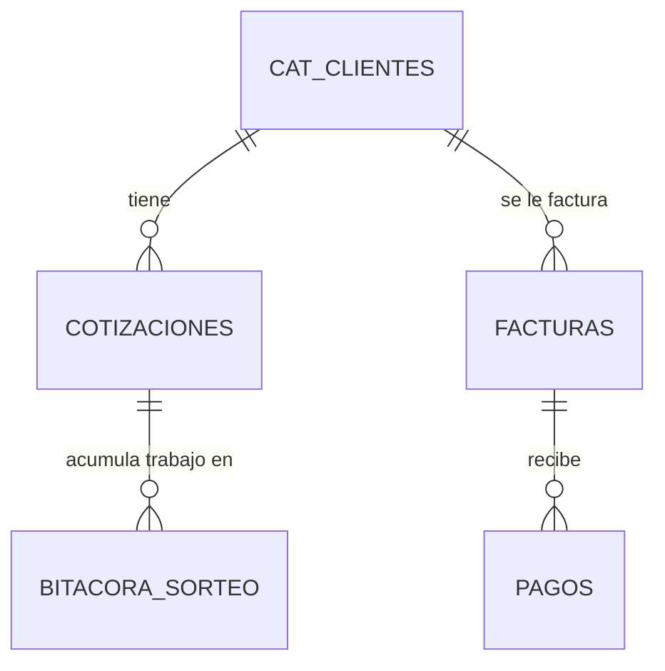

# Diseño de Estructura de Datos (Tier 0)
# BQS MVP1 Master Database Schema

**Proyecto:** BQS Executive Accounts Receivable and Billing Portal  
**Versión:** 1.0.0  
**Fecha:** 16/06/2026  
**Responsable:** Desarrollador / CTO  

---

## 1. Introducción y Reglas del Tier 0

Este documento define la estructura de datos obligatoria para consolidar la información financiera dispersa de Best Quality Solutions México (BQS). Todo el desarrollo del MVP1 (Tier 1) depende de la estricta implementación de este esquema relacional en la base de datos MySQL maestra.

### Reglas de Oro de Integridad:
1. **Identificadores Únicos (IDs):** Ninguna entidad (Cliente, Proyecto, Factura) puede ser referenciada o cruzada usando texto libre o nombres variables. Deben usar la clave única definida.
2. **Normalización:** Los nombres comerciales y variantes (ej. "NIDEC US", "Nidec México") deben mapearse a un único ID de Cliente.
3. **Tipos de Datos Fijos:** Las columnas numéricas (montos, cantidades de piezas) no deben contener texto como "N/A", "pendientes" o símbolos de moneda que rompan los cálculos de la base de datos o de la API del backend.

---

## 2. Definición de Tablas (Google Sheets / Base de Datos)

### Tabla 1: `CAT_CLIENTES` (Catálogo Maestro de Clientes)
Define la lista oficial de clientes de BQS con sus identificadores únicos.

| Columna | Tipo | Descripción | Ejemplo |
| :--- | :--- | :--- | :--- |
| `ID_Cliente` (PK) | Alfanumérico | Clave única inalterable (formato `CLI-XXX`) | `CLI-001` |
| `Nombre_Fiscal` | Texto | Nombre registrado ante el SAT | `Nidec Mobility México S.A. de C.V.` |
| `Nombre_Comercial`| Texto | Nombre corto para el portal | `NIDEC Mobility` |
| `RFC` | Texto | Registro Federal de Contribuyentes | `NMM120304AA1` |
| `Estatus` | Texto | Estado del cliente (`Activo`, `Inactivo`) | `Activo` |

---

### Tabla 2: `COTIZACIONES` (Servicios Cotizados y Autorizados)
Almacena las cotizaciones base que establecen el límite del servicio y enlazan a la Orden de Compra (PO).

| Columna | Tipo | Descripción | Ejemplo |
| :--- | :--- | :--- | :--- |
| `ID_Cotizacion` (PK)| Alfanumérico | ID de cotización (`COT-XXXX`) | `COT-2026-042` |
| `ID_Cliente` (FK) | Alfanumérico | Enlace a `CAT_CLIENTES` | `CLI-001` |
| `PO_Referencia` | Texto | Número de Orden de Compra asignada | `PO-882319` |
| `Monto_Autorizado` | Decimal | Límite financiero autorizado por el cliente | `150000.00` |
| `Piezas_Autorizadas`| Entero | Cantidad de piezas autorizadas (si aplica) | `10000` |
| `Estatus` | Texto | Estado (`Aprobada`, `Pendiente PO`, `Cerrada`) | `Aprobada` |

---

### Tabla 3: `BITACORA_SORTEO` (Sorteo Diario / Suministro)
Contiene la captura de piezas/horas trabajadas acumuladas (Alimentada por Lourdes o Juan Manuel a través de la herramienta de captura). Representa el trabajo ejecutado (devengado).

| Columna | Tipo | Descripción | Ejemplo |
| :--- | :--- | :--- | :--- |
| `ID_Captura` (PK) | Alfanumérico | Clave única de registro (`CAP-XXXXX`) | `CAP-98212` |
| `Fecha` | Fecha | Fecha de ejecución del sorteo (`DD/MM/AAAA`) | `15/06/2026` |
| `ID_Cotizacion` (FK)| Alfanumérico | Enlace a la cotización/proyecto de origen | `COT-2026-042` |
| `Horas_Trabajadas` | Decimal | Total de horas invertidas en el turno | `24.0` |
| `Piezas_Sorteadas` | Entero | Total de piezas inspeccionadas | `1500` |
| `Monto_Devengado` | Decimal | Valor del servicio en dinero (`Horas * Tarifa`) | `4800.00` |
| `Estatus_Facturacion`| Texto | Estatus del cobro (`Pendiente`, `Facturado`) | `Pendiente` |

---

### Tabla 4: `FACTURAS` (Cuentas por Cobrar y Facturación)
Controla los folios fiscales emitidos al cliente y su respectivo estado de cobro.

| Columna | Tipo | Descripción | Ejemplo |
| :--- | :--- | :--- | :--- |
| `Folio_Factura` (PK)| Alfanumérico | Folio interno o UUID fiscal | `F-12845` |
| `ID_Cliente` (FK) | Alfanumérico | Enlace a `CAT_CLIENTES` | `CLI-001` |
| `Fecha_Emision` | Fecha | Fecha en que se timbró/emitió la factura | `05/06/2026` |
| `Monto_Subtotal` | Decimal | Monto sin impuestos | `45000.00` |
| `Monto_Total` | Decimal | Monto total con IVA | `52200.00` |
| `Fecha_Vencimiento`| Fecha | Límite de pago según condiciones comerciales | `05/07/2026` |
| `Estatus_Pago` | Texto | Estado de cobranza (`Pagada`, `Vigente`, `Vencida`)| `Vigente` |

---

### Tabla 5: `PAGOS` (Cobros Aplicados)
Detalla los abonos o liquidaciones de facturas recibidas de los clientes para deducir del saldo de cuentas por cobrar.

| Columna | Tipo | Descripción | Ejemplo |
| :--- | :--- | :--- | :--- |
| `ID_Pago` (PK) | Alfanumérico | Clave de recibo de pago (`PAG-XXXX`) | `PAG-7712` |
| `Folio_Factura` (FK)| Alfanumérico | Enlace a la factura liquidada/abonada | `F-12845` |
| `Fecha_Pago` | Fecha | Fecha de recepción de transferencia | `12/06/2026` |
| `Monto_Pagado` | Decimal | Monto recibido aplicado a la factura | `52200.00` |
| `Referencia` | Texto | Folio o banco de origen | `SPEI BANORTE 9122` |

---

## 3. Relaciones del Modelo

