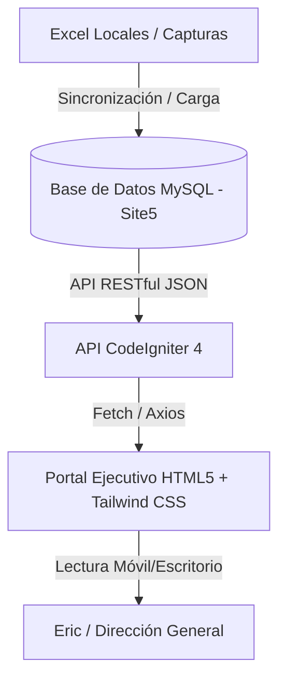

# Especificación Técnica de Desarrollo (Tier 1)
# BQS MVP1 Technical Specification

**Proyecto:** BQS Executive Accounts Receivable and Billing Portal  
**Versión:** 1.0.0  
**Fecha:** 16/06/2026  
**Responsable:** Desarrollador / CTO  

---

## 1. Arquitectura de Sincronización

El MVP1 se diseña como una aplicación de lectura ágil conectada a una base de datos maestra relacional MySQL alojada en el servidor Site5.

---

## 2. Reglas del Backend (Cálculos de las 3 Preguntas Clave)

Para responder las preguntas de Eric en la interfaz del celular sin saturarlo de datos complejos, la API en CodeIgniter 4 ejecutará los siguientes cálculos automatizados:

### Pregunta 1: ¿Qué ya se facturó?
* **Lógica de Cálculo:**
  Sumatoria de los montos de la tabla `FACTURAS` cuyo campo `Fecha_Emision` corresponda al mes en curso y cuyo `Estatus_Pago` sea igual a `Pagada` o `Vigente`.
* **Fórmula:**
  $$\text{Total Facturado Mes} = \sum (\text{Monto\_Total}) \quad \text{donde } \text{Mes(Fecha\_Emision)} = \text{Mes\_Actual}$$

### Pregunta 2: ¿Qué falta por facturar? (Trabajo Devengado No Facturado)
* **Lógica de Cálculo:**
  Filtra la tabla `BITACORA_SORTEO` buscando los registros con `Estatus_Facturacion` = `Pendiente`. Agrupa estos registros por `ID_Cotizacion` (para conocer qué cliente y proyecto generaron el servicio) y suma sus montos devengados.
* **Fórmula:**
  $$\text{Por Facturar} = \sum (\text{Monto\_Devengado}) \quad \text{donde } \text{Estatus\_Facturacion} = \text{"Pendiente"}$$

### Pregunta 3: ¿Cuánto dinero te deben? (Cuentas por Cobrar Vencidas y Vigentes)
* **Lógica de Cálculo:**
  Toma todas las facturas en la tabla `FACTURAS` que no estén en estatus `Pagada` (es decir, `Vigente` o `Vencida`). Resta los abonos parciales registrados en la tabla `PAGOS` asociados al folio de cada factura.
* **Fórmula:**
  $$\text{Saldo Deudor Total} = \sum (\text{Monto\_Total de Facturas Activas}) - \sum (\text{Monto\_Pagado en Pagos Asociados})$$

---

## 3. Seguridad e Identidad

* **Autenticación:**
  - Acceso seguro a la API de CI4 implementando Shield, validando el correo mediante lista blanca (*Whitelist*) de cuentas autorizadas.
  - El usuario principal es la Dirección General (`eric@bestqualitysolutions.com`).
* **Seguridad de Datos:**
  - Sesión gestionada vía Cookies HttpOnly y SameSite=Strict para evitar el robo de tokens.
  - Acceso en modo de "Solo Lectura" (métodos GET de la API únicamente) para la interfaz de Eric para evitar alteraciones accidentales del historial financiero desde el teléfono.
  - Conexión segura HTTPS y cabeceras CSP estrictas en el servidor Site5.

---

## 4. Credenciales de Servidor y Despliegue (Entorno de Desarrollo)

> [!WARNING]
> Estas credenciales son de uso restringido para el equipo de desarrollo de Dataholics. Mantener este archivo seguro.

* **Dominio del Proyecto:** [bqs.dataholics.com.mx](http://bqs.dataholics.com.mx)
* **Credenciales FTP:**
  - **Servidor:** `ftp.bqs.dataholics.com.mx` (o IP asignada en Site5)
  - **Usuario:** `DEV_BQS@bqs.dataholics.com.mx`
  - **Contraseña:** `MyggofQg!lgv`
* **Base de Datos MySQL (Site5):**
  - **Host:** `localhost` (para conexiones internas del servidor)
  - **Database:** `noodluis_bqs`
  - **Usuario:** `noodluis_dev_bqs`
  - **Contraseña:** `KdElbk}[0U6F`

