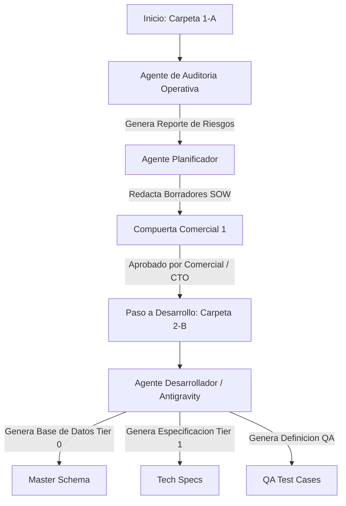

# Pipeline de Procesamiento y Promoción de MVPs
# Dataholics Document Promotion Pipeline (1-A -> 2-B)

**Empresa:** Dataholics  
**Área:** Dirección de Tecnología (CTO)  
**Versión:** 1.0.0  
**Fecha:** 16/06/2026  
**Responsable:** Luis Morales (CTO)

---

## 1. Introducción al Pipeline de Promoción

Este documento describe el flujo de procesos y los agentes automatizados requeridos para promover un proyecto desde la etapa de **Análisis Operativo y Definición Comercial (1-A Viable MVPs)** a la etapa de **Especificación Técnica y Desarrollo (2-B Phase 1 MVP)**.

El objetivo de este pipeline es mitigar el riesgo operativo del negocio y el retrabajo de código (Scope Creep) garantizando que ninguna línea de software sea escrita sin antes pasar por compuertas obligatorias de negocio e ingeniería.

---

## 2. Diagrama del Proceso de Promoción

---

## 3. Roles e Instrucciones de los Agentes en el Pipeline

Para ejecutar esta transición de manera automatizada y segura en el entorno de Dataholics, se requieren los siguientes agentes especializados, operando bajo sus respectivos mandatos y protocolos:

### Agent A: `commercial-onboarder` (Agente de Ingesta Comercial - Célula 0)
* **Objetivo:** Ingesta clerical y extracción de dolores del cliente sin intervención técnica (Zero-Trust).
* **Instrucciones Clave:**
  - Lee archivos en `raw-transcripts/` y `Context/`.
  - Prohibido sugerir código, bases de datos o viabilidad técnica.
  - Registra citas textuales literales categorizadas por departamento en `docs/0-onboarding-raw.md`.

### Agent B: `auditor-seguridad` / `risk-auditor` (Evaluador de Riesgos Operativos)
* **Objetivo:** Identificar vulnerabilidades lógicas, de negocio o de seguridad en el diseño del MVP.
* **Instrucciones Clave:**
  - Formular las preguntas "Kill Switch" para identificar problemas de piso (ej. prohibición de móviles en plantas).
  - Validar que no se usen credenciales hardcodeadas, se usen variables `.env` y se definan políticas de acceso de "Solo Lectura" para perfiles ejecutivos móviles.

### Agent C: `planificador` (Orquestador de Arquitectura)
* **Objetivo:** Traducir requerimientos ambiguos en especificaciones y checks accionables sin escribir código de producción.
* **Instrucciones Clave:**
  - Toma el control cuando la tarea requiere más de 3 pasos o decisiones arquitectónicas.
  - Descompone el plan de trabajo en un checklist verificable en `tasks/todo.md`.
  - Diseña el plan de verificación (tests y flujos manuales) antes de iniciar el desarrollo.

### Agent E: `desarrollador` (Antigravity AI / Célula de Ejecución)
* **Objetivo:** Implementación práctica de código y documentación técnica.
* **Instrucciones Clave:**
  - Lee las tareas en `tasks/todo.md` y verifica la existencia de un plan aprobado por el `@planificador`.
  - Aplica **Simplicidad Primero** (lo más sencillo que funcione) e **Impacto Mínimo** (tocar estrictamente lo necesario).
  - Genera el esquema de base de datos relacional (`Master-Schema.md`) y la especificación técnica (`Technical-Specification.md`) al promocionar a `2-B`.

---

## 4. Requisitos de Entrada y Salida por Etapa

### Entrada en Carpeta `1-A Viable MVPs`
Para que un proyecto sea considerado viable para análisis, debe contar con:
1. **[BQS-SOW-Plantilla-Base.md](file:///C:/Users/luisc/Documents/Dataholics/Dataholics%20Guidelines/proyectos/BestQuality/1-A%20Viable%20MVPs/BQS-SOW-Plantilla-Base.md)**: El borrador comercial del alcance.
2. **[BQS-ES-MVP-Validation-Operational-Audit.md](file:///C:/Users/luisc/Documents/Dataholics/Dataholics%20Guidelines/proyectos/BestQuality/1-A%20Viable%20MVPs/BQS-ES-MVP-Validation-Operational-Audit.md)**: La auditoría que confirma viabilidad operativa y la necesidad de pivotes.
3. **[BQS-Analisis-Agentes-Auditoria.md](file:///C:/Users/luisc/Documents/Dataholics/Dataholics%20Guidelines/proyectos/BestQuality/1-A%20Viable%20MVPs/BQS-Analisis-Agentes-Auditoria.md)**: Resumen del análisis de viabilidad técnica y negocio frente a la presentación fuente de verdad.

---

### Salida y Promoción a Carpeta `2-B Phase 1 MVP`
La promoción a `2-B` se activa únicamente cuando el SOW específico del MVP seleccionado es aprobado por el CTO (**Luis Morales**) y se generan los 3 cimientos del desarrollo:
1. **[BQS-MVP1-Database-Master-Schema.md](file:///C:/Users/luisc/Documents/Dataholics/Dataholics%20Guidelines/proyectos/BestQuality/2-B%20Phase%201%20MVP/BQS-MVP1-Database-Master-Schema.md)**: Estructura Tier 0 con IDs únicos.
2. **[BQS-MVP1-Technical-Specification.md](file:///C:/Users/luisc/Documents/Dataholics/Dataholics%20Guidelines/proyectos/BestQuality/2-B%20Phase%201%20MVP/BQS-MVP1-Technical-Specification.md)**: Reglas de cálculo del backend (3 preguntas de Eric) y credenciales de bases de datos/FTP.
3. **[BQS-MVP1-QA-Test-Cases.md](file:///C:/Users/luisc/Documents/Dataholics/Dataholics%20Guidelines/proyectos/BestQuality/2-B%20Phase%201%20MVP/BQS-MVP1-QA-Test-Cases.md)**: Escenarios de prueba automatizados y manuales de aceptación.
