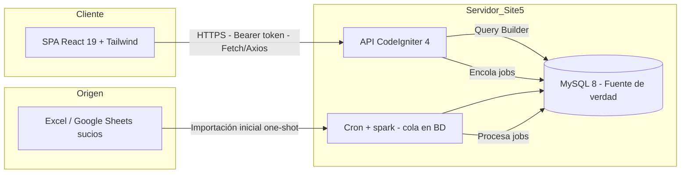
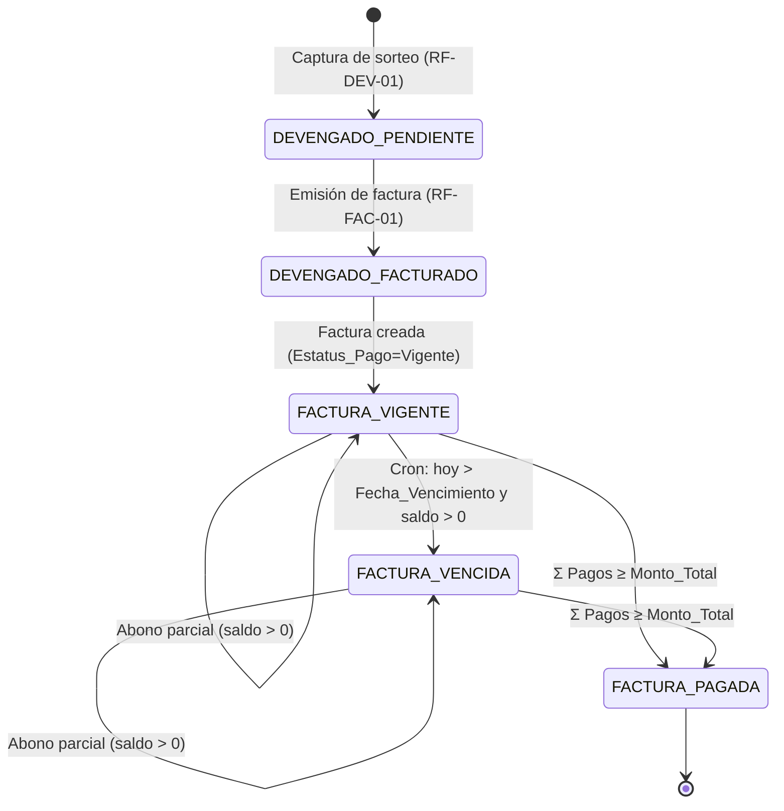

# 01 — Especificación de Requisitos de Software (SRS)

| Campo | Valor |
|---|---|
| **Proyecto** | Portal Ejecutivo BQS — MVP1 |
| **Organización** | Best Quality Solutions México (BQS) · Ciudad Juárez |
| **Documento** | 01 — SRS (Especificación de Requisitos de Software) |
| **Versión** | 1.0 |
| **Fecha** | 18/06/2026 |
| **Estándar** | ISO/IEC/IEEE 29148:2018 |
| **Autor técnico** | Dataholics — Dirección de Tecnología |
| **Depende de** | [Database-Master-Schema](../00-fuentes/BQS-MVP1-Database-Master-Schema.md) · [Technical-Specification](../00-fuentes/BQS-MVP1-Technical-Specification.md) · [QA-Test-Cases](../00-fuentes/BQS-MVP1-QA-Test-Cases.md) · [ADR-001](../02-arquitectura/ADR/ADR-001_stack-ci4-react.md) |

---

## 1. Introducción

### 1.1 Propósito

Este documento especifica, de forma verificable, **qué** debe hacer el Portal Ejecutivo BQS en su MVP1: los requisitos funcionales y no funcionales, los roles, las reglas de negocio de las tres preguntas de la Dirección General y la máquina de estados del ciclo de cobro. Sirve como contrato técnico entre BQS (cliente) y Dataholics (desarrollo), y como fuente de verdad para el diseño ([02](../02-arquitectura/02_arquitectura_sistema.md)), los datos ([03](../03-datos/03_modelo_de_datos.md)) y las pruebas ([06](../06-pruebas/06_plan_de_pruebas.md)). Garantiza que un desarrollador externo entienda el alcance sin ambigüedad.

### 1.2 Alcance del MVP

El MVP1 cubre, de extremo a extremo:

- Consolidación de la información financiera de BQS en una base MySQL única (Tier 0) con IDs únicos y datos saneados.
- Autenticación segura (Shield + whitelist) y perfil de **solo lectura** para la Dirección General.
- Un dashboard que responde las **tres preguntas**: facturado del mes, devengado por facturar, y saldo por cobrar (neto de abonos).
- Capa de captura/administración para el personal de BQS: alta de devengado (sorteo), emisión de facturas, registro de pagos y mantenimiento de catálogos.
- Auditoría de mutaciones financieras.

**Queda explícitamente fuera del MVP1** (ver §8):

- Timbrado fiscal / integración con PAC del SAT (la factura se registra, no se timbra desde el portal).
- Edición o captura financiera **desde el dispositivo de Eric** (su perfil es solo lectura).
- Notas de crédito, cancelaciones fiscales y reversa de facturas pagadas.
- Multidivisa y reglas de impuestos complejas (se asume MXN e IVA estándar).
- App móvil nativa (el portal es web responsivo).
- Lectura en tiempo de ejecución desde Google Sheets/Excel (solo importación inicial).
- Conciliación bancaria automática.

### 1.3 Definiciones, acrónimos y abreviaturas

| Término | Definición |
|---|---|
| **BQS** | Best Quality Solutions México, empresa cliente (inspección/sorteo de piezas). |
| **Dataholics** | Empresa desarrolladora del portal. |
| **MVP1 / Tier 1** | Primer producto mínimo viable: la app de lectura ágil. |
| **Tier 0** | Capa de datos maestra: estructura relacional con IDs únicos. |
| **Devengado** | Trabajo ejecutado (sorteo/inspección) cuyo valor ya se ganó pero puede no estar facturado. |
| **Sorteo** | Proceso de inspección/clasificación de piezas que BQS factura a sus clientes. |
| **Cotización (COT)** | Servicio autorizado por el cliente que fija el límite financiero y enlaza a la Orden de Compra. |
| **PO** | Purchase Order / Orden de Compra del cliente. |
| **Factura** | Folio fiscal emitido al cliente; cuenta por cobrar. |
| **Pago / Abono** | Liquidación total o parcial de una factura. |
| **Saldo por cobrar** | Monto de facturas activas menos pagos aplicados. |
| **Whitelist** | Lista blanca de correos autorizados a iniciar sesión. |
| **Dirección** | Rol de la Dirección General (Eric); solo lectura. |
| **Shield** | Librería de autenticación oficial de CodeIgniter 4. |
| **SPA** | Single Page Application (cliente React). |
| **RBAC** | Role-Based Access Control. |
| **LFPDPPP** | Ley Federal de Protección de Datos Personales en Posesión de los Particulares (México). |
| **ACID** | Atomicidad, Consistencia, Aislamiento, Durabilidad (transacciones). |
| **Site5** | Proveedor de hosting compartido donde se despliega el sistema. |

### 1.4 Stack tecnológico de referencia

| Capa | Tecnología | Versión |
|---|---|---|
| Backend / API | CodeIgniter 4 | 4.7.x (PHP 8.2+) |
| Frontend / SPA | React | 19 (Vite + TypeScript 5.x) |
| Estilos | Tailwind CSS | 3.x |
| Base de datos | MySQL | 8.0 (InnoDB, Site5) |
| Autenticación | Shield + access tokens (Bearer) + whitelist | — |
| Cola / asincronía | Cron + `spark` tasks (cola en BD) | — |

> **Nota de stack:** la fuente designa el frontend como "HTML5 + Tailwind". Se documenta como **React 19** conservando Tailwind y Fetch/Axios; el backend, la BD y la autenticación se mantienen tal cual la fuente. Justificación en [ADR-001](../02-arquitectura/ADR/ADR-001_stack-ci4-react.md).

---

## 2. Descripción general

### 2.1 Perspectiva del producto

El sistema es una **aplicación cliente-servidor desacoplada**: una SPA React consume una API REST de CodeIgniter 4, que es la única que lee y escribe sobre MySQL 8 (autoridad de datos, [ADR-002](../02-arquitectura/ADR/ADR-002_mysql-fuente-de-verdad.md)). Google Sheets/Excel son **canal de importación inicial**, no sistema vivo. El backend calcula las tres preguntas y aplica seguridad y autorización; el cliente solo presenta. Los trabajos pesados (importación, recálculo, vencimientos, notificaciones) se procesan de forma asíncrona por cron ([ADR-004](../02-arquitectura/ADR/ADR-004_cola-asincrona-cron.md)).

### 2.2 Roles de usuario

| Rol | Descripción | Privilegios clave |
|---|---|---|
| `direccion` | Dirección General (Eric). Consume el dashboard. | **Solo lectura (GET)**: dashboard de 3 preguntas, detalle de cartera por cliente. No puede escribir. |
| `capturista` | Personal de planta (Lourdes, Juan Manuel). Registra el trabajo ejecutado. | Alta/edición de `BITACORA_SORTEO` (devengado) sobre cotizaciones vigentes. |
| `facturacion` | Personal administrativo de cobranza/facturación. | Emite `FACTURAS`, registra `PAGOS`, gestiona `COTIZACIONES`. |
| `admin` | Administrador del sistema (Dataholics/BQS). | Gestión de `CAT_CLIENTES`, catálogos, whitelist y usuarios; acceso a auditoría. |

> Un usuario puede tener **múltiples roles** (p. ej. `facturacion` + `admin`). La autorización efectiva es la unión de privilegios, evaluada por Policies del lado servidor. El rol `direccion` nunca obtiene privilegios de escritura aunque se combine.

### 2.3 Suposiciones y dependencias

1. **Infraestructura Site5** disponible con MySQL 8, PHP 8.2+, HTTPS y acceso a cron.
2. La **migración inicial** de Excel/Sheets a MySQL se realiza una sola vez, con limpieza/normalización previa (ver Reglas de Oro del Master Schema).
3. El **timbrado fiscal** lo realiza un sistema externo; el portal solo registra el folio/UUID resultante.
4. Las **tarifas** para calcular `Monto_Devengado` (Horas × Tarifa) provienen de la cotización/contrato vigente.
5. La **whitelist** de correos la administra el rol `admin`; el correo semilla es `eric@bestqualitysolutions.com`.
6. Conectividad: Eric accede por navegador móvil/escritorio; las plantas pueden tener restricciones de uso de móvil (la captura es por personal autorizado en estaciones permitidas).
7. Moneda única **MXN** e IVA estándar para el MVP1.

---

## 3. Requisitos funcionales

> Formato: **RF-[MÓDULO]-[NN]**. Cada requisito incluye un criterio de aceptación verificable.

### 3.1 Autenticación y sesión (`AUTH`)

**RF-AUTH-01** — Inicio de sesión con credenciales
El sistema permite iniciar sesión con correo y contraseña validados por Shield. Tras validar credenciales, el correo debe existir en la whitelist; si no, se niega el acceso aunque la contraseña sea correcta.
**Criterio de aceptación:** un correo válido y en whitelist obtiene un access token; un correo no listado (`intruso@competidor.com`) recibe 403 y pantalla de acceso denegado.

**RF-AUTH-02** — Emisión y refresco de tokens
El sistema emite un access token Bearer de vida corta (en memoria del cliente) y un refresh token en cookie `HttpOnly`+`SameSite=Strict`+`Secure`. El access token se renueva con el refresh sin reingresar credenciales.
**Criterio de aceptación:** expirado el access token, el cliente obtiene uno nuevo vía refresh; sin refresh válido, se exige reingreso.

**RF-AUTH-03** — Cierre de sesión y revocación
El cierre de sesión revoca el token activo en BD e invalida el refresh.
**Criterio de aceptación:** tras logout, el token anterior recibe 401 en cualquier endpoint.

**RF-AUTH-04** — Solo lectura para Dirección
El rol `direccion` solo puede ejecutar métodos GET; cualquier intento de `POST/PUT/PATCH/DELETE` se rechaza.
**Criterio de aceptación:** una petición de escritura con token de `direccion` devuelve 403 sin alterar datos.

### 3.2 Gestión de cuentas y whitelist (`CTA`)

**RF-CTA-01** — Administración de whitelist
El rol `admin` puede listar, agregar y revocar correos autorizados.
**Criterio de aceptación:** un correo revocado no puede iniciar sesión a partir de ese momento.

**RF-CTA-02** — Asignación de roles
El rol `admin` asigna uno o más roles a cada usuario.
**Criterio de aceptación:** un usuario con `facturacion` puede emitir facturas; sin ese rol, recibe 403.

### 3.3 Catálogo de clientes (`CLI`) — CRUD

**RF-CLI-01** — Consolidación por ID único
Cada cliente se identifica por `ID_Cliente` (`CLI-XXX`) inalterable. Los nombres comerciales variantes se mapean a un único ID.
**Criterio de aceptación:** registros previos "NIDEC Mobility" y "Nidec México" se presentan como **una** entidad `CLI-001` con su cartera sumada ([Caso QA 1](../00-fuentes/BQS-MVP1-QA-Test-Cases.md)).

**RF-CLI-02** — Alta/edición/baja lógica de clientes
El rol `admin` da de alta y edita clientes (Nombre_Fiscal, Nombre_Comercial, RFC, Estatus). La baja es lógica (`Estatus = Inactivo`), nunca física si hay movimientos asociados.
**Criterio de aceptación:** no se permite eliminar físicamente un cliente con cotizaciones o facturas (FK `RESTRICT`); se marca `Inactivo`.

**RF-CLI-03** — Consulta de cartera por cliente
Los roles autorizados consultan el detalle financiero por cliente (cotizaciones, facturas, saldo).
**Criterio de aceptación:** el detalle muestra el saldo del cliente igual a la suma de sus facturas activas menos pagos.

### 3.4 Cotizaciones (`COT`)

**RF-COT-01** — Registro de cotización autorizada
El rol `facturacion` registra cotizaciones (`COT-XXXX`) ligadas a un cliente, con `PO_Referencia`, `Monto_Autorizado`, `Piezas_Autorizadas` y `Estatus`.
**Criterio de aceptación:** una cotización `Aprobada` queda disponible para asociar devengado.

**RF-COT-02** — Control de límite autorizado
El sistema expone el consumo de una cotización (devengado acumulado vs `Monto_Autorizado`).
**Criterio de aceptación:** al consultar una cotización se muestra cuánto se ha devengado contra su límite.

### 3.5 Bitácora de sorteo / devengado (`DEV`)

**RF-DEV-01** — Captura de trabajo ejecutado
El rol `capturista` registra en `BITACORA_SORTEO` (`CAP-XXXXX`) la fecha, cotización origen, horas, piezas y `Monto_Devengado`, con `Estatus_Facturacion = Pendiente`.
**Criterio de aceptación:** un registro nuevo nace `Pendiente` y suma al indicador "por facturar" de su cotización.

**RF-DEV-02** — Validación numérica estricta
Los campos numéricos (horas, piezas, monto) rechazan texto, negativos y nulos no permitidos.
**Criterio de aceptación:** un intento de capturar `"N/A"` o un monto negativo se rechaza con error de validación.

### 3.6 Facturas (`FAC`) — con máquina de estados

**RF-FAC-01** — Emisión de factura desde devengado
El rol `facturacion` emite una `FACTURA` (`F-XXXXX`) para un cliente, seleccionando uno o varios registros de devengado `Pendiente`. La operación, en una sola transacción ACID: crea la factura con `Estatus_Pago = Vigente` y marca los devengados como `Facturado`.
**Criterio de aceptación:** tras emitir, los devengados pasan a `Facturado`, la factura queda `Vigente` y el indicador "por facturar" disminuye en el monto facturado. Si algo falla, no se altera ningún registro (rollback).

**RF-FAC-02** — Estados de la factura
Una factura transita por `Vigente → Vencida → Pagada` según fecha de vencimiento y pagos aplicados (ver §4). Un pago total la marca `Pagada`; el cron diario marca `Vencida` las no pagadas pasadas de `Fecha_Vencimiento`.
**Criterio de aceptación:** una factura cuya `Fecha_Vencimiento` ya pasó y sin pago total aparece como `Vencida`.

**RF-FAC-03** — Inmutabilidad de factura pagada
Una factura `Pagada` no admite nuevas transiciones de estado en el MVP1.
**Criterio de aceptación:** intentar reabrir o revertir una factura `Pagada` se rechaza.

### 3.7 Pagos (`PAG`)

**RF-PAG-01** — Registro de pago/abono
El rol `facturacion` registra en `PAGOS` (`PAG-XXXX`) un abono ligado a una factura, con fecha, monto y referencia. En la misma transacción se reevalúa el `Estatus_Pago` de la factura.
**Criterio de aceptación:** si la suma de pagos ≥ `Monto_Total`, la factura pasa a `Pagada`; si es parcial, permanece `Vigente`/`Vencida` y el saldo disminuye en el abono ([Caso QA 4](../00-fuentes/BQS-MVP1-QA-Test-Cases.md)).

**RF-PAG-02** — Prevención de sobrepago
El sistema impide registrar pagos que excedan el saldo pendiente de la factura.
**Criterio de aceptación:** un abono mayor al saldo restante se rechaza con error de validación de negocio.

### 3.8 Dashboard ejecutivo — las tres preguntas (`DASH`)

**RF-DASH-01** — ¿Qué ya se facturó? (Pregunta 1)
El dashboard muestra el total facturado del **mes en curso**: suma de `FACTURAS.Monto_Total` cuyo `Fecha_Emision` cae en el mes actual y cuyo `Estatus_Pago` es `Pagada` o `Vigente`.
**Criterio de aceptación:** con $100,000 emitidos este mes y $50,000 el mes anterior, el indicador muestra exactamente **$100,000.00** ([Caso QA 2](../00-fuentes/BQS-MVP1-QA-Test-Cases.md)).

**RF-DASH-02** — ¿Qué falta por facturar? (Pregunta 2)
El dashboard muestra el total devengado no facturado: suma de `BITACORA_SORTEO.Monto_Devengado` con `Estatus_Facturacion = Pendiente`, con desglose por `ID_Cotizacion`.
**Criterio de aceptación:** al existir $10,000 devengado `Pendiente`, el indicador y su desglose por cotización reflejan +$10,000 ([Caso QA 3](../00-fuentes/BQS-MVP1-QA-Test-Cases.md)).

**RF-DASH-03** — ¿Cuánto te deben? (Pregunta 3)
El dashboard muestra el saldo por cobrar: suma de `Monto_Total` de facturas activas (`Vigente` o `Vencida`) menos la suma de `PAGOS` asociados.
**Criterio de aceptación:** factura `F-9901` de $50,000 con abono de $20,000 reporta saldo **$30,000.00** ([Caso QA 4](../00-fuentes/BQS-MVP1-QA-Test-Cases.md)).

**RF-DASH-04** — Cálculo en servidor
Las tres cifras se calculan en el backend; el cliente nunca las recalcula ni las recibe como entrada manipulable.
**Criterio de aceptación:** la respuesta de la API trae los totales ya calculados; alterar el payload del cliente no cambia los valores mostrados oficialmente.

### 3.9 Administración y captura (`ADM`)

**RF-ADM-01** — Panel de captura/administración
Los roles `capturista`, `facturacion` y `admin` acceden a un panel para sus operaciones de escritura según su rol.
**Criterio de aceptación:** cada rol ve solo las acciones permitidas; las no permitidas no se renderizan y se bloquean en backend.

**RF-ADM-02** — Importación inicial de datos
El rol `admin` dispara la importación inicial de Excel/Sheets, procesada de forma asíncrona, que normaliza nombres a `ID_Cliente` y sanea numéricos.
**Criterio de aceptación:** finalizada la importación, los clientes variantes quedan consolidados y los montos son numéricos válidos.

### 3.10 Auditoría, métricas y reportes (`MET`)

**RF-MET-01** — Auditoría de mutaciones
Toda escritura sobre `FACTURAS`, `PAGOS`, `BITACORA_SORTEO`, `COTIZACIONES`, `CAT_CLIENTES` y la whitelist registra en `AUDITORIA`: usuario, acción, entidad, id, antes/después y timestamp.
**Criterio de aceptación:** registrar un pago genera una entrada de auditoría con el usuario y el folio afectado.

**RF-MET-02** — Reporte de cartera
El sistema expone un resumen de cartera (facturado, por facturar, por cobrar) global y por cliente, para los roles autorizados.
**Criterio de aceptación:** el resumen global coincide con la suma de los resúmenes por cliente.

---

## 4. Máquina de estados del Ciclo de Cobro

El flujo principal del sistema es la conversión de trabajo ejecutado en dinero cobrado: **devengado → facturado → cobrado**. Estados y transiciones:

### 4.1 Tabla de transiciones

| Estado origen | Condición de transición | Estado destino | Actor responsable |
|---|---|---|---|
| (inicial) | Captura de devengado en cotización vigente | `DEVENGADO_PENDIENTE` | `capturista` |
| `DEVENGADO_PENDIENTE` | Se incluye en una factura emitida | `DEVENGADO_FACTURADO` | `facturacion` |
| `DEVENGADO_FACTURADO` | Factura creada en la misma transacción | `FACTURA_VIGENTE` | `facturacion` (sistema) |
| `FACTURA_VIGENTE` | Abono parcial (Σ Pagos < Monto_Total) | `FACTURA_VIGENTE` | `facturacion` |
| `FACTURA_VIGENTE` | Hoy > `Fecha_Vencimiento` y saldo > 0 | `FACTURA_VENCIDA` | sistema (cron diario) |
| `FACTURA_VIGENTE` | Σ Pagos ≥ Monto_Total | `FACTURA_PAGADA` | `facturacion` |
| `FACTURA_VENCIDA` | Abono parcial (saldo > 0) | `FACTURA_VENCIDA` | `facturacion` |
| `FACTURA_VENCIDA` | Σ Pagos ≥ Monto_Total | `FACTURA_PAGADA` | `facturacion` |

### 4.2 Reglas invariantes (transiciones ilegales)

1. **No hay reverso de `FACTURA_PAGADA`** en el MVP1: una factura pagada es terminal (correcciones vía nota de crédito → fuera de alcance, §8).
2. **No se "desfactura"**: un `DEVENGADO_FACTURADO` no vuelve a `DEVENGADO_PENDIENTE`.
3. **No se salta a `FACTURA_PAGADA`** sin pasar por `FACTURA_VIGENTE` (toda factura nace `Vigente`).
4. **Un abono nunca excede el saldo** (RF-PAG-02); no existe estado de "sobrepago".
5. **Solo el sistema (cron) marca `FACTURA_VENCIDA`**; ningún usuario la fuerza manualmente.
6. **`direccion` no dispara ninguna transición** (solo lectura, RF-AUTH-04).

---

## 5. Requisitos no funcionales

| ID | Categoría | Requisito | Criterio medible |
|---|---|---|---|
| RNF-01 | Rendimiento | El dashboard de las 3 preguntas responde con baja latencia. | P95 de los endpoints de dashboard < 800 ms con datos de un año de operación. |
| RNF-02 | Rendimiento | Las agregaciones usan índices, no escaneos completos. | Las consultas de cálculo usan índices sobre `Fecha_Emision`, `Estatus_Pago`, `Estatus_Facturacion`. |
| RNF-03 | Seguridad | Todo el tráfico cifrado y con cabeceras de seguridad. | HTTPS forzado, HSTS, CSP estricta; calificación A en SSL Labs. |
| RNF-04 | Seguridad | Acceso doble barrera. | Credenciales válidas **y** correo en whitelist; perfil `direccion` solo GET. |
| RNF-05 | Escalabilidad | Crecimiento hacia cartera completa sin rediseño. | Esquema normalizado y API versionada permiten añadir módulos sin romper contratos. |
| RNF-06 | Disponibilidad | Operación diaria estable en Site5. | Disponibilidad objetivo ≥ 99% mensual; jobs con reintentos. |
| RNF-07 | Usabilidad | Lectura clara en móvil para la Dirección. | Dashboard legible a 360 px de ancho; 3 KPIs visibles sin scroll horizontal. |
| RNF-08 | Usabilidad | Accesibilidad de color. | Contraste WCAG 2.1 AA; el estado no depende solo del color (ver [08](08_identidad_visual_design_system.md)). |
| RNF-09 | Privacidad / Cumplimiento | Manejo de datos conforme LFPDPPP. | PII identificada (RFC, nombres, correos); derechos ARCO atendibles; auditoría activa. |
| RNF-10 | Integridad | Consistencia financiera garantizada. | Toda escritura multi-tabla es ACID; FKs `RESTRICT`; `CHECK` en numéricos y enums. |
| RNF-11 | Mantenibilidad | Calidad de código verificable. | PHPStan nivel 8 sin errores; cero errores de tipado TS; cobertura ≥ 70% en lógica de negocio. |
| RNF-12 | Trazabilidad | Toda mutación financiera auditable. | 100% de escrituras sobre entidades financieras registran en `AUDITORIA`. |

---

## 6. Restricciones técnicas

1. **Despliegue en Site5** (hosting compartido): sin workers persistentes; asincronía vía cron ([ADR-004](../02-arquitectura/ADR/ADR-004_cola-asincrona-cron.md)).
2. **MySQL 8 como única autoridad** ([ADR-002](../02-arquitectura/ADR/ADR-002_mysql-fuente-de-verdad.md)); prohibido leer Sheets en runtime.
3. **Sin credenciales en el repositorio**: todo secreto en `.env` fuera de control de versiones (ver [04 §4.1](../04-seguridad/04_plan_de_seguridad.md)).
4. **Nomenclatura Tier 0 inmutable**: nombres de tablas y columnas del Master Schema no se renombran.
5. **Backend, BD y auth conforme a la fuente**; la única decisión de stack es el cliente React ([ADR-001](../02-arquitectura/ADR/ADR-001_stack-ci4-react.md)).
6. **Cumplimiento LFPDPPP** (México) para datos personales y fiscales.

---

## 7. Criterios de aceptación del MVP

El MVP1 se considera terminado y lanzable cuando:

1. La importación inicial consolida clientes variantes en un único `ID_Cliente` con cartera sumada (Caso QA 1).
2. La Pregunta 1 muestra exactamente el facturado del mes en curso, excluyendo meses previos (Caso QA 2).
3. La Pregunta 2 refleja en tiempo real el devengado `Pendiente` con desglose por cotización (Caso QA 3).
4. La Pregunta 3 calcula el saldo por cobrar neto de abonos parciales (Caso QA 4).
5. La whitelist bloquea cualquier correo no autorizado (Caso QA 5).
6. El perfil `direccion` no puede ejecutar ninguna escritura (RF-AUTH-04).
7. Emitir factura y registrar pago son transacciones ACID con auditoría.
8. La máquina de estados §4 se cumple sin transiciones ilegales (verificado en [06](../06-pruebas/06_plan_de_pruebas.md)).
9. Calidad: PHPStan nivel 8, cero errores TS, sin vulnerabilidades conocidas en dependencias.

---

## 8. Consideraciones futuras (fuera del MVP1)

- Timbrado fiscal directo con PAC del SAT y descarga de XML/PDF.
- Notas de crédito, cancelaciones y reversa de facturas pagadas.
- Conciliación bancaria automática (match de SPEI con `PAGOS`).
- Notificaciones proactivas (correo/WhatsApp) de facturas por vencer y vencidas.
- Multidivisa y reglas fiscales avanzadas.
- App móvil nativa y modo offline para captura en planta.
- Reportes históricos avanzados y proyección de flujo de efectivo.
- Captura financiera delegada (con doble confirmación) desde el perfil de Dirección.
