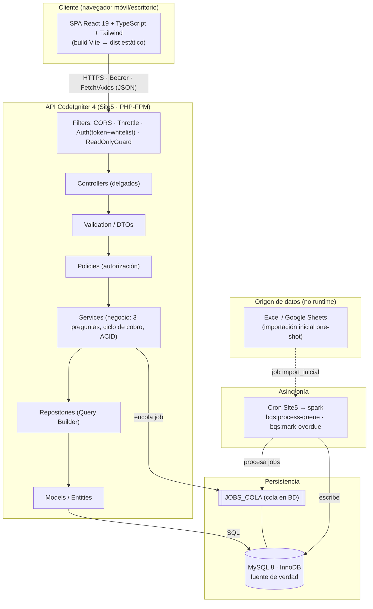
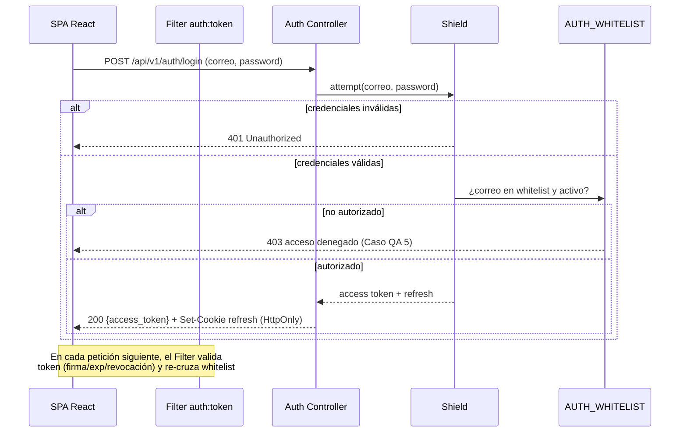
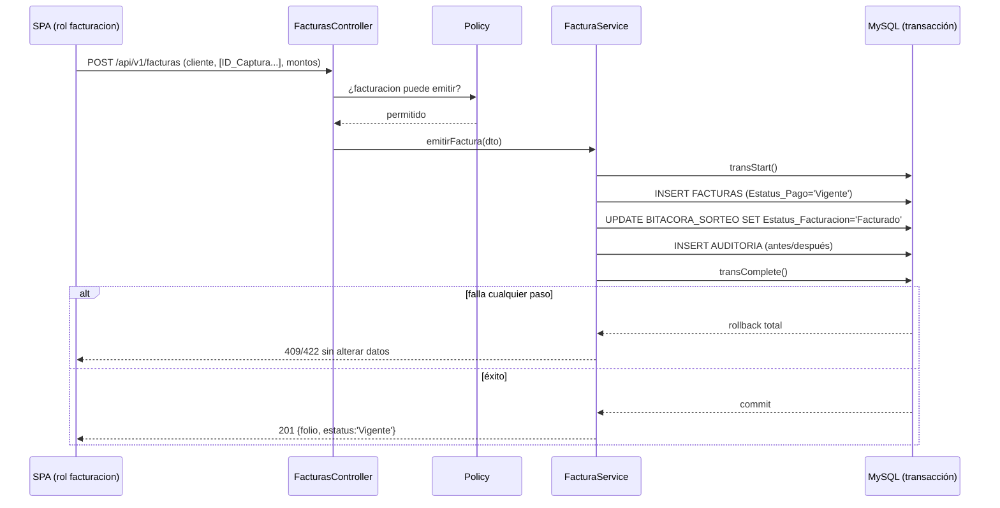
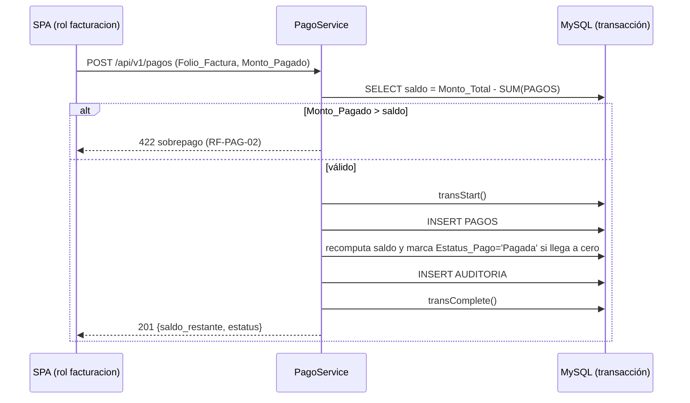
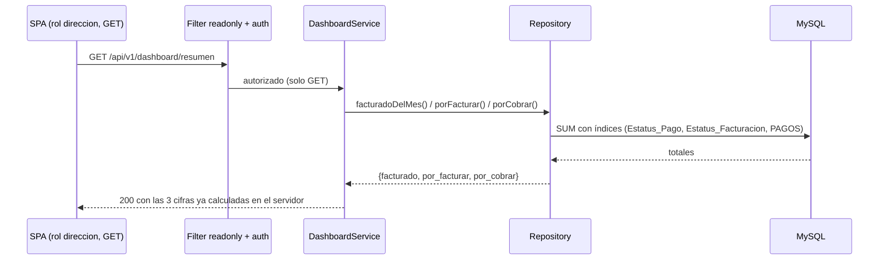
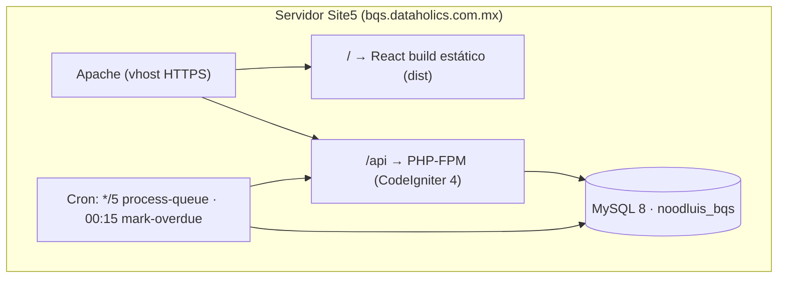

# 02 — Arquitectura del Sistema

| Campo | Valor |
|---|---|
| **Documento** | 02 — Arquitectura del Sistema |
| **Versión** | 1.0 |
| **Fecha** | 18/06/2026 |
| **Depende de** | [SRS (01)](../01-vision/01_SRS_especificacion_requisitos.md) · [Modelo de Datos (03)](../03-datos/03_modelo_de_datos.md) · [ADR-001](ADR/ADR-001_stack-ci4-react.md) · [ADR-002](ADR/ADR-002_mysql-fuente-de-verdad.md) · [ADR-003](ADR/ADR-003_autenticacion-shield-jwt.md) · [ADR-004](ADR/ADR-004_cola-asincrona-cron.md) |
| **Reemplaza** | — |

> **Decisión de stack del cliente.** El frontend se documenta como SPA React 19 sobre el "HTML5 + Tailwind" de la fuente; el backend, la BD y la autenticación se conservan tal cual. Ver [ADR-001](ADR/ADR-001_stack-ci4-react.md).

---

## 1. Principios rectores

**Fuente de verdad única.** MySQL 8 (InnoDB) es la autoridad absoluta de datos; el cliente y los Excel/Sheets nunca lo son. *Por qué:* el problema de BQS es la dispersión de datos en hojas sucias; cualquier lógica que vuelva a depender de ellas en runtime reintroduce el caos que el sistema existe para eliminar.

**El servidor decide; el cliente presenta.** Toda autorización, validación de negocio y cálculo (las 3 preguntas, saldos, vencimientos) ocurre en el backend. *Por qué:* el navegador es manipulable; confiar en él para seguridad o montos abre la puerta a fraude y a cifras financieras incorrectas.

**Integridad transaccional.** Toda operación que toca más de una tabla (emitir factura, registrar pago) es ACID. *Por qué:* un estado financiero a medias corrompe la cartera y las tres preguntas; la consistencia no es negociable en dinero.

**Simplicidad operativa acorde a Site5.** Monolito modular, una sola base, asincronía por cron. *Por qué:* BQS no necesita microservicios; la complejidad innecesaria encarece operación y mantenimiento en un hosting compartido sin workers persistentes.

**Trazabilidad por diseño.** Cada mutación financiera se audita; cada acceso de Dirección se registra. *Por qué:* requisito de cumplimiento (LFPDPPP) y base forense ante disputas de cobranza.

---

## 2. Estilo arquitectónico

**Monolito modular cliente-servidor desacoplado.** Un único backend CodeIgniter 4 expone una API REST versionada que una SPA React consume por HTTPS con tokens Bearer. No se adoptan microservicios: el dominio de BQS (5 entidades, un usuario ejecutivo, captura por personal reducido) no justifica la complejidad operativa, de despliegue y de observabilidad de servicios distribuidos. Un monolito modular —con capas internas bien separadas— ofrece la misma claridad de responsabilidades con **un solo despliegue, una sola base y un solo punto de seguridad**, lo cual es económicamente óptimo en Site5. El desacoplamiento cliente/servidor permite, además, que el frontend evolucione (o se reemplace) sin tocar el núcleo de negocio.

### 2.1 Diagrama de capas



---

## 3. Descripción de capas

### 3.1 Capa de presentación / cliente
**Responsabilidad:** renderizar el dashboard de las 3 preguntas y los formularios de captura/administración; gestionar el token en memoria. **Tecnología:** React 19 + TypeScript + Tailwind, build con Vite a estático. **Reglas:** consume solo la API REST por Fetch/Axios; el access token vive en memoria (nunca en `localStorage`); el refresh viaja en cookie `HttpOnly`. **No debe:** calcular montos oficiales, decidir permisos, ni asumir que ocultar un botón equivale a autorizar (el backend revalida siempre).

### 3.2 Filtros / Middlewares
**Responsabilidad:** primera línea de defensa antes del controlador. **Filtros:** `cors` (orígenes permitidos), `throttle` (rate limiting), `auth:token` (valida token Shield + cruza whitelist), `readonly` (bloquea métodos no-GET para el rol `direccion`). **Reglas:** se aplican por grupo de rutas en `Routes.php`. **No debe:** contener lógica de negocio.

### 3.3 Controladores
**Responsabilidad:** recibir la request, delegar a validación/policy/servicio y formatear la respuesta JSON. **Tecnología:** controladores CI4 delgados (extienden `BaseController`/`ResourceController`). **Reglas:** sin SQL, sin reglas de negocio, sin cálculos; máximo orquestar. **No debe:** acceder a modelos directamente para lógica compleja (eso es del servicio).

### 3.4 Validación y DTOs
**Responsabilidad:** garantizar forma y tipo de la entrada antes de tocar negocio. **Tecnología:** reglas de validación CI4 + objetos de transferencia tipados. **Reglas:** rechazar texto en numéricos, negativos, fechas inválidas, enums fuera de catálogo. **No debe:** validar reglas de negocio que requieran estado de BD (eso es del servicio/policy).

### 3.5 Servicios de autorización (Policies)
**Responsabilidad:** responder "¿este usuario+rol puede esta acción sobre este recurso?". **Reglas:** evaluadas del lado servidor, por recurso e id (previene IDOR); `direccion` nunca obtiene escritura. **No debe:** confiar en flags del cliente.

### 3.6 Servicios de negocio
**Responsabilidad:** el corazón del sistema: cálculo de las 3 preguntas, emisión de factura, registro de pago, transiciones del ciclo de cobro, encolado de jobs. **Reglas:** toda escritura multi-tabla en transacción ACID; emite eventos de auditoría. **No debe:** formatear HTTP ni conocer la request.

### 3.7 Repositorios
**Responsabilidad:** encapsular consultas y agregaciones (Query Builder), incluidas las sumas de las 3 preguntas. **Reglas:** consultas parametrizadas (jamás concatenar SQL); usar los índices definidos en [03](../03-datos/03_modelo_de_datos.md). **No debe:** contener reglas de negocio.

### 3.8 Modelos y Entidades
**Responsabilidad:** mapear filas a objetos y definir casts/atributos. **Tecnología:** `CodeIgniter\Model` + Entities. **Reglas:** un modelo por tabla; los montos se castean a tipo numérico exacto. **No debe:** orquestar transacciones de varias tablas.

### 3.9 Cola y trabajos asíncronos
**Responsabilidad:** ejecutar trabajo pesado fuera de la request: importación inicial, recálculo de saldos, marcado de vencidas, notificaciones. **Tecnología:** tabla `JOBS_COLA` + comandos `spark` por cron ([ADR-004](ADR/ADR-004_cola-asincrona-cron.md)). **Reglas:** jobs idempotentes, con reintentos y `max_intentos`. **No debe:** ejecutarse en línea dentro de una petición HTTP.

### 3.10 Eventos y auditoría
**Responsabilidad:** registrar en `AUDITORIA` toda mutación financiera (antes/después, usuario, ip) y los accesos de Dirección. **Reglas:** la auditoría es inmutable (solo inserción); se escribe dentro de la misma transacción de la mutación. **No debe:** poder editarse o borrarse desde la app.

---

## 4. Flujos de datos críticos

### 4.1 Autenticación con whitelist y solo lectura



### 4.2 Emisión de factura (transacción ACID)



### 4.3 Registro de pago y reevaluación de estatus



### 4.4 Dashboard de las 3 preguntas (cálculo en servidor)



---

## 5. Patrones de implementación

> Snippets representativos (CI4 4.7 / PHP 8.2 y React 19 / TS). Ilustran patrones; no son el código completo.

**Controlador delgado (delega, no calcula):**

```php
<?php
namespace App\Controllers\Api\V1;

use App\Controllers\BaseController;
use App\Services\DashboardService;
use CodeIgniter\HTTP\ResponseInterface;

final class DashboardController extends BaseController
{
    public function __construct(private readonly DashboardService $dashboard = new DashboardService()) {}

    public function resumen(): ResponseInterface
    {
        // Sin SQL ni cálculo aquí: el servicio resuelve las 3 preguntas.
        $data = $this->dashboard->resumenEjecutivo();
        return $this->response->setJSON(['data' => $data]);
    }
}
```

**Cadena validación → policy → service (emitir factura):**

```php
<?php
namespace App\Controllers\Api\V1;

use App\Controllers\BaseController;
use App\Services\FacturaService;
use App\Policies\FacturaPolicy;
use CodeIgniter\HTTP\ResponseInterface;

final class FacturasController extends BaseController
{
    public function create(): ResponseInterface
    {
        // 1) Validación de forma/tipos
        $rules = [
            'id_cliente'   => 'required|string|max_length[20]',
            'capturas'     => 'required|is_list',
            'monto_total'  => 'required|decimal|greater_than_equal_to[0]',
        ];
        if (! $this->validate($rules)) {
            return $this->response->setStatusCode(422)
                ->setJSON(['error' => ['code' => 'VALIDATION', 'fields' => $this->validator->getErrors()]]);
        }

        // 2) Autorización por rol/recurso (servidor)
        if (! FacturaPolicy::canCreate(auth()->user())) {
            return $this->response->setStatusCode(403)
                ->setJSON(['error' => ['code' => 'FORBIDDEN']]);
        }

        // 3) Negocio + transacción ACID dentro del servicio
        $factura = (new FacturaService())->emitir($this->request->getJSON(true));
        return $this->response->setStatusCode(201)->setJSON(['data' => $factura]);
    }
}
```

**Transacción multi-tabla (servicio):**

```php
<?php
namespace App\Services;

use Config\Database;

final class FacturaService
{
    public function emitir(array $dto): array
    {
        $db = Database::connect();
        $db->transStart(); // ACID: todo o nada

        $folio = $this->generarFolio();
        $db->table('FACTURAS')->insert([
            'Folio_Factura' => $folio,
            'ID_Cliente'    => $dto['id_cliente'],
            'Fecha_Emision' => date('Y-m-d'),
            'Monto_Subtotal'=> $dto['monto_subtotal'],
            'Monto_Total'   => $dto['monto_total'],
            'Fecha_Vencimiento' => $dto['fecha_vencimiento'],
            'Estatus_Pago'  => 'Vigente',
        ]);

        // Marca el devengado consumido como Facturado
        $db->table('BITACORA_SORTEO')
           ->whereIn('ID_Captura', $dto['capturas'])
           ->update(['Estatus_Facturacion' => 'Facturado']);

        $this->auditar($db, 'crear', 'FACTURAS', $folio, null, ['estatus' => 'Vigente']);

        $db->transComplete(); // rollback automático si algo falló
        if ($db->transStatus() === false) {
            throw new \RuntimeException('No se pudo emitir la factura; cambios revertidos.');
        }
        return ['folio' => $folio, 'estatus' => 'Vigente'];
    }
}
```

**Emisión/verificación de autenticación (Shield + whitelist):**

```php
<?php
namespace App\Controllers\Api\V1;

use App\Controllers\BaseController;
use App\Models\WhitelistModel;

final class AuthController extends BaseController
{
    public function login()
    {
        $creds = ['email' => $this->request->getVar('correo'), 'password' => $this->request->getVar('password')];
        $result = auth()->attempt($creds);
        if (! $result->isOK()) {
            return $this->response->setStatusCode(401)->setJSON(['error' => ['code' => 'BAD_CREDENTIALS']]);
        }
        // Segunda barrera: whitelist (Caso QA 5)
        if (! (new WhitelistModel())->estaAutorizado($creds['email'])) {
            auth()->logout();
            return $this->response->setStatusCode(403)->setJSON(['error' => ['code' => 'NOT_WHITELISTED']]);
        }
        $token = auth()->user()->generateAccessToken('spa')->raw_token;
        return $this->response->setJSON(['access_token' => $token]); // refresh va en cookie HttpOnly
    }
}
```

**Cliente React: consumo del dashboard (token en memoria):**

```tsx
import { useEffect, useState } from "react";
import { api } from "@/lib/api"; // instancia Axios con interceptor de Bearer

type Resumen = { facturado: number; por_facturar: number; por_cobrar: number };

export function useResumenEjecutivo() {
  const [data, setData] = useState<Resumen | null>(null);
  const [error, setError] = useState<string | null>(null);

  useEffect(() => {
    let activo = true;
    api.get<{ data: Resumen }>("/v1/dashboard/resumen")
      .then((r) => activo && setData(r.data.data))   // el backend ya calculó; el cliente solo renderiza
      .catch(() => activo && setError("No se pudo cargar el resumen"));
    return () => { activo = false; };
  }, []);

  return { data, error };
}
```

---

## 6. Estrategia de despliegue

**Infraestructura:** Site5 (hosting compartido Linux): Apache + PHP-FPM (PHP 8.2), MySQL 8, HTTPS con certificado válido, acceso a cron. El backend CI4 sirve `/api`; el build estático de React (`/web/dist`) se sirve como sitio en la raíz del dominio `bqs.dataholics.com.mx`.



**Checklist de hardening de producción:**

1. HTTPS forzado (redirección 80→443) + HSTS habilitado.
2. Cabeceras: `Content-Security-Policy` estricta, `X-Content-Type-Options: nosniff`, `X-Frame-Options: DENY`, `Referrer-Policy`.
3. `.env` fuera del docroot y fuera de control de versiones; `CI_ENVIRONMENT=production`.
4. Usuario MySQL de aplicación con privilegios mínimos (sin `DROP`/`GRANT`).
5. Mensajes de error genéricos al cliente; detalle solo en logs del servidor.
6. Cookies de refresh `HttpOnly` + `Secure` + `SameSite=Strict`.
7. Rate limiting activo en `auth/login` y endpoints sensibles.
8. Backups automáticos diarios de MySQL y prueba de restauración.
9. Desactivar listados de directorio y accesos a `writable/` y `app/`.
10. Rotación y custodia de las credenciales de despliegue (ver [mejoras](../OPORTUNIDADES_DE_MEJORA.md) sobre credenciales en la fuente).

---

## 7. Decisiones de diseño pendientes / riesgos técnicos

| Decisión / Riesgo | Opciones consideradas | Estado |
|---|---|---|
| Stack del cliente (HTML5 vs framework) | HTML5 plano · React 19 | **Decidido** en [ADR-001](ADR/ADR-001_stack-ci4-react.md) (React 19) |
| Autoridad de datos | Sheets vivo · MySQL único | **Decidido** en [ADR-002](ADR/ADR-002_mysql-fuente-de-verdad.md) (MySQL) |
| Mecanismo de sesión SPA | Sesión servidor · Access tokens | **Decidido** en [ADR-003](ADR/ADR-003_autenticacion-shield-jwt.md) (tokens + whitelist) |
| Asincronía en hosting compartido | Worker persistente · Cron + cola BD | **Decidido** en [ADR-004](ADR/ADR-004_cola-asincrona-cron.md) (cron) |
| Enlace devengado→factura | Inferir por cotización · FK explícita `Folio_Factura` en `BITACORA_SORTEO` | **Pendiente** — propuesto en [mejoras](../OPORTUNIDADES_DE_MEJORA.md); no altera el Tier 0 en MVP1 |
| Cálculo de saldo | Derivado en consulta · Campo materializado `saldo` | **Pendiente** — MVP1 usa derivado; materializar si el volumen lo exige |
| Credenciales en documento fuente | Mantener · Rotar + `.env` | **Pendiente** — ver [mejoras](../OPORTUNIDADES_DE_MEJORA.md); hardening recomendado |
