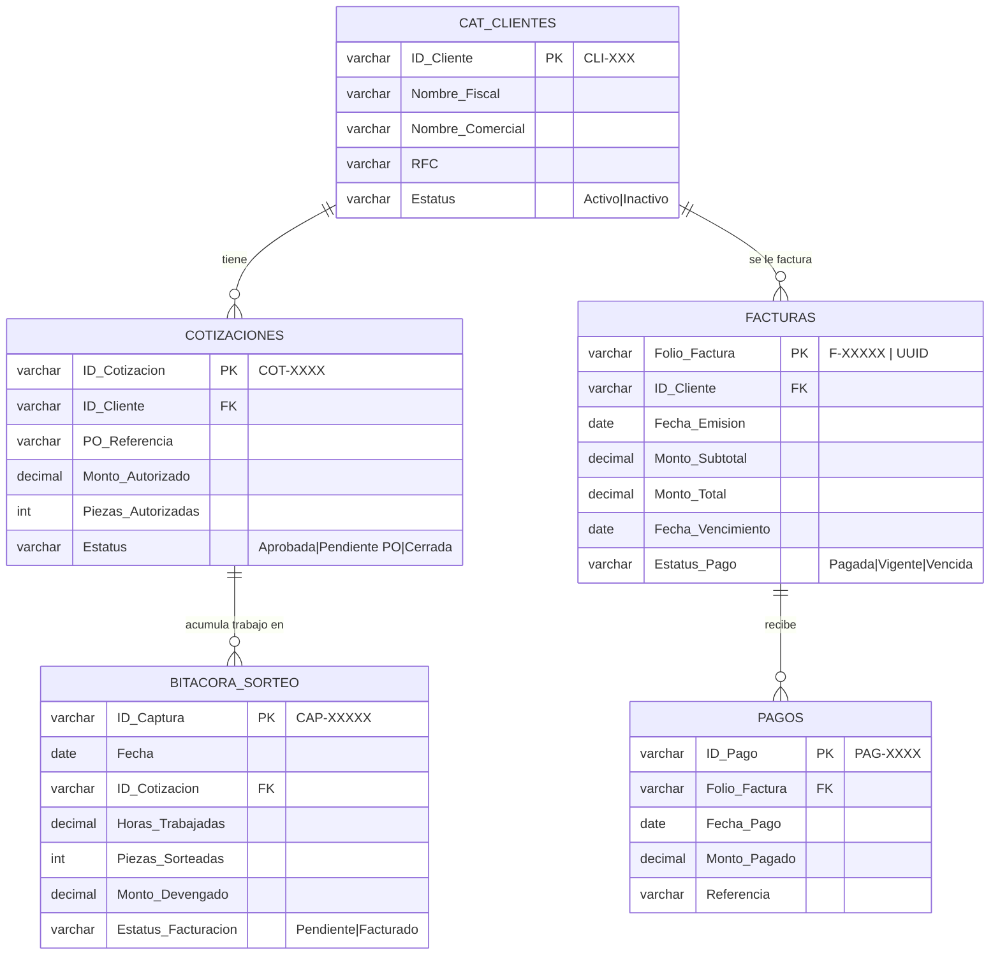
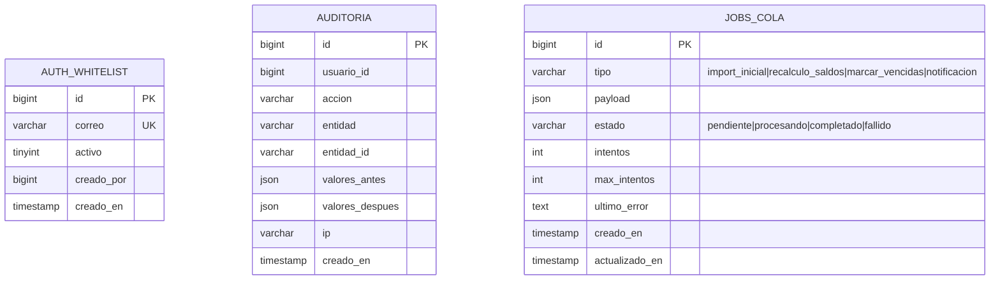

# 03 — Modelo de Datos

| Campo | Valor |
|---|---|
| **Documento** | 03 — Modelo de Datos |
| **Versión** | 1.0 |
| **Fecha** | 18/06/2026 |
| **Motor** | MySQL 8.0 (InnoDB) en Site5 |
| **Normalización** | 3FN sobre las entidades de dominio Tier 0 |
| **Depende de** | [Database-Master-Schema](../00-fuentes/BQS-MVP1-Database-Master-Schema.md) · [ADR-002](../02-arquitectura/ADR/ADR-002_mysql-fuente-de-verdad.md) · [SRS §3, §4](../01-vision/01_SRS_especificacion_requisitos.md) |

> **Fidelidad a la fuente.** Las **5 tablas de dominio** (`CAT_CLIENTES`, `COTIZACIONES`, `BITACORA_SORTEO`, `FACTURAS`, `PAGOS`) reproducen **exactamente** los nombres de tabla y columna del Master Schema (Tier 0); no se renombra ni se altera ningún campo estipulado. Las tablas de **soporte/infraestructura** (`AUTH_WHITELIST`, `AUDITORIA`, `JOBS_COLA`) son adiciones necesarias para autenticación, auditoría y asincronía exigidas por el estándar de ingeniería; no modifican el modelo de negocio. Las propuestas de evolución (p. ej. enlazar el devengado facturado con su folio) están en [`OPORTUNIDADES_DE_MEJORA.md`](../OPORTUNIDADES_DE_MEJORA.md), **no** aplicadas aquí.

---

## 1. Diagrama Entidad-Relación (dominio Tier 0)



## 2. Tablas de soporte / infraestructura

No se usan servicios no relacionales: toda la persistencia vive en MySQL ([ADR-002](../02-arquitectura/ADR/ADR-002_mysql-fuente-de-verdad.md)). Las tablas de soporte son:



> La **autenticación** usa las tablas propias de **CodeIgniter Shield** (`users`, `auth_identities`, `auth_logins`, `auth_token_logins`, `auth_groups_users`, `auth_permissions_users`), creadas por sus migraciones oficiales. `AUTH_WHITELIST` complementa a Shield con la lista blanca de correos exigida por la fuente (§3).

---

## 3. Diccionario de datos

### `CAT_CLIENTES`
Catálogo maestro de clientes con identificador único; consolida nombres comerciales variantes en un solo ID.

| Columna | Tipo | Nullable | Default | Restricciones | Descripción |
|---|---|---|---|---|---|
| `ID_Cliente` | VARCHAR(20) | No | — | PK | Clave única inalterable (`CLI-XXX`). |
| `Nombre_Fiscal` | VARCHAR(255) | No | — | — | Razón social registrada ante el SAT. |
| `Nombre_Comercial` | VARCHAR(150) | Sí | NULL | — | Nombre corto para el portal. |
| `RFC` | VARCHAR(13) | Sí | NULL | `UNIQUE` (si presente) | Registro Federal de Contribuyentes (12–13 chars). |
| `Estatus` | VARCHAR(10) | No | `'Activo'` | `CHECK IN ('Activo','Inactivo')` | Estado del cliente. |

Índices: PK (`ID_Cliente`), `UNIQUE(RFC)`, `INDEX(Estatus)`.

### `COTIZACIONES`
Servicios cotizados/autorizados; fijan el límite financiero y enlazan a la PO.

| Columna | Tipo | Nullable | Default | Restricciones | Descripción |
|---|---|---|---|---|---|
| `ID_Cotizacion` | VARCHAR(20) | No | — | PK | ID de cotización (`COT-XXXX`). |
| `ID_Cliente` | VARCHAR(20) | No | — | FK → `CAT_CLIENTES` `ON DELETE RESTRICT` | Cliente dueño de la cotización. |
| `PO_Referencia` | VARCHAR(50) | Sí | NULL | — | Número de Orden de Compra. |
| `Monto_Autorizado` | DECIMAL(14,2) | No | `0.00` | `CHECK (>= 0)` | Límite financiero autorizado. |
| `Piezas_Autorizadas` | INT UNSIGNED | Sí | NULL | — | Piezas autorizadas (si aplica). |
| `Estatus` | VARCHAR(12) | No | `'Pendiente PO'` | `CHECK IN ('Aprobada','Pendiente PO','Cerrada')` | Estado de la cotización. |

Índices: PK (`ID_Cotizacion`), `INDEX(ID_Cliente)`, `INDEX(Estatus)`.

### `BITACORA_SORTEO`
Captura del trabajo ejecutado (devengado) acumulado por cotización. Alimentada por `capturista`.

| Columna | Tipo | Nullable | Default | Restricciones | Descripción |
|---|---|---|---|---|---|
| `ID_Captura` | VARCHAR(20) | No | — | PK | Clave de registro (`CAP-XXXXX`). |
| `Fecha` | DATE | No | — | — | Fecha de ejecución del sorteo. |
| `ID_Cotizacion` | VARCHAR(20) | No | — | FK → `COTIZACIONES` `ON DELETE RESTRICT` | Cotización/proyecto de origen. |
| `Horas_Trabajadas` | DECIMAL(8,2) | No | `0.00` | `CHECK (>= 0)` | Horas invertidas en el turno. |
| `Piezas_Sorteadas` | INT UNSIGNED | Sí | NULL | — | Piezas inspeccionadas. |
| `Monto_Devengado` | DECIMAL(14,2) | No | `0.00` | `CHECK (>= 0)` | Valor del servicio (Horas × Tarifa). |
| `Estatus_Facturacion` | VARCHAR(10) | No | `'Pendiente'` | `CHECK IN ('Pendiente','Facturado')` | Estatus del cobro del devengado. |

Índices: PK (`ID_Captura`), `INDEX(ID_Cotizacion)`, `INDEX(Estatus_Facturacion)`, `INDEX(Fecha)`. El índice sobre `Estatus_Facturacion` es crítico para la Pregunta 2.

### `FACTURAS`
Folios fiscales emitidos y su estado de cobranza (cuentas por cobrar).

| Columna | Tipo | Nullable | Default | Restricciones | Descripción |
|---|---|---|---|---|---|
| `Folio_Factura` | VARCHAR(40) | No | — | PK | Folio interno o UUID fiscal (`F-XXXXX`). |
| `ID_Cliente` | VARCHAR(20) | No | — | FK → `CAT_CLIENTES` `ON DELETE RESTRICT` | Cliente facturado. |
| `Fecha_Emision` | DATE | No | — | — | Fecha de emisión/timbrado. |
| `Monto_Subtotal` | DECIMAL(14,2) | No | `0.00` | `CHECK (>= 0)` | Monto sin impuestos. |
| `Monto_Total` | DECIMAL(14,2) | No | `0.00` | `CHECK (Monto_Total >= Monto_Subtotal)` | Monto total con IVA. |
| `Fecha_Vencimiento` | DATE | No | — | `CHECK (>= Fecha_Emision)` | Límite de pago. |
| `Estatus_Pago` | VARCHAR(10) | No | `'Vigente'` | `CHECK IN ('Pagada','Vigente','Vencida')` | Estado de cobranza. |

Índices: PK (`Folio_Factura`), `INDEX(ID_Cliente)`, `INDEX(Estatus_Pago)`, `INDEX(Fecha_Emision)`, `INDEX(Fecha_Vencimiento)`, `INDEX(Estatus_Pago, Fecha_Emision)` (compuesto, para la Pregunta 1).

### `PAGOS`
Abonos/liquidaciones aplicados a las facturas.

| Columna | Tipo | Nullable | Default | Restricciones | Descripción |
|---|---|---|---|---|---|
| `ID_Pago` | VARCHAR(20) | No | — | PK | Clave de recibo (`PAG-XXXX`). |
| `Folio_Factura` | VARCHAR(40) | No | — | FK → `FACTURAS` `ON DELETE RESTRICT` | Factura abonada/liquidada. |
| `Fecha_Pago` | DATE | No | — | — | Fecha de recepción del pago. |
| `Monto_Pagado` | DECIMAL(14,2) | No | — | `CHECK (> 0)` | Monto aplicado a la factura. |
| `Referencia` | VARCHAR(100) | Sí | NULL | — | Folio o banco de origen (p. ej. `SPEI BANORTE 9122`). |

Índices: PK (`ID_Pago`), `INDEX(Folio_Factura)`, `INDEX(Fecha_Pago)`. El índice sobre `Folio_Factura` es crítico para la Pregunta 3.

### `AUTH_WHITELIST` (soporte)
Lista blanca de correos autorizados a iniciar sesión (segunda barrera además de credenciales).

| Columna | Tipo | Nullable | Default | Restricciones | Descripción |
|---|---|---|---|---|---|
| `id` | BIGINT UNSIGNED | No | AUTO_INCREMENT | PK | Identificador. |
| `correo` | VARCHAR(255) | No | — | `UNIQUE` | Correo autorizado. |
| `activo` | TINYINT(1) | No | `1` | — | 1 = habilitado, 0 = revocado. |
| `creado_por` | BIGINT UNSIGNED | Sí | NULL | — | Usuario `admin` que lo agregó. |
| `creado_en` | TIMESTAMP | No | `CURRENT_TIMESTAMP` | — | Alta del registro. |

### `AUDITORIA` (soporte)
Bitácora inmutable de mutaciones financieras y accesos (RF-MET-01).

| Columna | Tipo | Nullable | Default | Restricciones | Descripción |
|---|---|---|---|---|---|
| `id` | BIGINT UNSIGNED | No | AUTO_INCREMENT | PK | Identificador. |
| `usuario_id` | BIGINT UNSIGNED | Sí | NULL | — | Autor de la acción. |
| `accion` | VARCHAR(30) | No | — | — | `crear`/`actualizar`/`eliminar`/`acceso`. |
| `entidad` | VARCHAR(40) | No | — | — | Tabla/recurso afectado. |
| `entidad_id` | VARCHAR(40) | Sí | NULL | — | Clave del registro afectado. |
| `valores_antes` | JSON | Sí | NULL | — | Snapshot previo. |
| `valores_despues` | JSON | Sí | NULL | — | Snapshot posterior. |
| `ip` | VARCHAR(45) | Sí | NULL | — | IP de origen (IPv4/IPv6). |
| `creado_en` | TIMESTAMP | No | `CURRENT_TIMESTAMP` | — | Momento del evento. |

### `JOBS_COLA` (soporte)
Cola de trabajos asíncronos procesada por cron ([ADR-004](../02-arquitectura/ADR/ADR-004_cola-asincrona-cron.md)).

| Columna | Tipo | Nullable | Default | Restricciones | Descripción |
|---|---|---|---|---|---|
| `id` | BIGINT UNSIGNED | No | AUTO_INCREMENT | PK | Identificador. |
| `tipo` | VARCHAR(30) | No | — | `CHECK IN ('import_inicial','recalculo_saldos','marcar_vencidas','notificacion')` | Tipo de job. |
| `payload` | JSON | Sí | NULL | — | Datos del trabajo. |
| `estado` | VARCHAR(12) | No | `'pendiente'` | `CHECK IN ('pendiente','procesando','completado','fallido')` | Estado del job. |
| `intentos` | INT UNSIGNED | No | `0` | — | Intentos realizados. |
| `max_intentos` | INT UNSIGNED | No | `3` | — | Tope de reintentos. |
| `ultimo_error` | TEXT | Sí | NULL | — | Detalle del último fallo. |
| `creado_en` | TIMESTAMP | No | `CURRENT_TIMESTAMP` | — | Encolado. |
| `actualizado_en` | TIMESTAMP | No | `CURRENT_TIMESTAMP ON UPDATE CURRENT_TIMESTAMP` | — | Última actualización. |

---

## 4. DDL completo (MySQL 8)

```sql
-- =====================================================================
-- Portal Ejecutivo BQS — MVP1 · Esquema MySQL 8 (InnoDB)
-- Charset/Collation global: utf8mb4 / utf8mb4_0900_ai_ci
-- Las 5 tablas de dominio reproducen el Master Schema (Tier 0) sin cambios.
-- =====================================================================
SET NAMES utf8mb4;
SET time_zone = '-07:00'; -- Tiempo del Pacífico (Cd. Juárez = America/Ojinaga, UTC-7; -6 en horario de verano). Ver mejora M-11: el corte de "mes en curso" debe resolverse en la app con conciencia de DST, no con un offset fijo.

-- ---------- Catálogo maestro de clientes ----------
CREATE TABLE CAT_CLIENTES (
    ID_Cliente       VARCHAR(20)  NOT NULL,
    Nombre_Fiscal    VARCHAR(255) NOT NULL,
    Nombre_Comercial VARCHAR(150) NULL,
    RFC              VARCHAR(13)  NULL,
    Estatus          VARCHAR(10)  NOT NULL DEFAULT 'Activo',
    PRIMARY KEY (ID_Cliente),
    UNIQUE KEY uq_clientes_rfc (RFC),
    KEY idx_clientes_estatus (Estatus),
    CONSTRAINT chk_clientes_estatus CHECK (Estatus IN ('Activo','Inactivo'))
) ENGINE=InnoDB DEFAULT CHARSET=utf8mb4 COLLATE=utf8mb4_0900_ai_ci
  COMMENT='Catálogo maestro de clientes (Tier 0). ID único inalterable.';

-- ---------- Cotizaciones / servicios autorizados ----------
CREATE TABLE COTIZACIONES (
    ID_Cotizacion      VARCHAR(20)    NOT NULL,
    ID_Cliente         VARCHAR(20)    NOT NULL,
    PO_Referencia      VARCHAR(50)    NULL,
    Monto_Autorizado   DECIMAL(14,2)  NOT NULL DEFAULT 0.00,
    Piezas_Autorizadas INT UNSIGNED   NULL,
    Estatus            VARCHAR(12)    NOT NULL DEFAULT 'Pendiente PO',
    PRIMARY KEY (ID_Cotizacion),
    KEY idx_cot_cliente (ID_Cliente),
    KEY idx_cot_estatus (Estatus),
    CONSTRAINT fk_cot_cliente FOREIGN KEY (ID_Cliente)
        REFERENCES CAT_CLIENTES (ID_Cliente) ON DELETE RESTRICT ON UPDATE CASCADE,
    CONSTRAINT chk_cot_monto CHECK (Monto_Autorizado >= 0),
    CONSTRAINT chk_cot_estatus CHECK (Estatus IN ('Aprobada','Pendiente PO','Cerrada'))
) ENGINE=InnoDB DEFAULT CHARSET=utf8mb4 COLLATE=utf8mb4_0900_ai_ci
  COMMENT='Cotizaciones autorizadas; límite financiero y enlace a PO.';

-- ---------- Bitácora de sorteo (devengado) ----------
CREATE TABLE BITACORA_SORTEO (
    ID_Captura          VARCHAR(20)   NOT NULL,
    Fecha               DATE          NOT NULL,
    ID_Cotizacion       VARCHAR(20)   NOT NULL,
    Horas_Trabajadas    DECIMAL(8,2)  NOT NULL DEFAULT 0.00,
    Piezas_Sorteadas    INT UNSIGNED  NULL,
    Monto_Devengado     DECIMAL(14,2) NOT NULL DEFAULT 0.00,
    Estatus_Facturacion VARCHAR(10)   NOT NULL DEFAULT 'Pendiente',
    PRIMARY KEY (ID_Captura),
    KEY idx_bit_cotizacion (ID_Cotizacion),
    KEY idx_bit_estatus_fact (Estatus_Facturacion),
    KEY idx_bit_fecha (Fecha),
    CONSTRAINT fk_bit_cotizacion FOREIGN KEY (ID_Cotizacion)
        REFERENCES COTIZACIONES (ID_Cotizacion) ON DELETE RESTRICT ON UPDATE CASCADE,
    CONSTRAINT chk_bit_horas CHECK (Horas_Trabajadas >= 0),
    CONSTRAINT chk_bit_monto CHECK (Monto_Devengado >= 0),
    CONSTRAINT chk_bit_estatus CHECK (Estatus_Facturacion IN ('Pendiente','Facturado'))
) ENGINE=InnoDB DEFAULT CHARSET=utf8mb4 COLLATE=utf8mb4_0900_ai_ci
  COMMENT='Trabajo ejecutado (devengado) por cotización. Pregunta 2.';

-- ---------- Facturas (cuentas por cobrar) ----------
CREATE TABLE FACTURAS (
    Folio_Factura     VARCHAR(40)   NOT NULL,
    ID_Cliente        VARCHAR(20)   NOT NULL,
    Fecha_Emision     DATE          NOT NULL,
    Monto_Subtotal    DECIMAL(14,2) NOT NULL DEFAULT 0.00,
    Monto_Total       DECIMAL(14,2) NOT NULL DEFAULT 0.00,
    Fecha_Vencimiento DATE          NOT NULL,
    Estatus_Pago      VARCHAR(10)   NOT NULL DEFAULT 'Vigente',
    PRIMARY KEY (Folio_Factura),
    KEY idx_fac_cliente (ID_Cliente),
    KEY idx_fac_estatus (Estatus_Pago),
    KEY idx_fac_emision (Fecha_Emision),
    KEY idx_fac_vencimiento (Fecha_Vencimiento),
    KEY idx_fac_estatus_emision (Estatus_Pago, Fecha_Emision),
    CONSTRAINT fk_fac_cliente FOREIGN KEY (ID_Cliente)
        REFERENCES CAT_CLIENTES (ID_Cliente) ON DELETE RESTRICT ON UPDATE CASCADE,
    CONSTRAINT chk_fac_subtotal CHECK (Monto_Subtotal >= 0),
    CONSTRAINT chk_fac_total CHECK (Monto_Total >= Monto_Subtotal),
    CONSTRAINT chk_fac_vencimiento CHECK (Fecha_Vencimiento >= Fecha_Emision),
    CONSTRAINT chk_fac_estatus CHECK (Estatus_Pago IN ('Pagada','Vigente','Vencida'))
) ENGINE=InnoDB DEFAULT CHARSET=utf8mb4 COLLATE=utf8mb4_0900_ai_ci
  COMMENT='Folios emitidos y estado de cobranza. Preguntas 1 y 3.';

-- ---------- Pagos (abonos aplicados) ----------
CREATE TABLE PAGOS (
    ID_Pago       VARCHAR(20)   NOT NULL,
    Folio_Factura VARCHAR(40)   NOT NULL,
    Fecha_Pago    DATE          NOT NULL,
    Monto_Pagado  DECIMAL(14,2) NOT NULL,
    Referencia    VARCHAR(100)  NULL,
    PRIMARY KEY (ID_Pago),
    KEY idx_pag_factura (Folio_Factura),
    KEY idx_pag_fecha (Fecha_Pago),
    CONSTRAINT fk_pag_factura FOREIGN KEY (Folio_Factura)
        REFERENCES FACTURAS (Folio_Factura) ON DELETE RESTRICT ON UPDATE CASCADE,
    CONSTRAINT chk_pag_monto CHECK (Monto_Pagado > 0)
) ENGINE=InnoDB DEFAULT CHARSET=utf8mb4 COLLATE=utf8mb4_0900_ai_ci
  COMMENT='Abonos/liquidaciones por factura. Pregunta 3 (neto de abonos).';

-- ---------- Soporte: whitelist de acceso ----------
CREATE TABLE AUTH_WHITELIST (
    id         BIGINT UNSIGNED NOT NULL AUTO_INCREMENT,
    correo     VARCHAR(255)    NOT NULL,
    activo     TINYINT(1)      NOT NULL DEFAULT 1,
    creado_por BIGINT UNSIGNED NULL,
    creado_en  TIMESTAMP       NOT NULL DEFAULT CURRENT_TIMESTAMP,
    PRIMARY KEY (id),
    UNIQUE KEY uq_whitelist_correo (correo)
) ENGINE=InnoDB DEFAULT CHARSET=utf8mb4 COLLATE=utf8mb4_0900_ai_ci
  COMMENT='Lista blanca de correos autorizados (segunda barrera de acceso).';

-- ---------- Soporte: auditoría inmutable ----------
CREATE TABLE AUDITORIA (
    id              BIGINT UNSIGNED NOT NULL AUTO_INCREMENT,
    usuario_id      BIGINT UNSIGNED NULL,
    accion          VARCHAR(30)     NOT NULL,
    entidad         VARCHAR(40)     NOT NULL,
    entidad_id      VARCHAR(40)     NULL,
    valores_antes   JSON            NULL,
    valores_despues JSON            NULL,
    ip              VARCHAR(45)     NULL,
    creado_en       TIMESTAMP       NOT NULL DEFAULT CURRENT_TIMESTAMP,
    PRIMARY KEY (id),
    KEY idx_aud_entidad (entidad, entidad_id),
    KEY idx_aud_usuario (usuario_id),
    KEY idx_aud_fecha (creado_en)
) ENGINE=InnoDB DEFAULT CHARSET=utf8mb4 COLLATE=utf8mb4_0900_ai_ci
  COMMENT='Bitácora de mutaciones financieras y accesos (RF-MET-01).';

-- ---------- Soporte: cola de trabajos asíncronos ----------
CREATE TABLE JOBS_COLA (
    id            BIGINT UNSIGNED NOT NULL AUTO_INCREMENT,
    tipo          VARCHAR(30)     NOT NULL,
    payload       JSON            NULL,
    estado        VARCHAR(12)     NOT NULL DEFAULT 'pendiente',
    intentos      INT UNSIGNED    NOT NULL DEFAULT 0,
    max_intentos  INT UNSIGNED    NOT NULL DEFAULT 3,
    ultimo_error  TEXT            NULL,
    creado_en     TIMESTAMP       NOT NULL DEFAULT CURRENT_TIMESTAMP,
    actualizado_en TIMESTAMP      NOT NULL DEFAULT CURRENT_TIMESTAMP ON UPDATE CURRENT_TIMESTAMP,
    PRIMARY KEY (id),
    KEY idx_jobs_estado (estado),
    CONSTRAINT chk_jobs_tipo CHECK (tipo IN ('import_inicial','recalculo_saldos','marcar_vencidas','notificacion')),
    CONSTRAINT chk_jobs_estado CHECK (estado IN ('pendiente','procesando','completado','fallido'))
) ENGINE=InnoDB DEFAULT CHARSET=utf8mb4 COLLATE=utf8mb4_0900_ai_ci
  COMMENT='Cola en BD procesada por cron (ADR-004).';
```

---

## 5. Justificaciones de diseño

1. **IDs alfanuméricos como PK (`CLI-XXX`, `COT-XXXX`, …).** Se respeta el Master Schema: las claves son legibles por negocio y estables. Se evita el texto libre como llave (Regla de Oro #1), eliminando los cruces ambiguos de los Excel sucios.

2. **`DECIMAL(14,2)` para todo monto.** Nunca `FLOAT`/`DOUBLE`: el dinero exige aritmética exacta. `14,2` cubre hasta 999,999,999,999.99 MXN, holgado para BQS.

3. **`CHECK` para enums en vez de `ENUM` nativo.** Mantiene los valores como datos validables y portables, cumple el estándar ("CONSTRAINT CHECK para enums") y permite mensajes de error claros desde la capa de servicio. MySQL 8 aplica los `CHECK` desde 8.0.16.

4. **`ON DELETE RESTRICT` en todas las FK.** Protege la integridad financiera: no se puede borrar un cliente con cartera, una cotización con devengado ni una factura con pagos. La baja de clientes es **lógica** (`Estatus = Inactivo`, RF-CLI-02).

5. **Índices alineados a las 3 preguntas.** `idx_fac_estatus_emision (Estatus_Pago, Fecha_Emision)` acelera la Pregunta 1; `idx_bit_estatus_fact` la Pregunta 2; `idx_pag_factura` la Pregunta 3. Cumple RNF-02 (sin escaneos completos).

6. **`utf8mb4`** para soportar nombres y referencias con acentos y signos sin corrupción; collation `0900_ai_ci` (acento/caso-insensible) para búsquedas comerciales naturales.

7. **`Monto_Total >= Monto_Subtotal` y `Fecha_Vencimiento >= Fecha_Emision`** como invariantes a nivel de motor: el dato inválido se rechaza incluso si la capa de aplicación fallara.

8. **Auditoría con `JSON` antes/después.** Permite reconstruir cualquier cambio financiero sin tablas espejo por entidad; suficiente para el MVP y para cumplimiento LFPDPPP.

> **Limitación conocida (no modificada, ver [mejoras](../OPORTUNIDADES_DE_MEJORA.md)):** el Master Schema no define un enlace explícito entre `BITACORA_SORTEO` (devengado facturado) y el `Folio_Factura` que lo consumió, ni entre `FACTURAS` y `COTIZACIONES`. La trazabilidad fina devengado→factura se propone como mejora; en el MVP1 la relación se infiere por cliente/cotización y estatus.
