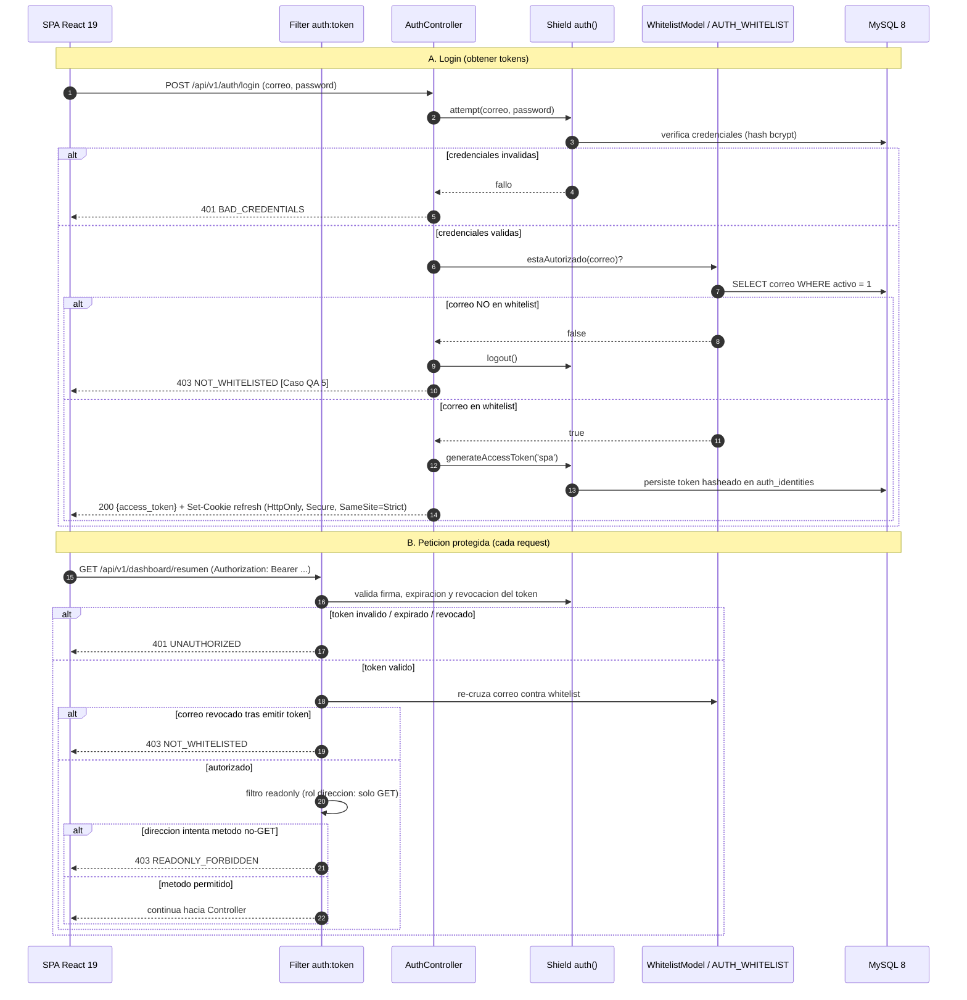

# 04 — Plan de Seguridad

| Campo | Valor |
|---|---|
| **Documento** | 04 — Plan de Seguridad |
| **Versión** | 1.0 |
| **Fecha** | 18/06/2026 |
| **Organización** | Best Quality Solutions México (BQS) · Ciudad Juárez |
| **Desarrollado por** | Dataholics |
| **Marco** | OWASP Top 10:2021 · OWASP ASVS · LFPDPPP (México) |
| **Depende de** | [SRS §3, §4, §5](../01-vision/01_SRS_especificacion_requisitos.md) · [Arquitectura (02)](../02-arquitectura/02_arquitectura_sistema.md) · [ADR-003](../02-arquitectura/ADR/ADR-003_autenticacion-shield-jwt.md) · [Modelo de Datos (03)](../03-datos/03_modelo_de_datos.md) |

> Este documento es **prescriptivo**: define los controles de seguridad que el código del MVP1 debe implementar, no propuestas opcionales. Los snippets son representativos del patrón a aplicar (CI4 4.7 / PHP 8.2 y React 19 / TS) y son compilables. Las mejoras que no se aplican en el MVP1 se enlazan a [`OPORTUNIDADES_DE_MEJORA.md`](../OPORTUNIDADES_DE_MEJORA.md).

---

## 1. Postura de seguridad

El Portal Ejecutivo BQS es un sistema financiero de la Dirección General: expone saldos por cobrar, facturación e información fiscal de clientes. Una fuga o una alteración tiene impacto directo en el negocio y en el cumplimiento legal. La postura es de **defensa en profundidad** con un principio rector tomado de [`CLAUDE.md`](../CLAUDE.md): **nunca se confía en el cliente para decisiones de seguridad o cálculo**. El navegador es territorio del atacante; toda autorización, validación de negocio y cálculo ocurre en el backend CodeIgniter 4. MySQL 8 es la única fuente de verdad ([ADR-002](../02-arquitectura/ADR/ADR-002_mysql-fuente-de-verdad.md)).

### 1.1 Activos a proteger

| Activo | Criticidad | Justificación |
|---|---|---|
| Datos financieros (`FACTURAS`, `PAGOS`, `BITACORA_SORTEO`, `COTIZACIONES`) | **Crítica** | Son la cartera de BQS. Su alteración corrompe las tres preguntas y la cobranza; su fuga revela la posición financiera de la empresa. |
| PII de clientes (`CAT_CLIENTES`: `Nombre_Fiscal`, `RFC`) | **Crítica** | Datos personales/fiscales bajo LFPDPPP. Una fuga acarrea sanción legal y daño reputacional. |
| Tokens de acceso y refresh (Shield) | **Crítica** | Un token robado equivale a una sesión activa. El access token vive en memoria del cliente; el refresh en cookie `HttpOnly`+`SameSite=Strict`+`Secure`. |
| Credenciales de BD y de despliegue (Site5) | **Crítica** | Dan acceso directo a la fuente de verdad y al servidor. Deben vivir solo en `.env` fuera del repo (ver §4.1). |
| Hash de contraseñas (tablas Shield `auth_identities`) | **Alta** | Comprometerlas permite suplantar usuarios. Se almacenan con el algoritmo de Shield, nunca en claro. |
| Bitácora de auditoría (`AUDITORIA`) | **Alta** | Evidencia forense ante disputas de cobranza e incidentes. Debe ser inmutable (solo inserción). |
| Whitelist de acceso (`AUTH_WHITELIST`) | **Alta** | Segunda barrera de autenticación. Su manipulación abriría acceso a correos no autorizados. |
| Disponibilidad del portal | **Media** | Eric depende del dashboard para decisiones diarias; un DoS degrada la operación pero no compromete datos. |

### 1.2 Actores de amenaza

| Actor | Capacidad | Vector principal | Mitigación de referencia |
|---|---|---|---|
| Usuario autenticado malicioso | Token válido de un rol de escritura (`capturista`, `facturacion`) | IDOR, abuso de privilegios, sobrepago | Policies por recurso/id (A01), validación de negocio en servicio (A04) |
| Escalada de privilegios | Usuario de bajo privilegio que intenta acciones de otro rol | Manipular payload de rol, llamar endpoints no autorizados | RBAC server-side; el cliente nunca decide rol (A01) |
| Atacante externo no autenticado | Sin credenciales | Inyección, fuerza bruta de login, interceptación de tráfico, XSS | Query Builder parametrizado (A03), rate limit + whitelist (A07), HTTPS/HSTS/CSP (A02, A05) |
| Robo del dispositivo de Eric | Acceso físico a una sesión de `direccion` | Uso del token en memoria, lectura del dashboard | Perfil **solo lectura** (no puede alterar datos); tokens de vida corta; revocación (A07) |
| Credenciales filtradas | Correo + contraseña válidos obtenidos por fuga externa | Login con credenciales legítimas | **Whitelist** como segunda barrera: la credencial sola es insuficiente (A07) |
| Dependencia/suministro comprometido | Paquete de terceros con código malicioso | Cadena de build (Composer/npm) | Lockfiles, auditoría de dependencias, build verificado (A08) |

---

## 2. OWASP Top 10:2021 — Controles aplicados

Se cubren los riesgos aplicables al sistema. Cada control indica su **capa** (Filter / Service / Model / Policy / React / Configuración) y un snippet representativo.

### A01 — Broken Access Control

**Descripción específica.** El sistema tiene cuatro roles con privilegios distintos ([SRS §2.2](../01-vision/01_SRS_especificacion_requisitos.md)). El riesgo concreto: que `direccion` (Eric) ejecute una escritura desde el teléfono, que un `capturista` emita facturas, o que cualquier usuario acceda a la cartera de un cliente que no le corresponde manipulando un id en la URL (IDOR). La regla dura: **el cliente nunca decide permisos; el servidor revalida siempre**.

**Control 1 — Filtro `readonly` para `direccion` (solo GET).**
(a) Un filtro corta cualquier método distinto de GET para el rol `direccion`, antes de llegar al controlador. (b) Snippet. (c) Capa: **Filter**.

```php
<?php

declare(strict_types=1);

namespace App\Filters;

use CodeIgniter\Filters\FilterInterface;
use CodeIgniter\HTTP\RequestInterface;
use CodeIgniter\HTTP\ResponseInterface;
use Config\Services;

/**
 * Bloquea todo método que no sea GET/HEAD/OPTIONS para el rol `direccion`.
 * Cumple RF-AUTH-04: la Dirección General es solo lectura.
 */
final class ReadOnlyFilter implements FilterInterface
{
    private const SAFE_METHODS = ['GET', 'HEAD', 'OPTIONS'];

    public function before(RequestInterface $request, $arguments = null): ?ResponseInterface
    {
        $user = auth()->user();

        if ($user !== null && $user->inGroup('direccion')) {
            $method = strtoupper($request->getMethod());

            if (! in_array($method, self::SAFE_METHODS, true)) {
                return Services::response()
                    ->setStatusCode(ResponseInterface::HTTP_FORBIDDEN)
                    ->setJSON(['error' => ['code' => 'READONLY_FORBIDDEN']]);
            }
        }

        return null;
    }

    public function after(RequestInterface $request, ResponseInterface $response, $arguments = null): ?ResponseInterface
    {
        return null;
    }
}
```

**Control 2 — Policy por recurso e id (anti-IDOR y RBAC).**
(a) Antes de operar sobre un recurso, una Policy comprueba que el rol del usuario permite la acción. El acceso a la cartera de un cliente se restringe a roles autorizados, no a quien adivine el id. (b) Snippet. (c) Capa: **Policy** (invocada desde el Controller, según la cadena de [Arquitectura §3.5](../02-arquitectura/02_arquitectura_sistema.md)).

```php
<?php

declare(strict_types=1);

namespace App\Policies;

use CodeIgniter\Shield\Entities\User;

/**
 * Autorización de la entidad FACTURAS. El cliente jamás decide esto;
 * se evalúa en servidor por rol (RBAC) y, cuando aplica, por propiedad del recurso.
 */
final class FacturaPolicy
{
    public static function canCreate(?User $user): bool
    {
        return $user !== null && $user->inGroup('facturacion');
    }

    public static function canViewCartera(?User $user): bool
    {
        // Roles que pueden leer cartera de cualquier cliente.
        return $user !== null
            && ($user->inGroup('direccion') || $user->inGroup('facturacion') || $user->inGroup('admin'));
    }

    public static function canRegisterPago(?User $user): bool
    {
        return $user !== null && $user->inGroup('facturacion');
    }
}
```

> El uso de `FacturaPolicy::canCreate()` en el controlador ya está ilustrado en [Arquitectura §5](../02-arquitectura/02_arquitectura_sistema.md). Las Policies devuelven 403 (`FORBIDDEN`) cuando el rol no autoriza la acción.

### A02 — Cryptographic Failures

**Descripción específica.** El portal transmite RFC, nombres fiscales, montos y tokens. El riesgo: tráfico interceptado en redes móviles (Eric usa el celular), contraseñas mal almacenadas o secretos en código. Controles: HTTPS forzado con HSTS, hashing de contraseñas vía Shield, y secretos fuera del repositorio.

**Control 1 — Hashing de contraseñas con Shield.**
(a) Shield gestiona el almacenamiento de contraseñas con un algoritmo adaptativo configurado en `Config\Auth`; nunca se guardan en claro ni se comparan en la aplicación. Se usa el verificador de Shield (`auth()->attempt()`), que aplica el hash y el `needsRehash` automáticamente. (b) Configuración. (c) Capa: **Configuración / Shield**.

```php
<?php

declare(strict_types=1);

namespace Config;

use CodeIgniter\Shield\Config\Auth as ShieldAuth;

class Auth extends ShieldAuth
{
    /**
     * Algoritmo de hash de contraseñas. bcrypt con coste reforzado.
     * Shield re-hashea de forma transparente si el coste cambia.
     */
    public int $hashAlgorithm = PASSWORD_BCRYPT;

    public array $hashOptions = [
        'cost' => 12,
    ];

    /**
     * Vida corta del access token (minutos). El refresh vive en cookie HttpOnly.
     */
    public int $accessTokenLifetime = 15 * MINUTE;
}
```

**Control 2 — HTTPS forzado + HSTS y secretos solo en `.env`.**
(a) Toda respuesta fuerza HTTPS y declara HSTS; las claves (cifrado de la app, credenciales de BD) viven en `.env` fuera del docroot y del control de versiones. El backend lee `getenv()`; jamás se incrustan literales. (b) Snippet de cabeceras (filtro de seguridad). (c) Capa: **Filter / Configuración**.

```php
<?php

declare(strict_types=1);

namespace App\Filters;

use CodeIgniter\Filters\FilterInterface;
use CodeIgniter\HTTP\RequestInterface;
use CodeIgniter\HTTP\ResponseInterface;

/**
 * Cabeceras de seguridad de transporte y contenido en cada respuesta.
 */
final class SecurityHeadersFilter implements FilterInterface
{
    public function before(RequestInterface $request, $arguments = null): ?ResponseInterface
    {
        return null;
    }

    public function after(RequestInterface $request, ResponseInterface $response, $arguments = null): ?ResponseInterface
    {
        return $response
            ->setHeader('Strict-Transport-Security', 'max-age=31536000; includeSubDomains; preload')
            ->setHeader('X-Content-Type-Options', 'nosniff')
            ->setHeader('X-Frame-Options', 'DENY')
            ->setHeader('Referrer-Policy', 'strict-origin-when-cross-origin')
            ->setHeader('Content-Security-Policy', "default-src 'self'; frame-ancestors 'none'; object-src 'none'; base-uri 'self'");
    }
}
```

> **Cifrado en reposo de campos sensibles.** El MVP1 protege el RFC y los nombres fiscales mediante el control de acceso de la base (usuario MySQL de mínimos privilegios, §3.6) y el cifrado a nivel de transporte. El cifrado de columna a nivel de aplicación (p. ej. `Encryption` de CI4 sobre `RFC`) **no se aplica en el MVP1** porque rompería las búsquedas por RFC y el `UNIQUE(RFC)`; queda registrado como mejora en [`OPORTUNIDADES_DE_MEJORA.md`](../OPORTUNIDADES_DE_MEJORA.md). La clave de la app (`encryption.key`) se genera con `php spark key:generate` y reside en `.env`.

### A03 — Injection

**Descripción específica.** Todo lo que entra desde la SPA o desde la importación inicial de Excel/Sheets es potencialmente hostil. El riesgo concreto: SQL injection en filtros de cartera, búsquedas por cliente o cálculos. La regla dura ([Arquitectura §3.7](../02-arquitectura/02_arquitectura_sistema.md)): **jamás concatenar SQL; siempre Query Builder parametrizado**.

**Control 1 — Query Builder con binding (nunca concatenación).**
(a) Los repositorios usan el Query Builder de CI4, que parametriza los valores. Para las agregaciones de las tres preguntas se usan placeholders, no interpolación de strings. (b) Snippet. (c) Capa: **Model / Repository**.

```php
<?php

declare(strict_types=1);

namespace App\Repositories;

use Config\Database;

/**
 * Consultas de cartera. Toda entrada se pasa parametrizada al Query Builder;
 * el SQL nunca se construye por concatenación de variables.
 */
final class CarteraRepository
{
    public function saldoPorCliente(string $idCliente): float
    {
        $db = Database::connect();

        // Pregunta 3: saldo = Σ(Monto_Total de facturas activas) − Σ(PAGOS asociados).
        // `where()` y `whereIn()` parametrizan el valor; sin interpolación de strings.
        $facturas = $db->table('FACTURAS')
            ->selectSum('Monto_Total', 'total')
            ->where('ID_Cliente', $idCliente)
            ->whereIn('Estatus_Pago', ['Vigente', 'Vencida'])
            ->get()
            ->getRow();

        $pagos = $db->table('PAGOS')
            ->selectSum('Monto_Pagado', 'abonado')
            ->whereIn('Folio_Factura', static function ($builder) use ($idCliente) {
                return $builder->select('Folio_Factura')
                    ->from('FACTURAS')
                    ->where('ID_Cliente', $idCliente)
                    ->whereIn('Estatus_Pago', ['Vigente', 'Vencida']);
            })
            ->get()
            ->getRow();

        return (float) ($facturas->total ?? 0) - (float) ($pagos->abonado ?? 0);
    }
}
```

**Control 2 — Validación de entrada antes de tocar negocio.**
(a) Las reglas de validación de CI4 rechazan texto en numéricos, negativos, fechas inválidas y enums fuera de catálogo (RF-DEV-02). Esto corta inyecciones de datos sucios y refuerza el tipado antes del servicio. (b) Snippet. (c) Capa: **Validation** (en el Controller).

```php
<?php

declare(strict_types=1);

// Reglas de validación para el registro de un pago (RF-PAG-01 / RF-PAG-02).
$rules = [
    'folio_factura' => 'required|string|max_length[40]|regex_match[/^[A-Za-z0-9\-]+$/]',
    'fecha_pago'    => 'required|valid_date[Y-m-d]',
    'monto_pagado'  => 'required|decimal|greater_than[0]',
    'referencia'    => 'permit_empty|string|max_length[100]',
];

if (! $this->validate($rules)) {
    return $this->response->setStatusCode(422)->setJSON([
        'error' => ['code' => 'VALIDATION', 'fields' => $this->validator->getErrors()],
    ]);
}
```

### A04 — Insecure Design

**Descripción específica.** El diseño debe impedir estados financieros inconsistentes por construcción, no a posteriori. Riesgos concretos del dominio: una factura creada sin marcar el devengado consumido, un pago registrado sin recalcular el saldo, o un **sobrepago** (abono mayor al saldo, RF-PAG-02). La máquina de estados del ciclo de cobro ([SRS §4](../01-vision/01_SRS_especificacion_requisitos.md)) define las transiciones legales; el servidor las hace cumplir.

**Control 1 — Transacciones ACID en toda escritura multi-tabla.**
(a) Emitir factura y registrar pago se ejecutan dentro de `transStart()/transComplete()`. Si cualquier paso falla, rollback total. Así nunca queda un estado a medias. (b) Snippet del registro de pago con reevaluación de estatus. (c) Capa: **Service**.

```php
<?php

declare(strict_types=1);

namespace App\Services;

use Config\Database;
use RuntimeException;

/**
 * Registro de pago con prevención de sobrepago (RF-PAG-02) y
 * reevaluación de Estatus_Pago en la misma transacción ACID.
 */
final class PagoService
{
    public function registrar(array $dto): array
    {
        $db    = Database::connect();
        $folio = (string) $dto['folio_factura'];

        // 1) Cálculo del saldo en servidor; el cliente no lo aporta.
        $factura = $db->table('FACTURAS')
            ->select('Monto_Total')
            ->where('Folio_Factura', $folio)
            ->get()
            ->getRow();

        if ($factura === null) {
            throw new RuntimeException('Factura inexistente.');
        }

        $abonado = (float) ($db->table('PAGOS')
            ->selectSum('Monto_Pagado', 'total')
            ->where('Folio_Factura', $folio)
            ->get()
            ->getRow()->total ?? 0);

        $saldo = (float) $factura->Monto_Total - $abonado;
        $monto = (float) $dto['monto_pagado'];

        // 2) Invariante de negocio: ningún abono excede el saldo.
        if ($monto > $saldo) {
            throw new RuntimeException('SOBREPAGO: el abono excede el saldo pendiente.');
        }

        // 3) Escritura atómica: insertar pago + recomputar estatus + auditar.
        $db->transStart();

        $db->table('PAGOS')->insert([
            'ID_Pago'       => $this->generarIdPago(),
            'Folio_Factura' => $folio,
            'Fecha_Pago'    => $dto['fecha_pago'],
            'Monto_Pagado'  => $monto,
            'Referencia'    => $dto['referencia'] ?? null,
        ]);

        if (($abonado + $monto) >= (float) $factura->Monto_Total) {
            $db->table('FACTURAS')
                ->where('Folio_Factura', $folio)
                ->update(['Estatus_Pago' => 'Pagada']);
        }

        $this->auditar($db, 'crear', 'PAGOS', $folio, null, ['monto' => $monto]);

        $db->transComplete();

        if ($db->transStatus() === false) {
            throw new RuntimeException('No se pudo registrar el pago; cambios revertidos.');
        }

        return ['saldo_restante' => $saldo - $monto];
    }
}
```

**Control 2 — No confiar en el cliente para montos ni estatus.**
(a) Las tres preguntas y los saldos se calculan en el backend (RF-DASH-04); el payload del navegador nunca determina cifras ni transiciones. El cron es el único actor que marca `Vencida` (invariante §4.2 del SRS). (b) El cálculo server-side ya se ilustra en `CarteraRepository` (A03) y en [Arquitectura §4.4](../02-arquitectura/02_arquitectura_sistema.md). (c) Capa: **Service / Repository**.

### A05 — Security Misconfiguration

**Descripción específica.** El despliegue es Site5 (hosting compartido). Riesgos: modo debug activo filtrando trazas, listados de directorio exponiendo `app/` o `writable/`, cabeceras ausentes, errores con detalle al cliente. Controles: entorno de producción, errores genéricos, cabeceras estrictas y bloqueo de listados.

**Control 1 — Entorno de producción y errores genéricos.**
(a) `CI_ENVIRONMENT=production` desactiva el debug toolbar y las trazas detalladas; el cliente recibe un mensaje genérico, el detalle va solo a los logs del servidor. (b) Snippet de manejo de excepciones del controlador base. (c) Capa: **Configuración / Controller**.

```php
<?php

declare(strict_types=1);

// .env (NUNCA versionado): fuerza producción.
// CI_ENVIRONMENT = production

// Respuesta genérica ante error no controlado: sin filtrar trazas al cliente.
try {
    $resultado = (new \App\Services\FacturaService())->emitir($dto);
    return $this->response->setStatusCode(201)->setJSON(['data' => $resultado]);
} catch (\Throwable $e) {
    // El detalle (mensaje, stack) va al log del servidor, no a la respuesta.
    log_message('error', 'Emisión de factura falló: {msg}', ['msg' => $e->getMessage()]);

    return $this->response->setStatusCode(409)->setJSON([
        'error' => ['code' => 'CONFLICT', 'message' => 'No se pudo completar la operación.'],
    ]);
}
```

**Control 2 — CSP estricta, cabeceras y bloqueo de listados de directorio.**
(a) La CSP y las cabeceras (`X-Frame-Options`, `nosniff`, etc.) se inyectan en cada respuesta (ver `SecurityHeadersFilter` en A02). A nivel de servidor, Apache deniega el listado de directorios y el acceso a carpetas internas. (b) Snippet `.htaccess` para Site5. (c) Capa: **Configuración (Apache)**.

```apache
# public/.htaccess — endurecimiento de Apache en Site5
Options -Indexes               # sin listados de directorio
ServerSignature Off

# Bloquear acceso directo a carpetas internas del framework
RedirectMatch 403 ^/(app|system|writable|tests|vendor)/.*$

# Negar archivos sensibles
<FilesMatch "(^\.env|\.env\..*|composer\.(json|lock)|.*\.ini)$">
    Require all denied
</FilesMatch>
```

> El checklist completo de hardening de Site5 está en §4.2 y se alinea con el de [Arquitectura §6](../02-arquitectura/02_arquitectura_sistema.md).

### A07 — Identification and Authentication Failures

**Descripción específica.** El acceso al portal es de **doble barrera** ([ADR-003](../02-arquitectura/ADR/ADR-003_autenticacion-shield-jwt.md)): credenciales válidas (Shield) **y** correo en la whitelist (`AUTH_WHITELIST`). Esto convierte una credencial filtrada en insuficiente y cubre directamente el **Caso QA 5** (`intruso@competidor.com` bloqueado, [QA-Test-Cases](../00-fuentes/BQS-MVP1-QA-Test-Cases.md)). Riesgos: fuerza bruta de login, tokens de vida larga, tokens no revocables.

**Control 1 — Doble barrera Shield + whitelist en login.**
(a) Tras validar credenciales, se cruza el correo contra la whitelist activa; si no está, se hace `logout()` y se responde 403, aunque la contraseña sea correcta (RF-AUTH-01). (b) Snippet del modelo de whitelist y su uso. (c) Capa: **Model + Controller**.

```php
<?php

declare(strict_types=1);

namespace App\Models;

use CodeIgniter\Model;

/**
 * Segunda barrera de acceso: solo correos en AUTH_WHITELIST con activo = 1
 * pueden autenticarse (Caso QA 5).
 */
final class WhitelistModel extends Model
{
    protected $table         = 'AUTH_WHITELIST';
    protected $primaryKey    = 'id';
    protected $returnType    = 'array';
    protected $allowedFields = ['correo', 'activo', 'creado_por'];

    public function estaAutorizado(string $correo): bool
    {
        return $this->where('correo', $correo)
            ->where('activo', 1)
            ->countAllResults() > 0;
    }
}
```

```php
<?php

declare(strict_types=1);

// AuthController::login() — doble barrera (alineado con Arquitectura §5).
$result = auth()->attempt([
    'email'    => $this->request->getVar('correo'),
    'password' => $this->request->getVar('password'),
]);

if (! $result->isOK()) {
    return $this->response->setStatusCode(401)->setJSON(['error' => ['code' => 'BAD_CREDENTIALS']]);
}

if (! (new \App\Models\WhitelistModel())->estaAutorizado((string) $this->request->getVar('correo'))) {
    auth()->logout();                       // revoca la sesión recién abierta
    return $this->response->setStatusCode(403)->setJSON(['error' => ['code' => 'NOT_WHITELISTED']]);
}

$token = auth()->user()->generateAccessToken('spa')->raw_token;
return $this->response->setJSON(['access_token' => $token]); // refresh va en cookie HttpOnly
```

**Control 2 — Tokens de vida corta, revocación y rate limit en login.**
(a) El access token expira en minutos (config de A02) y es revocable en BD vía Shield (logout invalida el token, RF-AUTH-03). El login se protege con un filtro de throttling que limita intentos por IP, mitigando fuerza bruta. (b) Snippet del filtro throttle aplicado a `auth/login`. (c) Capa: **Filter**.

```php
<?php

declare(strict_types=1);

namespace App\Filters;

use CodeIgniter\Filters\FilterInterface;
use CodeIgniter\HTTP\RequestInterface;
use CodeIgniter\HTTP\ResponseInterface;
use Config\Services;

/**
 * Rate limit del login: máx. 5 intentos por IP cada 60 s.
 * Mitiga fuerza bruta sobre credenciales (refuerza la whitelist).
 */
final class LoginThrottleFilter implements FilterInterface
{
    public function before(RequestInterface $request, $arguments = null): ?ResponseInterface
    {
        $throttler = Services::throttler();
        $bucket    = 'login_' . $request->getIPAddress();

        // 5 solicitudes por minuto; capacidad 5, recarga 1 cada 12 s.
        if ($throttler->check($bucket, 5, MINUTE) === false) {
            return Services::response()
                ->setStatusCode(ResponseInterface::HTTP_TOO_MANY_REQUESTS)
                ->setHeader('Retry-After', (string) $throttler->getTokenTime())
                ->setJSON(['error' => ['code' => 'TOO_MANY_ATTEMPTS']]);
        }

        return null;
    }

    public function after(RequestInterface $request, ResponseInterface $response, $arguments = null): ?ResponseInterface
    {
        return null;
    }
}
```

### A08 — Software and Data Integrity Failures

**Descripción específica.** Riesgos en la cadena de suministro (dependencias Composer/npm comprometidas), en el artefacto de build de React que se sirve como estático ([ADR-001 §6](../02-arquitectura/ADR/ADR-001_stack-ci4-react.md)), y en la integridad de la auditoría. Controles: lockfiles e integridad de dependencias, build verificado sin secretos, y auditoría inmutable.

**Control 1 — Integridad de dependencias y build verificado.**
(a) Las dependencias se fijan con `composer.lock` y `package-lock.json`; en CI se ejecuta auditoría de vulnerabilidades (`composer audit`, `npm audit`) y la instalación reproducible (`npm ci`). El bundle de React no contiene secretos (las claves viven en el backend `.env`). (b) Snippet del paso de verificación. (c) Capa: **Configuración (pipeline de build)**.

```bash
# Build verificado y reproducible — backend y frontend.
# Backend (/api)
composer install --no-dev --prefer-dist --optimize-autoloader
composer audit                       # falla si hay CVE conocido en dependencias

# Frontend (/web)
npm ci                               # instala exactamente lo del lockfile
npm audit --audit-level=high         # falla ante vulnerabilidades altas/críticas
npm run build                        # genera /web/dist sin secretos embebidos
```

**Control 2 — Auditoría inmutable (solo inserción).**
(a) Cada mutación financiera escribe en `AUDITORIA` (usuario, acción, entidad, id, antes/después, ip) dentro de la misma transacción de la mutación (RF-MET-01). La tabla es de solo inserción: el usuario MySQL de la app no tiene `UPDATE`/`DELETE` sobre ella (§3.6), de modo que el registro no puede falsificarse desde la aplicación. (b) Snippet del helper de auditoría. (c) Capa: **Service / Model**.

```php
<?php

declare(strict_types=1);

namespace App\Services;

use CodeIgniter\Database\BaseConnection;

/**
 * Inserta un registro inmutable en AUDITORIA dentro de la transacción de la mutación.
 * No existe método de actualización/borrado: la bitácora es append-only.
 */
trait AuditoriaTrait
{
    protected function auditar(
        BaseConnection $db,
        string $accion,
        string $entidad,
        ?string $entidadId,
        ?array $antes,
        ?array $despues
    ): void {
        $db->table('AUDITORIA')->insert([
            'usuario_id'      => auth()->id(),
            'accion'          => $accion,
            'entidad'         => $entidad,
            'entidad_id'      => $entidadId,
            'valores_antes'   => $antes !== null ? json_encode($antes, JSON_THROW_ON_ERROR) : null,
            'valores_despues' => $despues !== null ? json_encode($despues, JSON_THROW_ON_ERROR) : null,
            'ip'              => service('request')->getIPAddress(),
        ]);
    }
}
```

> **Riesgos OWASP no detallados en este MVP1.** **A06 (Vulnerable and Outdated Components)** se mitiga con el mismo control de A08 (auditoría de dependencias). **A09 (Logging and Monitoring Failures)** se cubre parcialmente con `AUDITORIA` y los logs de Site5; la monitorización proactiva (alertas) se registra como mejora en [`OPORTUNIDADES_DE_MEJORA.md`](../OPORTUNIDADES_DE_MEJORA.md). **A10 (SSRF)** no aplica: el backend no realiza peticiones salientes a URLs provistas por el usuario en el MVP1.

---

## 3. Seguridad específica por capa

### 3.1 Filtros / Middlewares

Primera línea de defensa, aplicada por grupo de rutas en `Config\Routes.php`, en este orden:

| Filtro | Propósito | Cuándo aplica |
|---|---|---|
| `cors` | Restringe los orígenes permitidos (la SPA en `bqs.dataholics.com.mx`) y los métodos/headers aceptados. | Todas las rutas de la API; preflight `OPTIONS`. |
| `throttle` | Rate limiting general por IP para mitigar abuso y DoS de bajo volumen. | Toda la API; reforzado en `auth/login` con `LoginThrottleFilter` (A07). |
| `auth:token` | Valida el access token de Shield (firma, expiración, revocación) y re-cruza el correo contra la whitelist. | Toda ruta no pública (todo salvo `auth/login` y `auth/refresh`). |
| `readonly` | Bloquea métodos no-GET para el rol `direccion` (RF-AUTH-04). | Rutas de escritura; deja pasar GET para todos los roles. |

```php
<?php

declare(strict_types=1);

// app/Config/Filters.php — registro de alias.
public array $aliases = [
    'cors'            => \App\Filters\CorsFilter::class,
    'throttle'        => \App\Filters\ThrottleFilter::class,
    'loginThrottle'   => \App\Filters\LoginThrottleFilter::class,
    'auth:token'      => \CodeIgniter\Shield\Filters\TokenAuth::class,
    'readonly'        => \App\Filters\ReadOnlyFilter::class,
    'securityHeaders' => \App\Filters\SecurityHeadersFilter::class,
];

// Aplicación global de cabeceras de seguridad y CORS.
public array $globals = [
    'before' => ['cors', 'securityHeaders'],
    'after'  => ['cors', 'securityHeaders'],
];
```

```php
<?php

declare(strict_types=1);

// app/Config/Routes.php — agrupación por barreras de seguridad.
$routes->group('api/v1', static function ($routes) {
    // Públicas: login con rate limit reforzado; refresh por cookie.
    $routes->post('auth/login', 'Api\V1\AuthController::login', ['filter' => 'loginThrottle']);
    $routes->post('auth/refresh', 'Api\V1\AuthController::refresh');

    // Protegidas: token + whitelist + solo lectura para dirección.
    $routes->group('', ['filter' => ['auth:token', 'readonly', 'throttle']], static function ($routes) {
        $routes->get('dashboard/resumen', 'Api\V1\DashboardController::resumen');
        $routes->get('clientes/(:segment)/cartera', 'Api\V1\ClientesController::cartera/$1');
        $routes->post('facturas', 'Api\V1\FacturasController::create');
        $routes->post('pagos', 'Api\V1\PagosController::create');
    });
});
```

### 3.2 Autenticación y sesión

Flujo completo, alineado con [Arquitectura §4.1](../02-arquitectura/02_arquitectura_sistema.md) y [ADR-003](../02-arquitectura/ADR/ADR-003_autenticacion-shield-jwt.md). Incluye el login (con la doble barrera y el Caso QA 5) y la validación en cada petición protegida (token + re-whitelist + readonly):



**Puntos de validación (resumen):**

1. **Credenciales** — Shield verifica correo/contraseña contra el hash almacenado.
2. **Whitelist en login** — el correo debe estar en `AUTH_WHITELIST` con `activo = 1`; si no, 403 (Caso QA 5).
3. **Token en cada petición** — firma, expiración y revocación validadas por `auth:token`.
4. **Re-whitelist en cada petición** — un correo revocado tras emitir el token pierde acceso de inmediato.
5. **Solo lectura** — el filtro `readonly` corta cualquier escritura del rol `direccion`.

### 3.3 Autorización RBAC

La autorización es server-side por Policies ([Arquitectura §3.5](../02-arquitectura/02_arquitectura_sistema.md)). Matriz de roles × recursos × acciones permitidas (G = GET/lectura; C/U = crear/actualizar; — = denegado):

| Recurso | `direccion` | `capturista` | `facturacion` | `admin` |
|---|---|---|---|---|
| Dashboard 3 preguntas (`/dashboard/resumen`) | **G** | G | G | G |
| Cartera por cliente (`/clientes/{id}/cartera`) | **G** | — | G | G |
| `BITACORA_SORTEO` (devengado) | **G** | G · C/U | G | G |
| `COTIZACIONES` | **G** | G | G · C/U | G · C/U |
| `FACTURAS` (emitir) | **G** | — | G · C | G |
| `PAGOS` (registrar) | **G** | — | G · C | G |
| `CAT_CLIENTES` (alta/edición) | **G** | — | — | C/U |
| `AUTH_WHITELIST` (gestión) | — | — | — | C/U |
| Usuarios y roles | — | — | — | C/U |
| `AUDITORIA` (consulta) | — | — | — | **G** |

> **`direccion` solo lee.** En toda fila de escritura, `direccion` aparece como **G** o —, nunca con C/U: es físicamente incapaz de mutar datos por el filtro `readonly` (RF-AUTH-04). Un usuario puede combinar roles ([SRS §2.2](../01-vision/01_SRS_especificacion_requisitos.md)); la autorización efectiva es la unión de privilegios, pero `direccion` nunca aporta escritura aunque se combine.

### 3.4 Protección de datos en tránsito y reposo

| Dimensión | Qué se protege | Mecanismo | Algoritmo / dónde vive la clave |
|---|---|---|---|
| **Tránsito** | Todo el tráfico SPA ↔ API | HTTPS forzado + HSTS (`SecurityHeadersFilter`) | TLS del certificado de Site5; redirección 80→443 |
| **Contraseñas** | Credenciales de usuarios | Hash adaptativo de Shield | bcrypt (`PASSWORD_BCRYPT`, coste 12); hash en `auth_identities`, nunca en claro |
| **Tokens** | Access y refresh | Access en memoria del cliente; refresh en cookie `HttpOnly`+`SameSite=Strict`+`Secure`; token persistido **hasheado** en BD | Hash de token gestionado por Shield en `auth_identities` |
| **Secretos de app** | Clave de cifrado, credenciales de BD | Variables de entorno fuera del docroot | `encryption.key` y credenciales en `.env`; generadas con `php spark key:generate` |
| **Reposo (PII)** | `RFC`, `Nombre_Fiscal` | Control de acceso a BD (usuario de mínimos privilegios, §3.6) + transporte cifrado | Cifrado de columna a nivel app: **mejora**, no aplicada en MVP1 (ver [mejoras](../OPORTUNIDADES_DE_MEJORA.md)) |
| **Reposo (backups)** | Volcados de MySQL | Backups diarios con acceso restringido | Custodia en Site5; cifrado de backups recomendado en [mejoras](../OPORTUNIDADES_DE_MEJORA.md) |

### 3.5 Seguridad del cliente SPA (React 19)

| Control | Implementación |
|---|---|
| **Escape por defecto** | React escapa todo contenido renderizado en JSX, neutralizando XSS reflejado/almacenado por construcción ([ADR-001 §6](../02-arquitectura/ADR/ADR-001_stack-ci4-react.md)). |
| **Prohibición de `dangerouslySetInnerHTML`** | Está vetado en el código del MVP1. No se renderiza HTML crudo proveniente de la API ni del usuario. |
| **Token en memoria, no en `localStorage`** | El access token vive en una variable de módulo/estado, jamás en `localStorage`/`sessionStorage` (objetivo de XSS). El refresh viaja en cookie `HttpOnly` que el JS no puede leer. |
| **CSP estricta** | La cabecera CSP (`default-src 'self'`) limita orígenes de scripts; reduce el impacto de una inyección. |
| **Sin secretos en el bundle** | El artefacto `dist/` no contiene claves: las credenciales viven en el backend `.env`. |

```tsx
// web/src/lib/auth.ts — el access token vive en memoria, nunca en localStorage.
let accessToken: string | null = null;

export function setAccessToken(token: string | null): void {
  accessToken = token; // memoria del módulo; se pierde al recargar (se rehidrata vía refresh cookie)
}

export function getAccessToken(): string | null {
  return accessToken;
}
```

```tsx
// web/src/lib/api.ts — interceptor que adjunta el Bearer; el refresh va en cookie HttpOnly.
import axios from "axios";
import { getAccessToken } from "./auth";

export const api = axios.create({
  baseURL: "/api",
  withCredentials: true, // envía la cookie HttpOnly de refresh en /auth/refresh
});

api.interceptors.request.use((config) => {
  const token = getAccessToken();
  if (token) {
    config.headers.Authorization = `Bearer ${token}`;
  }
  return config;
});
```

### 3.6 Seguridad de la base de datos y servicios

- **Usuario MySQL de mínimos privilegios.** La aplicación se conecta con un usuario que solo tiene `SELECT`, `INSERT`, `UPDATE` y `DELETE` sobre el esquema del portal; **sin** `DROP`, `ALTER`, `GRANT` ni `CREATE`. Sobre `AUDITORIA` se concede únicamente `INSERT`/`SELECT` (sin `UPDATE`/`DELETE`), lo que materializa la inmutabilidad de la bitácora (A08). Las migraciones se ejecutan con un usuario administrativo distinto, solo en despliegue.

```sql
-- Privilegios mínimos para el usuario de aplicación (ejecutado por el DBA en despliegue).
-- Operación normal sobre tablas de dominio y soporte:
GRANT SELECT, INSERT, UPDATE, DELETE ON `<db>`.* TO '<app_user>'@'localhost';

-- AUDITORIA es append-only: revocar mutaciones destructivas/correctivas.
REVOKE UPDATE, DELETE ON `<db>`.`AUDITORIA` FROM '<app_user>'@'localhost';
FLUSH PRIVILEGES;
```

- **Acceso solo desde la aplicación.** MySQL escucha en `localhost` (conexiones internas del servidor Site5); no se expone el puerto 3306 a Internet. Solo el backend CI4 alojado en el mismo servidor se conecta a la base.
- **Integridad referencial.** FKs con `ON DELETE RESTRICT` y `CHECK` en numéricos/enums ([Modelo de Datos §4](../03-datos/03_modelo_de_datos.md)) impiden datos inconsistentes incluso si la capa de aplicación fallara.
- **Jobs con contexto del backend.** Los trabajos asíncronos corren con el contexto de la aplicación, validan datos antes de escribir y auditan ([ADR-004 §5](../02-arquitectura/ADR/ADR-004_cola-asincrona-cron.md)).

---

## 4. Procedimientos operativos

### 4.1 Gestión de secretos

- **Dónde viven.** Todos los secretos (credenciales de BD, credenciales de despliegue/FTP, `encryption.key`, claves de Shield) residen exclusivamente en `.env`, **fuera del docroot** y **fuera del control de versiones** (regla no negociable, [SRS §6.3](../01-vision/01_SRS_especificacion_requisitos.md)). El repositorio versiona únicamente `env` (plantilla sin valores reales). La clave de la app se genera con `php spark key:generate`.
- **Rotación.** Las credenciales de BD y despliegue se rotan periódicamente y obligatoriamente ante cualquier sospecha de fuga. La rotación de `encryption.key` exige plan de migración de datos cifrados (si en el futuro se aplica cifrado de columna).
- **Qué hacer si se filtran.** (1) Rotar de inmediato la credencial afectada en Site5; (2) revocar accesos activos (tokens de Shield, sesiones FTP); (3) revisar `AUDITORIA` y los logs del servidor en busca de uso indebido; (4) documentar el incidente (§4.3).

> [!IMPORTANT]
> **Credenciales en la Especificación Técnica fuente.** La [Especificación Técnica §4](../00-fuentes/BQS-MVP1-Technical-Specification.md) incrusta credenciales de FTP y de MySQL **en texto plano** dentro del documento. Esto es una **exposición de secretos** que debe corregirse: dichas credenciales deben (1) **moverse a `.env`**, (2) **rotarse** (considerarlas comprometidas por haber estado en un documento) y (3) **removerse del documento fuente**. Este Plan de Seguridad **no reproduce** esas credenciales. La acción correctiva está registrada en [`OPORTUNIDADES_DE_MEJORA.md`](../OPORTUNIDADES_DE_MEJORA.md) y como riesgo abierto en [Arquitectura §7](../02-arquitectura/02_arquitectura_sistema.md).

### 4.2 Checklist de hardening de servidor (Site5)

Alineado con [Arquitectura §6](../02-arquitectura/02_arquitectura_sistema.md):

1. HTTPS forzado (redirección 80→443) y **HSTS** habilitado (`max-age` ≥ 1 año, `includeSubDomains`).
2. Cabeceras de seguridad en cada respuesta: **CSP** estricta, `X-Content-Type-Options: nosniff`, `X-Frame-Options: DENY`, `Referrer-Policy`.
3. `.env` fuera del docroot y del control de versiones; **`CI_ENVIRONMENT=production`** (sin debug toolbar ni trazas al cliente).
4. Usuario MySQL de aplicación con **privilegios mínimos** (sin `DROP`/`GRANT`/`ALTER`; `AUDITORIA` solo `INSERT`/`SELECT`).
5. Mensajes de error **genéricos** al cliente; el detalle solo en logs del servidor.
6. Cookies de refresh **`HttpOnly` + `Secure` + `SameSite=Strict`**.
7. **Rate limiting** activo en `auth/login` y endpoints sensibles.
8. **Backups** automáticos diarios de MySQL y prueba periódica de restauración.
9. **Listados de directorio desactivados** (`Options -Indexes`) y acceso denegado a `app/`, `system/`, `writable/`, `vendor/` y archivos sensibles (`.env`, lockfiles).
10. **Rotación y custodia** de credenciales de despliegue; removerlas de cualquier documento (ver §4.1 y [mejoras](../OPORTUNIDADES_DE_MEJORA.md)).
11. Dependencias auditadas (`composer audit`, `npm audit`) antes de cada despliegue (A08).
12. MySQL escuchando solo en `localhost`; sin exposición del puerto a Internet.

### 4.3 Plan de respuesta a incidentes

Pasos ordenados ante una brecha (acceso no autorizado, fuga de datos o alteración financiera):

1. **Detección y registro.** Identificar el incidente vía `AUDITORIA`, logs de Site5 o reporte. Anotar fecha/hora, alcance aparente y activo afectado.
2. **Contención.** Revocar tokens activos (Shield), suspender el correo comprometido en `AUTH_WHITELIST` (`activo = 0`) y, si aplica, poner el portal en mantenimiento. Rotar credenciales potencialmente expuestas.
3. **Erradicación.** Cerrar el vector (parchear dependencia, corregir configuración, eliminar acceso indebido).
4. **Evaluación de impacto.** Determinar qué datos se vieron afectados; si hay **PII** involucrada (RFC, nombres fiscales, correos), evaluar obligaciones de notificación bajo LFPDPPP (§4.4).
5. **Recuperación.** Restaurar datos íntegros desde backup verificado si hubo alteración; confirmar consistencia financiera (las tres preguntas, saldos) contra la auditoría.
6. **Cierre y lecciones aprendidas.** Documentar causa raíz, acciones tomadas y mejoras preventivas; trasladar las mejoras a [`OPORTUNIDADES_DE_MEJORA.md`](../OPORTUNIDADES_DE_MEJORA.md).

### 4.4 Privacidad y cumplimiento LFPDPPP

El sistema trata datos personales y fiscales bajo la **Ley Federal de Protección de Datos Personales en Posesión de los Particulares** (México), conforme a RNF-09 ([SRS §5](../01-vision/01_SRS_especificacion_requisitos.md)).

- **Datos PII tratados.** `RFC`, `Nombre_Fiscal` y `Nombre_Comercial` de `CAT_CLIENTES`; correos de usuarios en las tablas de Shield y en `AUTH_WHITELIST`. Estos son los datos que el plan considera personales/fiscales.
- **Principios de manejo.** Finalidad limitada (gestión de cuentas por cobrar y facturación), minimización (solo se almacena lo necesario para el ciclo de cobro), acceso restringido por RBAC (§3.3), trazabilidad de todo acceso y mutación vía `AUDITORIA` (RF-MET-01), y cifrado en tránsito (§3.4).
- **Derechos ARCO.** El titular puede ejercer:
  - **Acceso** — consultar qué datos suyos se tratan; atendible mediante consulta a `CAT_CLIENTES` y `AUDITORIA`.
  - **Rectificación** — corregir datos inexactos (p. ej. RFC o nombre fiscal erróneo) vía el rol `admin` (RF-CLI-02), quedando registro en auditoría.
  - **Cancelación** — la baja es **lógica** (`Estatus = Inactivo`), nunca física si existen movimientos asociados (FK `RESTRICT`), preservando la integridad financiera y la obligación de conservación contable.
  - **Oposición** — atender la solicitud de no tratamiento para finalidades no esenciales, dentro de los límites legales de conservación fiscal.
- **Conservación.** Los datos financieros y fiscales se conservan según las obligaciones contables/fiscales aplicables; la cancelación lógica concilia el derecho ARCO con dichas obligaciones.

---

## 5. Trazabilidad de controles

| Control | Riesgo OWASP | Requisito SRS | Caso QA |
|---|---|---|---|
| Filtro `readonly` (solo GET para `direccion`) | A01 | RF-AUTH-04 | — |
| Policies RBAC por recurso/id (anti-IDOR) | A01 | RF-CTA-02, RF-CLI-03 | — |
| HTTPS/HSTS + hash bcrypt + secretos en `.env` | A02 | RNF-03, RF-AUTH-02 | — |
| Query Builder parametrizado + validación | A03 | RF-DEV-02, RF-PAG-01 | — |
| Transacciones ACID + prevención de sobrepago | A04 | RF-FAC-01, RF-PAG-02 | Caso 4 |
| `CI_ENVIRONMENT=production`, CSP, sin listados | A05 | RNF-03 | — |
| Doble barrera Shield + whitelist; rate limit; revocación | A07 | RF-AUTH-01/02/03, RNF-04 | **Caso 5** |
| Integridad de dependencias + auditoría inmutable | A08 | RF-MET-01, RNF-12 | — |

> Los casos negativos de seguridad (token inválido/expirado/revocado, fuera de whitelist, intento de escritura de `direccion`) se verifican en el [Plan de Pruebas (06)](../06-pruebas/06_plan_de_pruebas.md), conforme a [ADR-003 §4](../02-arquitectura/ADR/ADR-003_autenticacion-shield-jwt.md).
