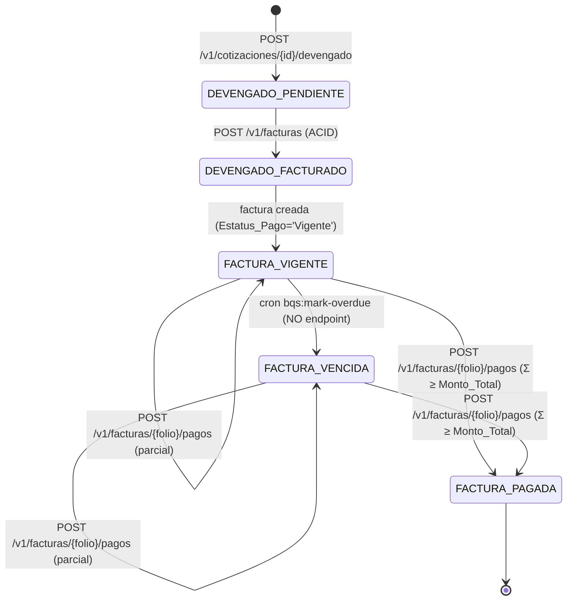

# 05 — Especificación de la API

| Campo | Valor |
|---|---|
| **Documento** | 05 — Especificación de la API |
| **Versión** | 1.0 |
| **Fecha** | 18/06/2026 |
| **Estilo** | API REST · CodeIgniter 4 (4.7.x, PHP 8.2+) |
| **Base URL** | `https://bqs.dataholics.com.mx/api` |
| **Versionado** | En la URL: prefijo `/v1` (ruta completa `…/api/v1/…`) |
| **Formato** | JSON (`Content-Type: application/json; charset=utf-8`) |
| **Autenticación** | Bearer access token (CodeIgniter Shield) + whitelist de correos |
| **Depende de** | [SRS §3, §4](../01-vision/01_SRS_especificacion_requisitos.md) · [Arquitectura (02)](../02-arquitectura/02_arquitectura_sistema.md) · [Modelo de Datos (03)](../03-datos/03_modelo_de_datos.md) · [Plan de Seguridad (04)](../04-seguridad/04_plan_de_seguridad.md) · [ADR-003](../02-arquitectura/ADR/ADR-003_autenticacion-shield-jwt.md) · [Technical-Specification §2, §3](../00-fuentes/BQS-MVP1-Technical-Specification.md) · [QA-Test-Cases](../00-fuentes/BQS-MVP1-QA-Test-Cases.md) |

> **Principio rector.** El servidor decide; el cliente presenta. Toda autorización (RBAC por Policies), toda validación de negocio y todo cálculo (las tres preguntas, saldos, transiciones del ciclo de cobro) ocurren en el backend. La SPA React envía intención y renderiza la respuesta; jamás determina rol, montos ni estatus. Los nombres de tabla y columna de los ejemplos reproducen **exactamente** el Tier 0 del [Modelo de Datos (03)](../03-datos/03_modelo_de_datos.md).

---

## 1. Convenciones

### 1.1 Versionado

La API se versiona **en la URL** con el prefijo `/v1` inmediatamente después de la Base URL. La ruta canónica de cualquier recurso es:

```
https://bqs.dataholics.com.mx/api/v1/{recurso}
```

En el servidor Site5, Apache enruta `/api` a PHP-FPM (CodeIgniter 4) y `/` al build estático de React ([Arquitectura §6](../02-arquitectura/02_arquitectura_sistema.md)). En adelante, las rutas se abrevian como `/v1/...` sobreentendiendo la Base URL. Cualquier cambio incompatible (breaking change) se publicará bajo `/v2` sin romper `/v1`, cumpliendo RNF-05 (escalabilidad sin romper contratos).

### 1.2 Autenticación

El esquema sigue [ADR-003](../02-arquitectura/ADR/ADR-003_autenticacion-shield-jwt.md): **Shield Access Tokens (Bearer)** con doble barrera (credenciales válidas **y** correo en whitelist) y refresh por cookie `HttpOnly`.

**1) Obtención del token.** El cliente envía credenciales a `POST /v1/auth/login`. Shield valida la contraseña; acto seguido el correo se cruza contra `AUTH_WHITELIST` (`activo = 1`). Si ambas barreras pasan, la respuesta entrega un **access token de vida corta** en el cuerpo JSON y fija el **refresh token** en una cookie `HttpOnly`.

**2) Adjunto del token.** En cada petición a un endpoint protegido, el cliente envía el access token en la cabecera:

```
Authorization: Bearer <access_token>
```

El filtro `auth:token` valida firma, expiración y revocación contra Shield (`auth_identities` / `auth_token_logins`) y **re-cruza** el correo contra la whitelist en cada petición. El access token vive **solo en memoria** del cliente (nunca en `localStorage`), por mitigación de XSS ([Plan de Seguridad (04)](../04-seguridad/04_plan_de_seguridad.md)).

**3) Refresh.** El access token es de vida corta. Cuando expira, el cliente llama a `POST /v1/auth/refresh`; el navegador adjunta automáticamente la cookie `HttpOnly` de refresh (el JS no la lee). Si el refresh es válido, se emite un nuevo access token sin reingresar credenciales.

**4) Logout / revocación.** `POST /v1/auth/logout` revoca el token activo en BD e invalida el refresh (borra la cookie). Tras el logout, el token anterior recibe `401` en cualquier endpoint (RF-AUTH-03).

```mermaid
sequenceDiagram
    participant U as SPA React
    participant API as API CI4
    participant S as Shield
    participant W as AUTH_WHITELIST
    U->>API: POST /v1/auth/login {correo, password}
    API->>S: attempt(correo, password)
    alt credenciales inválidas
        S-->>U: 401 BAD_CREDENTIALS
    else credenciales válidas
        S->>W: ¿correo activo en whitelist?
        alt no autorizado
            W-->>U: 403 NOT_WHITELISTED (Caso QA 5)
        else autorizado
            S-->>API: access token + refresh
            API-->>U: 200 {access_token} + Set-Cookie refresh (HttpOnly)
        end
    end
    Note over U,API: Cada petición posterior reenvía Bearer; el filtro<br/>revalida firma/exp/revocación y re-cruza whitelist
```

**Cookie de refresh (atributos obligatorios):** `HttpOnly`, `Secure`, `SameSite=Strict`, `Path=/api/v1/auth`. El cuerpo de respuesta **nunca** incluye el refresh token en texto plano.

### 1.3 Códigos de estado HTTP

La API usa el subconjunto de códigos siguiente con esta semántica exacta:

| Código | Nombre | Cuándo se usa en esta API |
|---|---|---|
| `200` | OK | Lectura exitosa (GET) o mutación que no crea recurso (logout, refresh, baja lógica). |
| `201` | Created | Recurso creado: alta de cliente/cotización/devengado, emisión de factura, registro de pago, alta en whitelist. |
| `204` | No Content | Operación exitosa sin cuerpo de respuesta (p. ej. `DELETE` de whitelist). |
| `400` | Bad Request | Petición malformada: JSON inválido, parámetro de query con tipo incorrecto, cabecera faltante. |
| `401` | Unauthorized | Falta el token, o el token es inválido / expirado / revocado. También credenciales incorrectas en `login`. |
| `403` | Forbidden | Autenticado pero sin permiso: rol insuficiente (RBAC), `direccion` intentando escribir (RF-AUTH-04), o correo fuera de la whitelist. |
| `404` | Not Found | El recurso referenciado (cliente, cotización, factura, pago) no existe. |
| `409` | Conflict | Conflicto de estado: transición ilegal del ciclo de cobro (p. ej. operar sobre factura `Pagada`), o ID duplicado. |
| `422` | Unprocessable Entity | La entrada es sintácticamente válida pero viola una regla de negocio o de validación (numérico inválido, sobrepago, devengado ya facturado). |
| `429` | Too Many Requests | Se superó el límite de tasa del grupo de rutas (ver §1.5). |
| `500` | Internal Server Error | Error inesperado del servidor. Cuerpo genérico; el detalle solo va a logs (nunca al cliente). |

> **Nota sobre 422 vs 400.** `400` se reserva para fallos de **forma** (no se pudo siquiera parsear o tipar la petición). `422` indica que la petición se entendió pero **no se puede procesar** por validación de campos o reglas de negocio; su cuerpo trae `error.fields` cuando aplica. Esta separación es la que usan los controladores CI4 del proyecto ([Arquitectura §5](../02-arquitectura/02_arquitectura_sistema.md)).

### 1.4 Formato de error estándar

Toda respuesta de error (códigos `4xx` y `5xx`) usa esta envoltura JSON. Los mensajes al cliente son genéricos; el detalle técnico va a logs del servidor ([Arquitectura §6](../02-arquitectura/02_arquitectura_sistema.md), punto 5).

```json
{
  "error": {
    "code": "VALIDATION",
    "message": "La solicitud contiene campos inválidos.",
    "fields": {
      "Monto_Devengado": "El monto debe ser un número mayor o igual a 0.",
      "Horas_Trabajadas": "Las horas no pueden ser negativas."
    }
  }
}
```

- `error.code` — identificador estable, en MAYÚSCULAS, legible por máquina. Catálogo base: `BAD_CREDENTIALS`, `NOT_WHITELISTED`, `TOKEN_INVALID`, `TOKEN_EXPIRED`, `FORBIDDEN`, `READ_ONLY`, `NOT_FOUND`, `VALIDATION`, `BUSINESS_RULE`, `OVERPAYMENT`, `ILLEGAL_TRANSITION`, `CONFLICT`, `RATE_LIMITED`, `SERVER_ERROR`.
- `error.message` — texto breve apto para mostrar al usuario (en español).
- `error.fields` — objeto opcional; presente solo en `422` por validación de campos. Llave = nombre del campo (con la nomenclatura Tier 0 cuando aplica), valor = motivo.

### 1.5 Rate limiting

El filtro `throttle` se aplica por grupo de rutas en `Routes.php` ([Arquitectura §3.2](../02-arquitectura/02_arquitectura_sistema.md)). Los límites se miden por **IP + identidad** en ventanas deslizantes. Al superar el límite se responde `429` con cabecera `Retry-After` (segundos).

| Grupo | Rutas | Límite | Ventana | Justificación |
|---|---|---|---|---|
| `auth` | `POST /v1/auth/login`, `POST /v1/auth/refresh` | 10 peticiones | 1 min | Mitiga fuerza bruta sobre credenciales (RNF-04, hardening §6 Arq.). |
| `lectura` | `GET /v1/dashboard/*`, `GET /v1/reportes/*`, demás `GET` | 120 peticiones | 1 min | Dashboard ejecutivo de consulta frecuente (RNF-01). |
| `escritura` | `POST/PUT/DELETE` de negocio (devengado, facturas, pagos, clientes, cotizaciones) | 40 peticiones | 1 min | Operación de captura/cobranza; protege contra abuso accidental o malicioso. |
| `admin` | `/v1/admin/*` | 30 peticiones | 1 min | Operaciones sensibles (whitelist, usuarios, auditoría). |

Respuesta al exceder el límite:

```json
{
  "error": {
    "code": "RATE_LIMITED",
    "message": "Demasiadas solicitudes. Intente de nuevo en unos segundos."
  }
}
```

### 1.6 Paginación

Todos los listados (`GET` de colección) se paginan. Parámetros de query:

| Parámetro | Tipo | Default | Máximo | Descripción |
|---|---|---|---|---|
| `page` | int ≥ 1 | `1` | — | Número de página (base 1). |
| `per_page` | int ≥ 1 | `20` | `100` | Elementos por página. Si se solicita más de 100, se ajusta a 100. |

La respuesta de colección encapsula los elementos en `data` y la metadata en `meta`:

```json
{
  "data": [],
  "meta": {
    "page": 1,
    "per_page": 20,
    "total": 137,
    "total_pages": 7
  }
}
```

Un `page` mayor a `total_pages` devuelve `data: []` con `meta` coherente (no es error). Un `page` o `per_page` no numérico devuelve `400`.

---

## 2. Recurso: Autenticación y sesión

Endpoints del ciclo de vida de la sesión (RF-AUTH-01 a RF-AUTH-04). El login es público; el resto requieren Bearer.

### POST /v1/auth/login — Iniciar sesión

Valida credenciales con Shield y, si son correctas, cruza el correo contra la whitelist (`AUTH_WHITELIST.activo = 1`). Solo si ambas barreras pasan emite el access token y fija la cookie de refresh. Una credencial filtrada de un correo no listado **no** concede acceso (RF-AUTH-01, [Caso QA 5](../00-fuentes/BQS-MVP1-QA-Test-Cases.md)).

**Autenticación:** pública
**Rate limit:** `auth`

**Request:**

Headers:
```
Content-Type: application/json
```

Body:
```json
{
  "correo": "eric@bestqualitysolutions.com",
  "password": "********"
}
```

**Respuesta exitosa 200:**
```json
{
  "data": {
    "access_token": "eyJ0eXAiOiJ...token-de-vida-corta...",
    "token_type": "Bearer",
    "expires_in": 900,
    "usuario": {
      "id": 1,
      "correo": "eric@bestqualitysolutions.com",
      "nombre": "Eric — Dirección General",
      "roles": ["direccion"]
    }
  }
}
```
Además, cabecera `Set-Cookie: refresh_token=...; HttpOnly; Secure; SameSite=Strict; Path=/api/v1/auth`.

**Respuestas de error:**

| Código | Condición |
|---|---|
| `400` | Cuerpo ausente o malformado; falta `correo` o `password`. |
| `401` | Credenciales incorrectas (`BAD_CREDENTIALS`). |
| `403` | Credenciales correctas pero correo fuera de la whitelist o revocado (`NOT_WHITELISTED`). |
| `429` | Más de 10 intentos por minuto (`RATE_LIMITED`). |

**Seguridad:** doble barrera credenciales + whitelist; el refresh token nunca viaja en el cuerpo; rate limit anti fuerza bruta; mensaje de error no distingue "usuario inexistente" de "contraseña incorrecta" (ambos `401 BAD_CREDENTIALS`).

### POST /v1/auth/refresh — Renovar access token

Emite un nuevo access token a partir del refresh token enviado en la cookie `HttpOnly`. No requiere ni acepta credenciales en el cuerpo. Re-cruza la whitelist: un correo revocado tras el login no obtiene nuevo token (RF-AUTH-02).

**Autenticación:** cookie de refresh (`HttpOnly`); no requiere Bearer
**Rate limit:** `auth`

**Request:**

Headers:
```
Cookie: refresh_token=<gestionada por el navegador>
```
Body: vacío.

**Respuesta exitosa 200:**
```json
{
  "data": {
    "access_token": "eyJ0eXAiOiJ...nuevo-access-token...",
    "token_type": "Bearer",
    "expires_in": 900
  }
}
```

**Respuestas de error:**

| Código | Condición |
|---|---|
| `401` | No hay cookie de refresh, o es inválida / expirada / revocada (`TOKEN_INVALID`). |
| `403` | Correo del refresh ya no está activo en la whitelist (`NOT_WHITELISTED`). |
| `429` | Exceso de peticiones del grupo `auth`. |

**Seguridad:** el refresh token solo viaja por cookie `HttpOnly` (inaccesible a JS); rotación de refresh recomendada; revalidación de whitelist en cada refresh.

### POST /v1/auth/logout — Cerrar sesión

Revoca el access token activo en BD (Shield) e invalida el refresh borrando la cookie. Tras esta llamada, el token anterior recibe `401` en cualquier endpoint (RF-AUTH-03).

**Autenticación:** Bearer
**Rate limit:** `auth`

**Request:**

Headers:
```
Authorization: Bearer <access_token>
```
Body: vacío.

**Respuesta exitosa 200:**
```json
{
  "data": {
    "message": "Sesión cerrada. Token revocado."
  }
}
```
Además, cabecera `Set-Cookie: refresh_token=; Max-Age=0` (elimina la cookie).

**Respuestas de error:**

| Código | Condición |
|---|---|
| `401` | Token ausente, inválido o ya revocado. |

**Seguridad:** revocación efectiva en BD (no solo borrado de cookie); idempotente ante doble logout.

### GET /v1/auth/me — Perfil de la sesión actual

Devuelve el usuario autenticado y sus roles efectivos. El cliente lo usa para condicionar la UI (qué módulos renderizar), entendiendo que el backend revalida cada acción de todos modos (RF-ADM-01).

**Autenticación:** Bearer
**Rate limit:** `lectura`

**Request:**

Headers:
```
Authorization: Bearer <access_token>
```

**Respuesta exitosa 200:**
```json
{
  "data": {
    "id": 5,
    "correo": "facturacion@bestqualitysolutions.com",
    "nombre": "Cobranza BQS",
    "roles": ["facturacion"],
    "solo_lectura": false
  }
}
```
Para Eric, `roles: ["direccion"]` y `solo_lectura: true`.

**Respuestas de error:**

| Código | Condición |
|---|---|
| `401` | Token ausente, inválido, expirado o revocado. |

**Seguridad:** la respuesta refleja los roles del lado servidor (unión de roles del usuario, §2.2 SRS); el flag `solo_lectura` es informativo, no es la autoridad —el filtro `readonly` bloquea escrituras de `direccion` aunque el cliente lo ignore.

---

## 3. Recurso: Dashboard ejecutivo (las tres preguntas)

Endpoints de **solo lectura** que el rol `direccion` (y roles superiores) consume. Las tres cifras se calculan en el backend con las fórmulas de la [Technical-Specification §2](../00-fuentes/BQS-MVP1-Technical-Specification.md); el cliente nunca las recalcula ni las recibe como entrada manipulable (RF-DASH-04). El filtro `readonly` garantiza que estos endpoints solo admiten `GET`.

### GET /v1/dashboard/resumen — Las tres cifras consolidadas

Responde, en una sola llamada, las tres preguntas de la Dirección General para alimentar el dashboard móvil (RF-DASH-01/02/03). Todos los montos son `DECIMAL(14,2)` serializados como número con dos decimales.

Cálculo en servidor:
1. **Facturado del mes** = Σ `FACTURAS.Monto_Total` donde `Mes(Fecha_Emision) = mes actual` y `Estatus_Pago ∈ {Pagada, Vigente}`.
2. **Por facturar** = Σ `BITACORA_SORTEO.Monto_Devengado` donde `Estatus_Facturacion = 'Pendiente'`.
3. **Por cobrar** = Σ `FACTURAS.Monto_Total` de facturas activas (`Vigente|Vencida`) − Σ `PAGOS.Monto_Pagado` asociados.

**Autenticación:** Bearer + rol `direccion` (o `facturacion`/`admin`)
**Rate limit:** `lectura`

**Request:**

Headers:
```
Authorization: Bearer <access_token>
```

**Respuesta exitosa 200:**
```json
{
  "data": {
    "periodo": "2026-06",
    "moneda": "MXN",
    "facturado_mes": 100000.00,
    "por_facturar": 10000.00,
    "por_cobrar": 30000.00,
    "calculado_en": "2026-06-18T14:32:05-06:00"
  }
}
```
> Los valores del ejemplo son coherentes con los Casos QA 2 ($100,000 facturados este mes), 3 ($10,000 devengado `Pendiente`) y 4 (saldo $30,000 tras abono).

**Respuestas de error:**

| Código | Condición |
|---|---|
| `401` | Token ausente o inválido. |
| `403` | Rol sin permiso de lectura del dashboard. |

**Seguridad:** cálculo íntegro en servidor (RF-DASH-04); consultas con índices `idx_fac_estatus_emision`, `idx_bit_estatus_fact`, `idx_pag_factura` (RNF-02); acceso de Dirección registrado en `AUDITORIA` (acción `acceso`).

### GET /v1/dashboard/por-facturar — Desglose del devengado pendiente por cotización

Responde la Pregunta 2 con su **desglose por `ID_Cotizacion`** (RF-DASH-02, [Technical-Specification §2](../00-fuentes/BQS-MVP1-Technical-Specification.md)): agrupa `BITACORA_SORTEO` con `Estatus_Facturacion = 'Pendiente'` por cotización y suma `Monto_Devengado`. Incluye datos de cliente y cotización para contexto.

**Autenticación:** Bearer + rol `direccion` (o `facturacion`/`admin`)
**Rate limit:** `lectura`

**Request:**

Headers:
```
Authorization: Bearer <access_token>
```
Query params: `page`, `per_page` (§1.6).

**Respuesta exitosa 200:**
```json
{
  "data": {
    "total_por_facturar": 10000.00,
    "moneda": "MXN",
    "desglose": [
      {
        "ID_Cotizacion": "COT-0042",
        "ID_Cliente": "CLI-001",
        "Nombre_Comercial": "NIDEC Mobility",
        "PO_Referencia": "PO-77310",
        "Monto_Autorizado": 250000.00,
        "monto_devengado_pendiente": 10000.00,
        "capturas": 1
      }
    ]
  },
  "meta": {
    "page": 1,
    "per_page": 20,
    "total": 1,
    "total_pages": 1
  }
}
```

**Respuestas de error:**

| Código | Condición |
|---|---|
| `400` | `page`/`per_page` no numéricos. |
| `401` | Token ausente o inválido. |
| `403` | Rol sin permiso de lectura. |

**Seguridad:** agregación en servidor con `GROUP BY ID_Cotizacion`; `Monto_Devengado` proviene de BD, nunca del cliente; índice `idx_bit_estatus_fact` para evitar escaneo completo.

### GET /v1/dashboard/por-cobrar — Desglose del saldo por cobrar por cliente/factura

Responde la Pregunta 3 con desglose por factura activa y agrupación por cliente (RF-DASH-03). Por cada factura `Vigente|Vencida` calcula `saldo = Monto_Total − Σ PAGOS`. Excluye facturas `Pagada`.

**Autenticación:** Bearer + rol `direccion` (o `facturacion`/`admin`)
**Rate limit:** `lectura`

**Request:**

Headers:
```
Authorization: Bearer <access_token>
```
Query params: `page`, `per_page` (§1.6).

**Respuesta exitosa 200:**
```json
{
  "data": {
    "total_por_cobrar": 30000.00,
    "moneda": "MXN",
    "clientes": [
      {
        "ID_Cliente": "CLI-001",
        "Nombre_Comercial": "NIDEC Mobility",
        "saldo_cliente": 30000.00,
        "facturas": [
          {
            "Folio_Factura": "F-9901",
            "Fecha_Emision": "2026-06-03",
            "Fecha_Vencimiento": "2026-07-03",
            "Estatus_Pago": "Vigente",
            "Monto_Total": 50000.00,
            "pagado": 20000.00,
            "saldo": 30000.00
          }
        ]
      }
    ]
  },
  "meta": {
    "page": 1,
    "per_page": 20,
    "total": 1,
    "total_pages": 1
  }
}
```
> Coherente con el Caso QA 4: factura `F-9901` de $50,000.00 con abono de $20,000.00 reporta saldo `$30,000.00`.

**Respuestas de error:**

| Código | Condición |
|---|---|
| `400` | `page`/`per_page` no numéricos. |
| `401` | Token ausente o inválido. |
| `403` | Rol sin permiso de lectura. |

**Seguridad:** saldo derivado en consulta (`Monto_Total − SUM(PAGOS)`), nunca enviado por el cliente; índice `idx_pag_factura`; lectura exclusiva (filtro `readonly`).

---

## 4. Recurso: Clientes (`CAT_CLIENTES`)

CRUD del catálogo maestro de clientes. La **lectura** está disponible para roles autorizados; la **escritura** (alta, edición, baja lógica) es exclusiva de `admin` (RF-CLI-02). La baja es **lógica** (`Estatus = 'Inactivo'`), nunca física si hay movimientos asociados (FK `ON DELETE RESTRICT`). El cliente se referencia siempre por `ID_Cliente` (`CLI-XXX`), nunca por texto libre.

### GET /v1/clientes — Lista paginada con búsqueda consolidada

Lista clientes con paginación y búsqueda. La búsqueda `q` es **consolidada**: empareja contra `Nombre_Fiscal`, `Nombre_Comercial`, `RFC` e `ID_Cliente`, devolviendo la **entidad única** aunque el término histórico fuera un nombre variante (RF-CLI-01, [Caso QA 1](../00-fuentes/BQS-MVP1-QA-Test-Cases.md)).

**Autenticación:** Bearer (cualquier rol autenticado)
**Rate limit:** `lectura`

**Request:**

Headers:
```
Authorization: Bearer <access_token>
```
Query params:

| Param | Tipo | Default | Descripción |
|---|---|---|---|
| `q` | string | — | Texto de búsqueda consolidada (nombre, RFC o ID). |
| `estatus` | enum | — | Filtra por `Activo` o `Inactivo`. |
| `page` | int | `1` | Página. |
| `per_page` | int | `20` | Tamaño de página (máx. 100). |

**Respuesta exitosa 200:**
```json
{
  "data": [
    {
      "ID_Cliente": "CLI-001",
      "Nombre_Fiscal": "NIDEC Mobility México S.A. de C.V.",
      "Nombre_Comercial": "NIDEC Mobility",
      "RFC": "NMO180423QF1",
      "Estatus": "Activo"
    }
  ],
  "meta": {
    "page": 1,
    "per_page": 20,
    "total": 1,
    "total_pages": 1
  }
}
```

**Respuestas de error:**

| Código | Condición |
|---|---|
| `400` | `page`/`per_page` no numéricos o `estatus` fuera de catálogo. |
| `401` | Token ausente o inválido. |

**Seguridad:** búsqueda parametrizada (sin concatenación de SQL); resultado consolidado por `ID_Cliente`.

### GET /v1/clientes/{ID_Cliente} — Detalle del cliente + cartera

Devuelve el cliente y su **cartera consolidada**: cotizaciones, facturas y saldo. El saldo del cliente es la suma de sus facturas activas menos sus pagos (RF-CLI-03). Resuelve el Caso QA 1: dos nombres históricos ("NIDEC Mobility" / "Nidec México") se presentan como **una** entidad con su cartera sumada.

**Autenticación:** Bearer (cualquier rol autenticado)
**Rate limit:** `lectura`

**Request:**

Headers:
```
Authorization: Bearer <access_token>
```
Path params:

| Param | Tipo | Descripción |
|---|---|---|
| `ID_Cliente` | string | Clave del cliente (`CLI-XXX`). |

**Respuesta exitosa 200:**
```json
{
  "data": {
    "ID_Cliente": "CLI-001",
    "Nombre_Fiscal": "NIDEC Mobility México S.A. de C.V.",
    "Nombre_Comercial": "NIDEC Mobility",
    "RFC": "NMO180423QF1",
    "Estatus": "Activo",
    "cartera": {
      "moneda": "MXN",
      "saldo_por_cobrar": 30000.00,
      "cotizaciones": [
        { "ID_Cotizacion": "COT-0042", "Monto_Autorizado": 250000.00, "Estatus": "Aprobada" }
      ],
      "facturas": [
        { "Folio_Factura": "F-9901", "Monto_Total": 50000.00, "pagado": 20000.00, "saldo": 30000.00, "Estatus_Pago": "Vigente" }
      ]
    }
  }
}
```

**Respuestas de error:**

| Código | Condición |
|---|---|
| `401` | Token ausente o inválido. |
| `404` | No existe el `ID_Cliente`. |

**Seguridad:** saldo derivado en servidor; cartera unificada por `ID_Cliente` (RF-CLI-01).

### POST /v1/clientes — Alta de cliente

Crea un cliente con `ID_Cliente` único e inalterable. Valida formato de RFC (12–13 caracteres) y unicidad. El `Estatus` por defecto es `Activo` (RF-CLI-02).

**Autenticación:** Bearer + rol `admin`
**Rate limit:** `escritura`

**Request:**

Headers:
```
Authorization: Bearer <access_token>
Content-Type: application/json
```
Body:
```json
{
  "ID_Cliente": "CLI-014",
  "Nombre_Fiscal": "Bocar Group S.A. de C.V.",
  "Nombre_Comercial": "Bocar",
  "RFC": "BGR990817AB2",
  "Estatus": "Activo"
}
```

**Respuesta exitosa 201:**
```json
{
  "data": {
    "ID_Cliente": "CLI-014",
    "Nombre_Fiscal": "Bocar Group S.A. de C.V.",
    "Nombre_Comercial": "Bocar",
    "RFC": "BGR990817AB2",
    "Estatus": "Activo"
  }
}
```

**Respuestas de error:**

| Código | Condición |
|---|---|
| `401` | Token ausente o inválido. |
| `403` | Rol distinto de `admin` (`FORBIDDEN`). También si el actor es `direccion` (`READ_ONLY`). |
| `409` | `ID_Cliente` o `RFC` ya existe (`CONFLICT`). |
| `422` | RFC con formato inválido, `Estatus` fuera de catálogo, `Nombre_Fiscal` vacío (`VALIDATION`). |

**Seguridad:** solo `admin`; `CHECK` de `Estatus IN ('Activo','Inactivo')` y `UNIQUE(RFC)` a nivel motor; auditoría `crear` sobre `CAT_CLIENTES`.

### PUT /v1/clientes/{ID_Cliente} — Edición de cliente

Actualiza datos editables del cliente (`Nombre_Fiscal`, `Nombre_Comercial`, `RFC`, `Estatus`). El `ID_Cliente` es inmutable y no se puede cambiar por este endpoint (RF-CLI-02).

**Autenticación:** Bearer + rol `admin`
**Rate limit:** `escritura`

**Request:**

Headers:
```
Authorization: Bearer <access_token>
Content-Type: application/json
```
Path params: `ID_Cliente` (string, `CLI-XXX`).

Body:
```json
{
  "Nombre_Fiscal": "Bocar Group S.A. de C.V.",
  "Nombre_Comercial": "Bocar Autopartes",
  "RFC": "BGR990817AB2",
  "Estatus": "Activo"
}
```

**Respuesta exitosa 200:**
```json
{
  "data": {
    "ID_Cliente": "CLI-014",
    "Nombre_Fiscal": "Bocar Group S.A. de C.V.",
    "Nombre_Comercial": "Bocar Autopartes",
    "RFC": "BGR990817AB2",
    "Estatus": "Activo"
  }
}
```

**Respuestas de error:**

| Código | Condición |
|---|---|
| `401` | Token ausente o inválido. |
| `403` | Rol distinto de `admin`. |
| `404` | No existe el `ID_Cliente`. |
| `409` | El nuevo `RFC` colisiona con otro cliente (`CONFLICT`). |
| `422` | Datos inválidos (RFC, `Estatus`). |

**Seguridad:** solo `admin`; auditoría `actualizar` con `valores_antes`/`valores_despues`.

### DELETE /v1/clientes/{ID_Cliente} — Baja lógica

Marca el cliente como `Inactivo` (baja **lógica**). No elimina físicamente: las FK `ON DELETE RESTRICT` protegen la integridad si el cliente tiene cotizaciones o facturas (RF-CLI-02). Operación idempotente: dar de baja un cliente ya inactivo devuelve `200` sin cambios.

**Autenticación:** Bearer + rol `admin`
**Rate limit:** `escritura`

**Request:**

Headers:
```
Authorization: Bearer <access_token>
```
Path params: `ID_Cliente` (string, `CLI-XXX`).

**Respuesta exitosa 200:**
```json
{
  "data": {
    "ID_Cliente": "CLI-014",
    "Estatus": "Inactivo",
    "message": "Cliente dado de baja lógicamente."
  }
}
```

**Respuestas de error:**

| Código | Condición |
|---|---|
| `401` | Token ausente o inválido. |
| `403` | Rol distinto de `admin`. |
| `404` | No existe el `ID_Cliente`. |

**Seguridad:** nunca borrado físico; auditoría `actualizar` (transición de `Estatus`).

---

## 5. Recurso: Cotizaciones (`COTIZACIONES`)

Servicios autorizados que fijan el límite financiero y enlazan a la PO. Lectura para roles autorizados; alta y edición para `facturacion` (RF-COT-01/02). Cada cotización pertenece a un cliente (`ID_Cliente`) y expone su **consumo** (devengado acumulado contra `Monto_Autorizado`).

### GET /v1/cotizaciones — Lista paginada

Lista cotizaciones con filtros por cliente y estatus.

**Autenticación:** Bearer (cualquier rol autenticado)
**Rate limit:** `lectura`

**Request:**

Headers:
```
Authorization: Bearer <access_token>
```
Query params: `id_cliente` (string), `estatus` (`Aprobada|Pendiente PO|Cerrada`), `page`, `per_page`.

**Respuesta exitosa 200:**
```json
{
  "data": [
    {
      "ID_Cotizacion": "COT-0042",
      "ID_Cliente": "CLI-001",
      "PO_Referencia": "PO-77310",
      "Monto_Autorizado": 250000.00,
      "Piezas_Autorizadas": 120000,
      "Estatus": "Aprobada"
    }
  ],
  "meta": { "page": 1, "per_page": 20, "total": 1, "total_pages": 1 }
}
```

**Respuestas de error:**

| Código | Condición |
|---|---|
| `400` | Parámetros de query inválidos. |
| `401` | Token ausente o inválido. |

**Seguridad:** consultas parametrizadas; índices `idx_cot_cliente`, `idx_cot_estatus`.

### GET /v1/cotizaciones/{ID_Cotizacion} — Detalle con consumo vs autorizado

Devuelve la cotización y su consumo: `Monto_Autorizado`, devengado acumulado (Σ `BITACORA_SORTEO.Monto_Devengado` de la cotización) y monto disponible (RF-COT-02).

**Autenticación:** Bearer (cualquier rol autenticado)
**Rate limit:** `lectura`

**Request:**

Headers:
```
Authorization: Bearer <access_token>
```
Path params: `ID_Cotizacion` (string, `COT-XXXX`).

**Respuesta exitosa 200:**
```json
{
  "data": {
    "ID_Cotizacion": "COT-0042",
    "ID_Cliente": "CLI-001",
    "PO_Referencia": "PO-77310",
    "Monto_Autorizado": 250000.00,
    "Piezas_Autorizadas": 120000,
    "Estatus": "Aprobada",
    "consumo": {
      "devengado_acumulado": 60000.00,
      "devengado_pendiente": 10000.00,
      "devengado_facturado": 50000.00,
      "disponible": 190000.00
    }
  }
}
```

**Respuestas de error:**

| Código | Condición |
|---|---|
| `401` | Token ausente o inválido. |
| `404` | No existe la cotización. |

**Seguridad:** consumo calculado en servidor; índice `idx_bit_cotizacion`.

### POST /v1/cotizaciones — Alta de cotización

Registra una cotización ligada a un cliente con `PO_Referencia`, `Monto_Autorizado`, `Piezas_Autorizadas` y `Estatus` (RF-COT-01). Una cotización `Aprobada` queda disponible para asociar devengado.

**Autenticación:** Bearer + rol `facturacion`
**Rate limit:** `escritura`

**Request:**

Headers:
```
Authorization: Bearer <access_token>
Content-Type: application/json
```
Body:
```json
{
  "ID_Cotizacion": "COT-0051",
  "ID_Cliente": "CLI-001",
  "PO_Referencia": "PO-78002",
  "Monto_Autorizado": 180000.00,
  "Piezas_Autorizadas": 90000,
  "Estatus": "Aprobada"
}
```

**Respuesta exitosa 201:**
```json
{
  "data": {
    "ID_Cotizacion": "COT-0051",
    "ID_Cliente": "CLI-001",
    "PO_Referencia": "PO-78002",
    "Monto_Autorizado": 180000.00,
    "Piezas_Autorizadas": 90000,
    "Estatus": "Aprobada"
  }
}
```

**Respuestas de error:**

| Código | Condición |
|---|---|
| `401` | Token ausente o inválido. |
| `403` | Rol sin permiso (`FORBIDDEN`) o `direccion` (`READ_ONLY`). |
| `404` | El `ID_Cliente` referenciado no existe. |
| `409` | `ID_Cotizacion` duplicado. |
| `422` | `Monto_Autorizado` negativo, `Estatus` fuera de catálogo, `ID_Cliente` ausente (`VALIDATION`). |

**Seguridad:** FK a `CAT_CLIENTES` (`RESTRICT`); `CHECK (Monto_Autorizado >= 0)` y `CHECK` de estatus; auditoría `crear`.

### PUT /v1/cotizaciones/{ID_Cotizacion} — Edición de cotización

Actualiza datos de la cotización (`PO_Referencia`, `Monto_Autorizado`, `Piezas_Autorizadas`, `Estatus`). El `ID_Cotizacion` es inmutable.

**Autenticación:** Bearer + rol `facturacion`
**Rate limit:** `escritura`

**Request:**

Headers:
```
Authorization: Bearer <access_token>
Content-Type: application/json
```
Path params: `ID_Cotizacion` (string, `COT-XXXX`).

Body:
```json
{
  "PO_Referencia": "PO-78002-R1",
  "Monto_Autorizado": 200000.00,
  "Piezas_Autorizadas": 100000,
  "Estatus": "Aprobada"
}
```

**Respuesta exitosa 200:**
```json
{
  "data": {
    "ID_Cotizacion": "COT-0051",
    "ID_Cliente": "CLI-001",
    "PO_Referencia": "PO-78002-R1",
    "Monto_Autorizado": 200000.00,
    "Piezas_Autorizadas": 100000,
    "Estatus": "Aprobada"
  }
}
```

**Respuestas de error:**

| Código | Condición |
|---|---|
| `401` | Token ausente o inválido. |
| `403` | Rol sin permiso o `direccion`. |
| `404` | No existe la cotización. |
| `422` | Datos inválidos. |

**Seguridad:** solo `facturacion`/`admin`; auditoría `actualizar`.

---

## 6. Recurso: Devengado (`BITACORA_SORTEO`)

Captura del trabajo ejecutado (sorteo/inspección). Alta exclusiva del rol `capturista` con **validación numérica estricta** (RF-DEV-01/02). Todo registro nace `Estatus_Facturacion = 'Pendiente'` y suma de inmediato a la Pregunta 2. Estado inicial de la máquina del ciclo de cobro: `DEVENGADO_PENDIENTE` ([SRS §4](../01-vision/01_SRS_especificacion_requisitos.md)).

### GET /v1/cotizaciones/{ID_Cotizacion}/devengado — Lista de devengado por cotización

Lista los registros de `BITACORA_SORTEO` de una cotización, con su estatus de facturación. Es el detalle que sustenta el desglose de la Pregunta 2.

**Autenticación:** Bearer (cualquier rol autenticado)
**Rate limit:** `lectura`

**Request:**

Headers:
```
Authorization: Bearer <access_token>
```
Path params: `ID_Cotizacion` (string, `COT-XXXX`).
Query params: `estatus` (`Pendiente|Facturado`), `page`, `per_page`.

**Respuesta exitosa 200:**
```json
{
  "data": [
    {
      "ID_Captura": "CAP-00231",
      "Fecha": "2026-06-15",
      "ID_Cotizacion": "COT-0042",
      "Horas_Trabajadas": 40.00,
      "Piezas_Sorteadas": 8000,
      "Monto_Devengado": 10000.00,
      "Estatus_Facturacion": "Pendiente"
    }
  ],
  "meta": { "page": 1, "per_page": 20, "total": 1, "total_pages": 1 }
}
```

**Respuestas de error:**

| Código | Condición |
|---|---|
| `401` | Token ausente o inválido. |
| `404` | No existe la cotización. |

**Seguridad:** índices `idx_bit_cotizacion`, `idx_bit_estatus_fact`.

### POST /v1/cotizaciones/{ID_Cotizacion}/devengado — Alta de devengado

Registra trabajo ejecutado sobre una cotización vigente. La **validación numérica estricta** rechaza texto (`"N/A"`), negativos y nulos no permitidos en `Horas_Trabajadas`, `Piezas_Sorteadas` y `Monto_Devengado` (RF-DEV-02). El registro nace `Pendiente` y suma a "por facturar" de su cotización (RF-DEV-01).

**Autenticación:** Bearer + rol `capturista`
**Rate limit:** `escritura`

**Request:**

Headers:
```
Authorization: Bearer <access_token>
Content-Type: application/json
```
Path params: `ID_Cotizacion` (string, `COT-XXXX`).

Body:
```json
{
  "ID_Captura": "CAP-00231",
  "Fecha": "2026-06-15",
  "Horas_Trabajadas": 40.00,
  "Piezas_Sorteadas": 8000,
  "Monto_Devengado": 10000.00
}
```

**Respuesta exitosa 201:**
```json
{
  "data": {
    "ID_Captura": "CAP-00231",
    "Fecha": "2026-06-15",
    "ID_Cotizacion": "COT-0042",
    "Horas_Trabajadas": 40.00,
    "Piezas_Sorteadas": 8000,
    "Monto_Devengado": 10000.00,
    "Estatus_Facturacion": "Pendiente"
  }
}
```

**Respuestas de error:**

| Código | Condición |
|---|---|
| `401` | Token ausente o inválido. |
| `403` | Rol distinto de `capturista` (`FORBIDDEN`) o `direccion` (`READ_ONLY`). |
| `404` | La cotización no existe. |
| `409` | `ID_Captura` duplicado. |
| `422` | Numérico inválido: texto en `Monto_Devengado`/`Horas_Trabajadas`, valor negativo, o nulo no permitido (`VALIDATION`). |

Ejemplo de error `422` (intento de capturar `"N/A"` y monto negativo):
```json
{
  "error": {
    "code": "VALIDATION",
    "message": "La solicitud contiene campos inválidos.",
    "fields": {
      "Horas_Trabajadas": "El valor 'N/A' no es numérico.",
      "Monto_Devengado": "El monto debe ser mayor o igual a 0."
    }
  }
}
```

**Seguridad:** solo `capturista`; validación de tipos en la capa de validación CI4 antes de tocar negocio; `CHECK (Horas_Trabajadas >= 0)` y `CHECK (Monto_Devengado >= 0)` a nivel motor como última barrera; auditoría `crear` sobre `BITACORA_SORTEO`.

---

## 7. Recurso: Facturas (`FACTURAS`)

Folios fiscales emitidos y su estado de cobranza. La **emisión** (transición devengado → facturado + creación de factura `Vigente`) es una transacción **ACID** operada por `facturacion` (RF-FAC-01). Refleja la máquina de estados del [SRS §4](../01-vision/01_SRS_especificacion_requisitos.md). Las transiciones de estado están gobernadas por reglas invariantes (ver §7.4).

### 7.1 Máquina de estados reflejada en la API



### GET /v1/facturas — Lista paginada

Lista facturas con filtros por cliente, estatus de pago y rango de emisión.

**Autenticación:** Bearer (cualquier rol autenticado)
**Rate limit:** `lectura`

**Request:**

Headers:
```
Authorization: Bearer <access_token>
```
Query params:

| Param | Tipo | Descripción |
|---|---|---|
| `id_cliente` | string | Filtra por cliente. |
| `estatus` | enum | `Pagada|Vigente|Vencida`. |
| `desde` | date | `Fecha_Emision` >= valor (`YYYY-MM-DD`). |
| `hasta` | date | `Fecha_Emision` <= valor. |
| `page`, `per_page` | int | Paginación. |

**Respuesta exitosa 200:**
```json
{
  "data": [
    {
      "Folio_Factura": "F-9901",
      "ID_Cliente": "CLI-001",
      "Fecha_Emision": "2026-06-03",
      "Monto_Subtotal": 43103.45,
      "Monto_Total": 50000.00,
      "Fecha_Vencimiento": "2026-07-03",
      "Estatus_Pago": "Vigente"
    }
  ],
  "meta": { "page": 1, "per_page": 20, "total": 1, "total_pages": 1 }
}
```

**Respuestas de error:**

| Código | Condición |
|---|---|
| `400` | Parámetros de query inválidos (fecha o enum mal formados). |
| `401` | Token ausente o inválido. |

**Seguridad:** índices `idx_fac_cliente`, `idx_fac_estatus`, `idx_fac_emision`.

### GET /v1/facturas/{Folio_Factura} — Detalle de factura con saldo y pagos

Devuelve la factura, sus pagos aplicados y el saldo derivado (`Monto_Total − Σ PAGOS`).

**Autenticación:** Bearer (cualquier rol autenticado)
**Rate limit:** `lectura`

**Request:**

Headers:
```
Authorization: Bearer <access_token>
```
Path params: `Folio_Factura` (string, `F-XXXXX`).

**Respuesta exitosa 200:**
```json
{
  "data": {
    "Folio_Factura": "F-9901",
    "ID_Cliente": "CLI-001",
    "Fecha_Emision": "2026-06-03",
    "Monto_Subtotal": 43103.45,
    "Monto_Total": 50000.00,
    "Fecha_Vencimiento": "2026-07-03",
    "Estatus_Pago": "Vigente",
    "pagado": 20000.00,
    "saldo": 30000.00,
    "pagos": [
      {
        "ID_Pago": "PAG-0307",
        "Fecha_Pago": "2026-06-12",
        "Monto_Pagado": 20000.00,
        "Referencia": "SPEI BANORTE 9122"
      }
    ]
  }
}
```

**Respuestas de error:**

| Código | Condición |
|---|---|
| `401` | Token ausente o inválido. |
| `404` | No existe el folio. |

**Seguridad:** saldo derivado en servidor; índice `idx_pag_factura`.

### POST /v1/facturas — Emitir factura desde devengado (ACID)

Emite una factura para un cliente seleccionando uno o varios registros de devengado `Pendiente`. En **una sola transacción ACID** ([Arquitectura §4.2](../02-arquitectura/02_arquitectura_sistema.md)): (1) crea la `FACTURA` con `Estatus_Pago = 'Vigente'`; (2) marca los `BITACORA_SORTEO` indicados como `Facturado`; (3) inserta el registro de `AUDITORIA`. Si cualquier paso falla, **rollback total** sin alterar ningún registro (RF-FAC-01). Tras emitir, la Pregunta 2 disminuye en el monto facturado y la factura queda `Vigente`.

**Autenticación:** Bearer + rol `facturacion`
**Rate limit:** `escritura`

**Request:**

Headers:
```
Authorization: Bearer <access_token>
Content-Type: application/json
```
Body:
```json
{
  "Folio_Factura": "F-9902",
  "ID_Cliente": "CLI-001",
  "Fecha_Emision": "2026-06-18",
  "Fecha_Vencimiento": "2026-07-18",
  "Monto_Subtotal": 8620.69,
  "Monto_Total": 10000.00,
  "capturas": ["CAP-00231"]
}
```

**Respuesta exitosa 201:**
```json
{
  "data": {
    "Folio_Factura": "F-9902",
    "ID_Cliente": "CLI-001",
    "Fecha_Emision": "2026-06-18",
    "Fecha_Vencimiento": "2026-07-18",
    "Monto_Subtotal": 8620.69,
    "Monto_Total": 10000.00,
    "Estatus_Pago": "Vigente",
    "capturas_facturadas": ["CAP-00231"]
  }
}
```

**Respuestas de error:**

| Código | Condición |
|---|---|
| `401` | Token ausente o inválido. |
| `403` | Rol distinto de `facturacion` (`FORBIDDEN`) o `direccion` (`READ_ONLY`). |
| `404` | El `ID_Cliente` o alguna `ID_Captura` no existe. |
| `409` | `Folio_Factura` duplicado, o alguna captura **ya estaba `Facturado`** (`ILLEGAL_TRANSITION`: no se factura dos veces). |
| `422` | `Monto_Total < Monto_Subtotal`, `Fecha_Vencimiento < Fecha_Emision`, lista `capturas` vacía, o capturas de distinto cliente (`VALIDATION`). |
| `500` | Falla en la transacción; se ejecuta rollback total y no se altera ningún dato. |

**Seguridad:** transacción ACID (`transStart`/`transComplete`); `CHECK (Monto_Total >= Monto_Subtotal)` y `CHECK (Fecha_Vencimiento >= Fecha_Emision)` a nivel motor; invariante "no se factura dos veces el mismo devengado"; auditoría dentro de la misma transacción.

### 7.2 Estados Vencida — proceso, no endpoint público

La transición a `Vencida` **no** se expone como endpoint público. La marca `FACTURA_VENCIDA` la realiza **exclusivamente** el proceso asíncrono `bqs:mark-overdue` (cron diario 00:15, [Arquitectura §6](../02-arquitectura/02_arquitectura_sistema.md)), que actualiza a `Vencida` las facturas con `hoy > Fecha_Vencimiento` y saldo > 0 (RF-FAC-02, [SRS §4.2 regla 5](../01-vision/01_SRS_especificacion_requisitos.md)). Ningún usuario —incluido `admin`— puede forzarla manualmente vía API. Esta decisión es coherente con la asincronía obligatoria por cron ([ADR-004](../02-arquitectura/ADR/ADR-004_cola-asincrona-cron.md)).

### 7.3 Inmutabilidad de factura pagada

Una factura `Pagada` es **terminal** en el MVP1 (RF-FAC-03, [SRS §4.2 regla 1](../01-vision/01_SRS_especificacion_requisitos.md)). Cualquier intento de registrar un pago sobre ella o de revertir su estado se rechaza con `409 ILLEGAL_TRANSITION`. No existe endpoint de "desfacturar" ni de reapertura (correcciones vía nota de crédito quedan fuera del MVP1, ver [`OPORTUNIDADES_DE_MEJORA.md`](../OPORTUNIDADES_DE_MEJORA.md)).

### 7.4 Resumen de transiciones permitidas vía API

| Transición | Disparador (endpoint/proceso) | Actor | Resultado |
|---|---|---|---|
| → `DEVENGADO_PENDIENTE` | `POST /v1/cotizaciones/{id}/devengado` | `capturista` | Nace devengado pendiente. |
| `DEVENGADO_PENDIENTE` → `DEVENGADO_FACTURADO` + `FACTURA_VIGENTE` | `POST /v1/facturas` (ACID) | `facturacion` | Devengado facturado; factura nace `Vigente`. |
| `FACTURA_VIGENTE/VENCIDA` → misma (saldo > 0) | `POST /v1/facturas/{folio}/pagos` | `facturacion` | Abono parcial; saldo disminuye. |
| `FACTURA_VIGENTE/VENCIDA` → `FACTURA_PAGADA` | `POST /v1/facturas/{folio}/pagos` (Σ ≥ Total) | `facturacion` | Liquidada; estado terminal. |
| `FACTURA_VIGENTE` → `FACTURA_VENCIDA` | `bqs:mark-overdue` (cron) | sistema | Solo proceso; nunca API. |

Transiciones ilegales (rechazadas): reverso de `Pagada`, "desfacturar", saltar a `Pagada` sin pasar por `Vigente`, sobrepago, marcar `Vencida` manualmente, y cualquier escritura del rol `direccion`.

---

## 8. Recurso: Pagos (`PAGOS`)

Abonos aplicados a facturas. El registro de un pago **reevalúa** el `Estatus_Pago` de la factura y **previene el sobrepago** en la misma transacción ACID (RF-PAG-01/02, [Arquitectura §4.3](../02-arquitectura/02_arquitectura_sistema.md)). Los pagos cuelgan de la factura: `POST /v1/facturas/{Folio_Factura}/pagos`.

### POST /v1/facturas/{Folio_Factura}/pagos — Registrar abono

Registra un abono ligado a una factura. El backend calcula `saldo = Monto_Total − Σ PAGOS` **antes** de aceptar; si el `Monto_Pagado` excede el saldo, rechaza con `422 OVERPAYMENT` sin escribir (RF-PAG-02). Si el pago es válido, inserta en `PAGOS`, recomputa el saldo y, si llega a 0, marca la factura `Pagada`; si es parcial, conserva `Vigente`/`Vencida` (RF-PAG-01). Todo en transacción ACID con auditoría.

**Autenticación:** Bearer + rol `facturacion`
**Rate limit:** `escritura`

**Request:**

Headers:
```
Authorization: Bearer <access_token>
Content-Type: application/json
```
Path params: `Folio_Factura` (string, `F-XXXXX`).

Body (abono parcial de $20,000 sobre `F-9901` de $50,000 — Caso QA 4):
```json
{
  "ID_Pago": "PAG-0307",
  "Fecha_Pago": "2026-06-12",
  "Monto_Pagado": 20000.00,
  "Referencia": "SPEI BANORTE 9122"
}
```

**Respuesta exitosa 201 (parcial):**
```json
{
  "data": {
    "ID_Pago": "PAG-0307",
    "Folio_Factura": "F-9901",
    "Fecha_Pago": "2026-06-12",
    "Monto_Pagado": 20000.00,
    "Referencia": "SPEI BANORTE 9122",
    "factura": {
      "Monto_Total": 50000.00,
      "pagado": 20000.00,
      "saldo": 30000.00,
      "Estatus_Pago": "Vigente"
    }
  }
}
```
> Resultado coherente con el Caso QA 4: saldo restante `$30,000.00`, la factura permanece `Vigente`.

**Respuesta exitosa 201 (liquidación total):** si luego se abona el saldo restante de $30,000, la factura pasa a `Pagada`:
```json
{
  "data": {
    "ID_Pago": "PAG-0312",
    "Folio_Factura": "F-9901",
    "Fecha_Pago": "2026-06-20",
    "Monto_Pagado": 30000.00,
    "Referencia": "SPEI BANORTE 9377",
    "factura": {
      "Monto_Total": 50000.00,
      "pagado": 50000.00,
      "saldo": 0.00,
      "Estatus_Pago": "Pagada"
    }
  }
}
```

**Respuestas de error:**

| Código | Condición |
|---|---|
| `401` | Token ausente o inválido. |
| `403` | Rol distinto de `facturacion` (`FORBIDDEN`) o `direccion` (`READ_ONLY`). |
| `404` | No existe el `Folio_Factura`. |
| `409` | La factura ya está `Pagada` (`ILLEGAL_TRANSITION`); o `ID_Pago` duplicado. |
| `422` | `Monto_Pagado <= 0`, o **sobrepago** (`Monto_Pagado` > saldo) → `OVERPAYMENT`. |

Ejemplo de error `422` por sobrepago (intentar abonar $40,000 cuando el saldo es $30,000):
```json
{
  "error": {
    "code": "OVERPAYMENT",
    "message": "El abono ($40,000.00) excede el saldo pendiente de la factura ($30,000.00)."
  }
}
```

**Seguridad:** cálculo de saldo en servidor antes de aceptar; `CHECK (Monto_Pagado > 0)` a nivel motor; sin estado de "sobrepago" (regla invariante 4, [SRS §4.2](../01-vision/01_SRS_especificacion_requisitos.md)); transacción ACID; auditoría `crear` sobre `PAGOS` y `actualizar` sobre `FACTURAS` si cambia el estatus.

### GET /v1/facturas/{Folio_Factura}/pagos — Pagos de una factura

Lista los abonos aplicados a una factura, en orden cronológico.

**Autenticación:** Bearer (cualquier rol autenticado)
**Rate limit:** `lectura`

**Request:**

Headers:
```
Authorization: Bearer <access_token>
```
Path params: `Folio_Factura` (string, `F-XXXXX`).

**Respuesta exitosa 200:**
```json
{
  "data": {
    "Folio_Factura": "F-9901",
    "Monto_Total": 50000.00,
    "pagado": 20000.00,
    "saldo": 30000.00,
    "pagos": [
      {
        "ID_Pago": "PAG-0307",
        "Fecha_Pago": "2026-06-12",
        "Monto_Pagado": 20000.00,
        "Referencia": "SPEI BANORTE 9122"
      }
    ]
  }
}
```

**Respuestas de error:**

| Código | Condición |
|---|---|
| `401` | Token ausente o inválido. |
| `404` | No existe el folio. |

**Seguridad:** índice `idx_pag_factura`; saldo derivado en servidor.

---

## 9. Recurso: Administración

Operaciones de `admin`: gestión de whitelist (RF-CTA-01) y de usuarios/roles (RF-CTA-02). Todas pasan por el grupo de rate limit `admin` y se auditan.

### GET /v1/admin/whitelist — Listar correos autorizados

Lista los correos de `AUTH_WHITELIST` con su estado.

**Autenticación:** Bearer + rol `admin`
**Rate limit:** `admin`

**Request:**

Headers:
```
Authorization: Bearer <access_token>
```
Query params: `activo` (`0|1`), `page`, `per_page`.

**Respuesta exitosa 200:**
```json
{
  "data": [
    { "id": 1, "correo": "eric@bestqualitysolutions.com", "activo": 1, "creado_en": "2026-06-10T09:00:00-06:00" },
    { "id": 2, "correo": "facturacion@bestqualitysolutions.com", "activo": 1, "creado_en": "2026-06-10T09:05:00-06:00" }
  ],
  "meta": { "page": 1, "per_page": 20, "total": 2, "total_pages": 1 }
}
```

**Respuestas de error:**

| Código | Condición |
|---|---|
| `401` | Token ausente o inválido. |
| `403` | Rol distinto de `admin`. |

**Seguridad:** solo `admin`; `UNIQUE(correo)`.

### POST /v1/admin/whitelist — Agregar correo a la whitelist

Autoriza un correo a iniciar sesión (RF-CTA-01). Idempotente sobre `correo`: reactivar uno revocado lo pone `activo = 1`.

**Autenticación:** Bearer + rol `admin`
**Rate limit:** `admin`

**Request:**

Headers:
```
Authorization: Bearer <access_token>
Content-Type: application/json
```
Body:
```json
{
  "correo": "capturista@bestqualitysolutions.com"
}
```

**Respuesta exitosa 201:**
```json
{
  "data": {
    "id": 3,
    "correo": "capturista@bestqualitysolutions.com",
    "activo": 1,
    "creado_por": 9,
    "creado_en": "2026-06-18T14:40:00-06:00"
  }
}
```

**Respuestas de error:**

| Código | Condición |
|---|---|
| `401` | Token ausente o inválido. |
| `403` | Rol distinto de `admin`. |
| `409` | El correo ya existe y está activo (`CONFLICT`). |
| `422` | Correo con formato inválido (`VALIDATION`). |

**Seguridad:** solo `admin`; validación de formato de correo; auditoría `crear` sobre `AUTH_WHITELIST`; `creado_por` = id del admin actor.

### DELETE /v1/admin/whitelist/{id} — Revocar correo de la whitelist

Revoca el acceso de un correo (`activo = 0`). A partir de ese momento no puede iniciar sesión ni refrescar token (RF-CTA-01, [Caso QA 5](../00-fuentes/BQS-MVP1-QA-Test-Cases.md)). Se conserva el registro (no se borra físicamente) para trazabilidad.

**Autenticación:** Bearer + rol `admin`
**Rate limit:** `admin`

**Request:**

Headers:
```
Authorization: Bearer <access_token>
```
Path params: `id` (int, id de `AUTH_WHITELIST`).

**Respuesta exitosa 204:** sin cuerpo.

**Respuestas de error:**

| Código | Condición |
|---|---|
| `401` | Token ausente o inválido. |
| `403` | Rol distinto de `admin`. |
| `404` | No existe el id en la whitelist. |

**Seguridad:** revocación lógica (no borra el registro); auditoría `actualizar`; el correo semilla del sistema no puede revocarse a sí mismo si es el único `admin` autorizado (regla de seguridad operativa).

### GET /v1/admin/usuarios — Listar usuarios y roles

Lista usuarios del sistema con sus roles efectivos (Shield `users` + `auth_groups_users`).

**Autenticación:** Bearer + rol `admin`
**Rate limit:** `admin`

**Request:**

Headers:
```
Authorization: Bearer <access_token>
```
Query params: `page`, `per_page`.

**Respuesta exitosa 200:**
```json
{
  "data": [
    { "id": 1, "correo": "eric@bestqualitysolutions.com", "nombre": "Eric — Dirección General", "roles": ["direccion"] },
    { "id": 5, "correo": "facturacion@bestqualitysolutions.com", "nombre": "Cobranza BQS", "roles": ["facturacion"] }
  ],
  "meta": { "page": 1, "per_page": 20, "total": 2, "total_pages": 1 }
}
```

**Respuestas de error:**

| Código | Condición |
|---|---|
| `401` | Token ausente o inválido. |
| `403` | Rol distinto de `admin`. |

**Seguridad:** solo `admin`; los roles son los del lado servidor.

### PUT /v1/admin/usuarios/{id}/roles — Asignar roles a un usuario

Establece los roles de un usuario (RF-CTA-02). Un usuario puede tener múltiples roles; la autorización efectiva es su unión. **El rol `direccion` nunca obtiene escritura** aunque se combine con otros ([SRS §2.2](../01-vision/01_SRS_especificacion_requisitos.md)).

**Autenticación:** Bearer + rol `admin`
**Rate limit:** `admin`

**Request:**

Headers:
```
Authorization: Bearer <access_token>
Content-Type: application/json
```
Path params: `id` (int, id de usuario).

Body:
```json
{
  "roles": ["facturacion", "admin"]
}
```

**Respuesta exitosa 200:**
```json
{
  "data": {
    "id": 5,
    "correo": "facturacion@bestqualitysolutions.com",
    "roles": ["facturacion", "admin"]
  }
}
```

**Respuestas de error:**

| Código | Condición |
|---|---|
| `401` | Token ausente o inválido. |
| `403` | Rol distinto de `admin`. |
| `404` | No existe el usuario. |
| `422` | Algún rol fuera del catálogo (`direccion|capturista|facturacion|admin`) (`VALIDATION`). |

**Seguridad:** solo `admin`; catálogo cerrado de roles; auditoría `actualizar`; aunque se asigne `direccion`, el filtro `readonly` sigue bloqueando escrituras para ese rol.

---

## 10. Recurso: Métricas, reportes y auditoría

Reporte de cartera para roles autorizados (RF-MET-02) y consulta de la bitácora de auditoría, exclusiva de `admin` (RF-MET-01).

### GET /v1/reportes/cartera — Resumen de cartera global y por cliente

Expone el resumen de cartera (facturado, por facturar, por cobrar) **global** y **por cliente** (RF-MET-02). El resumen global coincide con la suma de los resúmenes por cliente.

**Autenticación:** Bearer + rol `direccion` (o `facturacion`/`admin`)
**Rate limit:** `lectura`

**Request:**

Headers:
```
Authorization: Bearer <access_token>
```
Query params: `id_cliente` (opcional, para acotar a un cliente), `page`, `per_page`.

**Respuesta exitosa 200:**
```json
{
  "data": {
    "periodo": "2026-06",
    "moneda": "MXN",
    "global": {
      "facturado_mes": 100000.00,
      "por_facturar": 10000.00,
      "por_cobrar": 30000.00
    },
    "por_cliente": [
      {
        "ID_Cliente": "CLI-001",
        "Nombre_Comercial": "NIDEC Mobility",
        "facturado_mes": 100000.00,
        "por_facturar": 10000.00,
        "por_cobrar": 30000.00
      }
    ]
  },
  "meta": { "page": 1, "per_page": 20, "total": 1, "total_pages": 1 }
}
```

**Respuestas de error:**

| Código | Condición |
|---|---|
| `400` | Parámetros de query inválidos. |
| `401` | Token ausente o inválido. |
| `403` | Rol sin permiso de lectura. |

**Seguridad:** agregaciones en servidor con los mismos índices que el dashboard; consistencia global = Σ por cliente (RF-MET-02).

### GET /v1/admin/auditoria — Bitácora de mutaciones financieras

Consulta `AUDITORIA`: usuario, acción, entidad, id afectado, valores antes/después y timestamp (RF-MET-01). Exclusiva de `admin`. Es de **solo lectura** desde la API; la auditoría es inmutable (solo inserción interna, [Arquitectura §3.10](../02-arquitectura/02_arquitectura_sistema.md)).

**Autenticación:** Bearer + rol `admin`
**Rate limit:** `admin`

**Request:**

Headers:
```
Authorization: Bearer <access_token>
```
Query params:

| Param | Tipo | Descripción |
|---|---|---|
| `entidad` | string | Filtra por entidad (`FACTURAS`, `PAGOS`, `BITACORA_SORTEO`, `COTIZACIONES`, `CAT_CLIENTES`, `AUTH_WHITELIST`). |
| `usuario_id` | int | Filtra por autor. |
| `desde`, `hasta` | datetime | Rango de `creado_en`. |
| `page`, `per_page` | int | Paginación. |

**Respuesta exitosa 200:**
```json
{
  "data": [
    {
      "id": 4521,
      "usuario_id": 5,
      "accion": "crear",
      "entidad": "PAGOS",
      "entidad_id": "PAG-0307",
      "valores_antes": null,
      "valores_despues": {
        "Folio_Factura": "F-9901",
        "Monto_Pagado": 20000.00,
        "Referencia": "SPEI BANORTE 9122"
      },
      "ip": "189.203.10.45",
      "creado_en": "2026-06-12T11:24:31-06:00"
    }
  ],
  "meta": { "page": 1, "per_page": 20, "total": 1, "total_pages": 1 }
}
```

**Respuestas de error:**

| Código | Condición |
|---|---|
| `400` | Parámetros de query inválidos. |
| `401` | Token ausente o inválido. |
| `403` | Rol distinto de `admin`. |

**Seguridad:** solo `admin`; la API no permite editar ni borrar registros de auditoría (inmutabilidad); índices `idx_aud_entidad`, `idx_aud_usuario`, `idx_aud_fecha`.

---

## 11. Mapa de endpoints y autorización

Resumen de todos los endpoints, su grupo de rate limit y la autorización exigida. `R` = solo lectura; `W` = escritura.

| Método | Ruta | Tipo | Rate limit | Autorización |
|---|---|---|---|---|
| POST | `/v1/auth/login` | — | `auth` | Pública (+ whitelist) |
| POST | `/v1/auth/refresh` | — | `auth` | Cookie refresh (+ whitelist) |
| POST | `/v1/auth/logout` | — | `auth` | Bearer |
| GET | `/v1/auth/me` | R | `lectura` | Bearer |
| GET | `/v1/dashboard/resumen` | R | `lectura` | `direccion`+ |
| GET | `/v1/dashboard/por-facturar` | R | `lectura` | `direccion`+ |
| GET | `/v1/dashboard/por-cobrar` | R | `lectura` | `direccion`+ |
| GET | `/v1/clientes` | R | `lectura` | Bearer |
| GET | `/v1/clientes/{id}` | R | `lectura` | Bearer |
| POST | `/v1/clientes` | W | `escritura` | `admin` |
| PUT | `/v1/clientes/{id}` | W | `escritura` | `admin` |
| DELETE | `/v1/clientes/{id}` | W | `escritura` | `admin` |
| GET | `/v1/cotizaciones` | R | `lectura` | Bearer |
| GET | `/v1/cotizaciones/{id}` | R | `lectura` | Bearer |
| POST | `/v1/cotizaciones` | W | `escritura` | `facturacion` |
| PUT | `/v1/cotizaciones/{id}` | W | `escritura` | `facturacion` |
| GET | `/v1/cotizaciones/{id}/devengado` | R | `lectura` | Bearer |
| POST | `/v1/cotizaciones/{id}/devengado` | W | `escritura` | `capturista` |
| GET | `/v1/facturas` | R | `lectura` | Bearer |
| GET | `/v1/facturas/{folio}` | R | `lectura` | Bearer |
| POST | `/v1/facturas` | W | `escritura` | `facturacion` |
| GET | `/v1/facturas/{folio}/pagos` | R | `lectura` | Bearer |
| POST | `/v1/facturas/{folio}/pagos` | W | `escritura` | `facturacion` |
| GET | `/v1/reportes/cartera` | R | `lectura` | `direccion`+ |
| GET | `/v1/admin/whitelist` | R | `admin` | `admin` |
| POST | `/v1/admin/whitelist` | W | `admin` | `admin` |
| DELETE | `/v1/admin/whitelist/{id}` | W | `admin` | `admin` |
| GET | `/v1/admin/usuarios` | R | `admin` | `admin` |
| PUT | `/v1/admin/usuarios/{id}/roles` | W | `admin` | `admin` |
| GET | `/v1/admin/auditoria` | R | `admin` | `admin` |

> El rol `direccion` solo aparece en filas `R`. Cualquier intento de `direccion` sobre una fila `W` se rechaza con `403 READ_ONLY` antes de tocar negocio (RF-AUTH-04, filtro `readonly`). La marca `Vencida` no figura como endpoint: la ejecuta el proceso `bqs:mark-overdue` (§7.2).

---

## 12. Notas finales

- **Fidelidad al Tier 0.** Los nombres de campo de los ejemplos (`Monto_Total`, `Estatus_Pago`, `Monto_Devengado`, `Estatus_Facturacion`, `Folio_Factura`, `ID_Cliente`, etc.) reproducen exactamente el [Modelo de Datos (03)](../03-datos/03_modelo_de_datos.md). No se renombra ningún campo del Master Schema.
- **Enlace devengado → factura.** El Master Schema no define una FK explícita entre `BITACORA_SORTEO` y `Folio_Factura`; en el MVP1 la emisión relaciona ambas por la lista de `capturas` dentro de la transacción y por cliente/cotización. La trazabilidad fina se propone como mejora en [`OPORTUNIDADES_DE_MEJORA.md`](../OPORTUNIDADES_DE_MEJORA.md), sin alterar el Tier 0.
- **Cálculo en servidor.** Las tres preguntas, los saldos y los consumos se calculan siempre en el backend; los payloads del cliente no determinan montos ni estatus (RF-DASH-04, [CLAUDE.md regla 1](../CLAUDE.md)).
- **Cumplimiento.** PII (RFC, nombres, correos) se maneja conforme LFPDPPP; toda mutación financiera se audita (RNF-09, RNF-12). No se documentan ni transmiten credenciales en texto plano en esta API (las del entorno de desarrollo viven en `.env`, ver [Plan de Seguridad (04)](../04-seguridad/04_plan_de_seguridad.md)).
