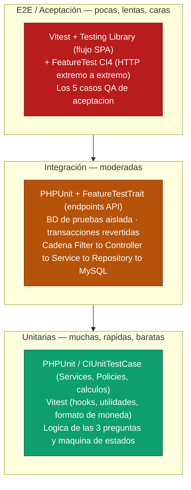
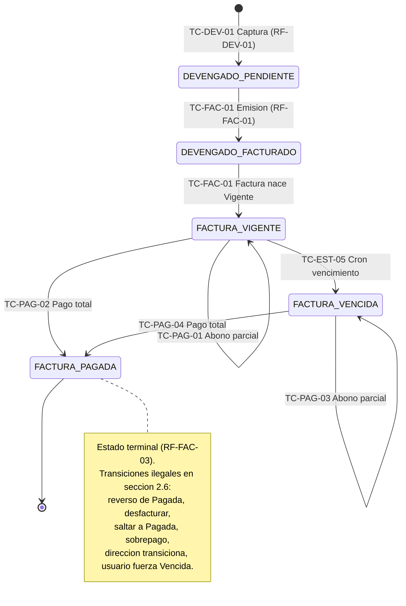

# 06 — Plan de Pruebas

| Campo | Valor |
|---|---|
| **Documento** | 06 — Plan de Pruebas |
| **Proyecto** | Portal Ejecutivo BQS — MVP1 |
| **Organización** | Best Quality Solutions México (BQS) · Ciudad Juárez |
| **Versión** | 1.0 |
| **Fecha** | 18/06/2026 |
| **Frameworks** | PHPUnit (CodeIgniter 4 `CIUnitTestCase` + `FeatureTestTrait`) · Vitest + Testing Library (React 19) |
| **Análisis estático** | PHPStan nivel 8 · `tsc --noEmit` · ESLint |
| **Cobertura objetivo** | ≥ 70 % en lógica de negocio (Services, Policies, cálculo de las 3 preguntas, ciclo de cobro) |
| **Depende de** | [SRS (01)](../01-vision/01_SRS_especificacion_requisitos.md) · [Arquitectura (02)](../02-arquitectura/02_arquitectura_sistema.md) · [Modelo de Datos (03)](../03-datos/03_modelo_de_datos.md) · [Seguridad (04)](../04-seguridad/04_plan_de_seguridad.md) · [API (05)](../05-api/05_especificacion_api.md) · [QA-Test-Cases (fuente)](../00-fuentes/BQS-MVP1-QA-Test-Cases.md) |

> **Fidelidad a la fuente.** Este plan verifica **exactamente** los requisitos funcionales del [SRS §3](../01-vision/01_SRS_especificacion_requisitos.md), la máquina de estados del [SRS §4](../01-vision/01_SRS_especificacion_requisitos.md) y los **5 casos de aceptación oficiales** del [QA-Test-Cases](../00-fuentes/BQS-MVP1-QA-Test-Cases.md). No se inventan reglas de negocio. Las propuestas de evolución (p. ej. trazabilidad fina devengado→factura) se registran como enlace a [`OPORTUNIDADES_DE_MEJORA.md`](../OPORTUNIDADES_DE_MEJORA.md) y **no** se prueban como parte del MVP1.

---

## 1. Estrategia

El sistema es un portal financiero donde el **servidor decide y calcula, el cliente solo presenta** ([CLAUDE.md, regla 1](../CLAUDE.md)). En consecuencia, el peso de las pruebas recae en el **backend CodeIgniter 4** (lógica de negocio, autorización, transacciones ACID, las 3 preguntas y la máquina de estados), con una capa de pruebas de componente en el **frontend React 19** para garantizar que el render y los formularios consumen correctamente la API sin recalcular montos.

La estrategia sigue la **pirámide de pruebas**: muchas pruebas unitarias rápidas en la base, una capa intermedia de integración sobre la API real con base de datos aislada, y una cima reducida de pruebas extremo a extremo que materializan los 5 casos de aceptación.

### 1.1 Pirámide de pruebas



### 1.1.1 Tabla tipo → herramienta → qué cubre

| Nivel | Tipo de prueba | Herramienta | Qué cubre |
|---|---|---|---|
| Base | Unitaria backend | **PHPUnit** + `CIUnitTestCase` | Métodos puros de `Services` y `Policies`: cálculo de saldo, validación de sobrepago, decisión de transición de estado, reglas de autorización por rol, fórmulas de las 3 preguntas con datos en memoria/mock. |
| Base | Unitaria frontend | **Vitest** | Hooks (`useResumenEjecutivo`), utilidades de formato (moneda MXN `$100,000.00`), reducers de UI. No tocan red real (mock de `fetch`/Axios). |
| Media | Integración / API | **PHPUnit** + `FeatureTestTrait` | Endpoints REST completos (`/api/v1/...`) atravesando Filters → Controller → Validation → Policy → Service → Repository → MySQL de pruebas. Verifican código HTTP, payload, estado persistido y auditoría. |
| Media | Componente con datos | **Testing Library** (`@testing-library/react`) | Render del dashboard y formularios contra respuestas de API mockeadas (MSW); que el cliente **muestre** lo que el servidor calculó y **no recalcule**; ocultamiento de acciones de escritura para `direccion`. |
| Cima | E2E / Aceptación | **PHPUnit FeatureTest** (backend) + **Testing Library** (UI) | Los **5 casos de aceptación** del [QA-Test-Cases](../00-fuentes/BQS-MVP1-QA-Test-Cases.md) de extremo a extremo. |
| Transversal | Análisis estático | **PHPStan nivel 8**, **`tsc --noEmit`**, **ESLint** | Tipos, nulabilidad, contratos; no ejecuta pero es puerta de release ([RNF-11](../01-vision/01_SRS_especificacion_requisitos.md)). |
| Transversal | Rendimiento | **k6** / Apache Bench (escenario de carga) | Umbrales P95 por tipo de endpoint ([RNF-01](../01-vision/01_SRS_especificacion_requisitos.md)); ver §3. |
| Transversal | Seguridad de dependencias | **`composer audit`**, **`npm audit`** | Cero vulnerabilidades conocidas en dependencias (criterio de release, §5). |

### 1.2 Entornos y datos de prueba

| Aspecto | Decisión | Justificación |
|---|---|---|
| **Base de datos de pruebas** | Conexión `tests` dedicada en `app/Config/Database.php` (BD `bqs_test` en MySQL 8, **nunca** la de desarrollo ni producción). CI usa el grupo `tests`. | Aislar los datos de prueba de los reales; permitir migraciones y truncados destructivos sin riesgo. |
| **Esquema** | `php spark migrate --all` con las migraciones de las 5 tablas Tier 0 + soporte ([03 §4](../03-datos/03_modelo_de_datos.md)) y las migraciones oficiales de **Shield**. | El esquema bajo prueba es idéntico al de producción (mismos `CHECK`, FKs `RESTRICT`, índices). |
| **Migraciones por suite** | `protected $migrate = true; $migrateOnce = true;` en las clases base. | Garantiza esquema fresco una vez por corrida; rápido y reproducible. |
| **Factories / Seeders** | Seeders dedicados (`ClienteSeeder`, `CotizacionSeeder`, `DevengadoSeeder`, `FacturaSeeder`, `PagoSeeder`, `WhitelistSeeder`) y *fakers* internos para construir entidades válidas (`CLI-001`, `COT-0001`, `CAP-00001`, `F-9901`, `PAG-0001`). | Datos deterministas alineados a los IDs de los casos QA; sin dependencia de la importación de Excel. |
| **Transacciones revertidas por test** | `use DatabaseTestTrait;` con `protected $refresh = false;` y envoltura transaccional automática: cada test corre dentro de una transacción que se **revierte en `tearDown`**. | Aislamiento total entre tests; el estado no se filtra de un test a otro. Excepción: los tests que verifican explícitamente el `commit`/`rollback` de negocio gestionan su propia transacción. |
| **Mock de servicios externos** | El **timbrado fiscal** está fuera del MVP1 ([SRS §1.2](../01-vision/01_SRS_especificacion_requisitos.md)); no hay PAC que mockear. El folio fiscal se inyecta como dato. | El portal solo registra el folio, no lo timbra; no hay integración externa que simular en MVP1. |
| **Mock del cron** | Las tareas `spark` (`bqs:mark-overdue`, `bqs:process-queue`) se invocan **directamente** en el test (`command('bqs:mark-overdue')`) o se llama al método del servicio que ejecutan, con la fecha del sistema controlada. **Ningún test depende del reloj real del cron.** | Permite verificar de forma determinista que **solo el cron** marca `Vencida` (invariante §2.6) y que la marca depende de `Fecha_Vencimiento` vs. fecha de corte. |
| **Reloj / fecha** | La "fecha de hoy" se inyecta vía servicio de tiempo o `Time::setTestNow()` de CI4. | Probar vencimientos y "facturado del mes" sin depender del día real de ejecución. |
| **Frontend** | Vitest con entorno `jsdom`; **MSW (Mock Service Worker)** o mock de Axios para simular la API. Nunca se golpea el backend real desde el unit test de UI. | El cliente se prueba contra contratos de API estables; el backend ya está cubierto por sus propias pruebas. |

> Convención de nombres de casos: **`TC-<MÓDULO>-<NN>`** (Test Case). Cada `TC` referencia el/los **RF** del SRS que verifica. Los casos de aceptación oficiales conservan su nombre de fuente **`Caso QA N`** y se mapean a `TC` automatizados en §6.

---

## 2. Pruebas por módulo

Para cada caso: **condición de entrada → resultado esperado** (código HTTP, estado de datos persistido, comportamiento observable). Todos los endpoints siguen la convención `/api/v1/...` de la [arquitectura (02 §4)](../02-arquitectura/02_arquitectura_sistema.md) y la [especificación de API (05)](../05-api/05_especificacion_api.md).

### 2.1 Autenticación, sesión y whitelist (`AUTH`, `CTA`)

| Caso | Condición de entrada | Resultado esperado |
|---|---|---|
| **TC-AUTH-01** (RF-AUTH-01) | `POST /api/v1/auth/login` con correo en whitelist + contraseña correcta. | `200`; cuerpo con `access_token`; `Set-Cookie` de refresh `HttpOnly`+`Secure`+`SameSite=Strict`. |
| **TC-AUTH-02** (RF-AUTH-01) | `POST /auth/login` con correo correcto pero contraseña incorrecta. | `401 BAD_CREDENTIALS`; sin token; sin cookie. |
| **TC-AUTH-03** (RF-AUTH-01 · **Caso QA 5**) | `POST /auth/login` con `intruso@competidor.com` (no en whitelist) y contraseña válida en Shield. | `403 NOT_WHITELISTED`; sin token; sesión cerrada en backend; el registro **no** queda autenticado. |
| **TC-AUTH-04** (RF-AUTH-02) | Access token expirado + refresh válido en cookie → `POST /auth/refresh`. | `200` con nuevo access token; sin reingreso de credenciales. |
| **TC-AUTH-05** (RF-AUTH-02) | `POST /auth/refresh` sin cookie de refresh (o expirada). | `401`; se exige reingreso de credenciales. |
| **TC-AUTH-06** (RF-AUTH-03) | `POST /auth/logout` con token activo; luego cualquier `GET` con el token anterior. | Logout `200`; el token revocado devuelve `401` en cualquier endpoint posterior. |
| **TC-AUTH-07** (RF-AUTH-04) | Token de `direccion` ejecuta `POST /api/v1/pagos`. | `403`; **ningún** registro creado (verificar `PAGOS` sin cambios). Ver §2.10 (seguridad). |
| **TC-AUTH-08** (RF-AUTH-02) | Petición con token Bearer manipulado (firma inválida). | `401`; rechazado por el filtro `auth:token` antes del controlador. |
| **TC-CTA-01** (RF-CTA-01) | `admin` ejecuta `DELETE`/`PATCH` sobre whitelist para revocar `usuario@bqs.com`; luego ese usuario intenta `login`. | Revocación `200`; el correo revocado recibe `403 NOT_WHITELISTED` a partir de ese momento. |
| **TC-CTA-02** (RF-CTA-02) | `admin` asigna rol `facturacion` a un usuario; el usuario emite factura. Otro usuario **sin** ese rol intenta emitir. | Con rol: `201`. Sin rol: `403`. |

### 2.2 Catálogo de clientes (`CLI`)

| Caso | Condición de entrada | Resultado esperado |
|---|---|---|
| **TC-CLI-01** (RF-CLI-01 · **Caso QA 1**) | BD con cotizaciones del cliente `CLI-001` cuyos textos previos eran "NIDEC Mobility" y "Nidec México"; `GET /api/v1/clientes/CLI-001`. | **Una** entidad consolidada `CLI-001`; la cartera (suma de cotizaciones/facturas) refleja **ambos** orígenes sumados; no aparecen dos clientes distintos. |
| **TC-CLI-02** (RF-CLI-02) | `admin` intenta `DELETE /clientes/CLI-001` teniendo el cliente cotizaciones/facturas asociadas. | `409`/`422`; **no** se elimina físicamente (FK `RESTRICT`); el cliente puede marcarse `Inactivo` (baja lógica). |
| **TC-CLI-03** (RF-CLI-02) | `admin` actualiza `Estatus = 'Inactivo'` de un cliente sin movimientos. | `200`; `Estatus` persistido como `Inactivo`; entrada en `AUDITORIA`. |
| **TC-CLI-04** (RF-CLI-03 · apoya **Caso QA 4**) | `GET /clientes/CLI-001/cartera` con factura `F-9901` $50,000 y abono $20,000. | `200`; el saldo del cliente = suma de facturas activas − pagos = **$30,000.00** para ese folio. |
| **TC-CLI-05** (RF-CLI-02) | `POST /clientes` con `RFC` duplicado de un cliente existente. | `422`; rechazado por `UNIQUE(RFC)`; mensaje de validación claro. |

### 2.3 Cotizaciones (`COT`)

| Caso | Condición de entrada | Resultado esperado |
|---|---|---|
| **TC-COT-01** (RF-COT-01) | `facturacion` registra `COT-0002` `Aprobada` ligada a `CLI-001` con `Monto_Autorizado` y `PO_Referencia`. | `201`; cotización persistida `Aprobada`; queda disponible para asociar devengado. |
| **TC-COT-02** (RF-COT-01) | `POST /cotizaciones` con `Estatus` fuera de catálogo (`'Borrador'`). | `422`; rechazado por `CHECK Estatus IN ('Aprobada','Pendiente PO','Cerrada')`. |
| **TC-COT-03** (RF-COT-02) | `GET /cotizaciones/COT-0001/consumo` con devengado acumulado registrado. | `200`; muestra devengado acumulado vs `Monto_Autorizado` (consumo del límite). |
| **TC-COT-04** (RF-COT-01) | `capturista` (sin rol `facturacion`) intenta `POST /cotizaciones`. | `403`; no autorizado para gestionar cotizaciones. |

### 2.4 Bitácora de sorteo / devengado (`DEV`)

| Caso | Condición de entrada | Resultado esperado |
|---|---|---|
| **TC-DEV-01** (RF-DEV-01) | `capturista` registra `CAP-00001` sobre `COT-0001` vigente, con `Horas`, `Piezas` y `Monto_Devengado = 10000`. | `201`; nace `Estatus_Facturacion = 'Pendiente'`; suma +$10,000 al indicador "por facturar" de su cotización. (Estado inicial de la máquina: `DEVENGADO_PENDIENTE`.) |
| **TC-DEV-02** (RF-DEV-02) | `POST /devengado` con `Monto_Devengado = "N/A"` (texto). | `422`; rechazado por validación numérica; nada persistido. |
| **TC-DEV-03** (RF-DEV-02) | `POST /devengado` con `Monto_Devengado = -500` (negativo). | `422`; rechazado por regla de negocio + `CHECK (Monto_Devengado >= 0)`. |
| **TC-DEV-04** (RF-DEV-01) | `facturacion` (sin rol `capturista`) intenta capturar devengado. | `403`; solo `capturista` (o unión con sus privilegios) puede alimentar `BITACORA_SORTEO`. |
| **TC-DEV-05** (RF-DEV-01) | `capturista` captura devengado sobre una cotización inexistente. | `422`/`409`; FK `RESTRICT` impide huérfanos; mensaje de cotización inválida. |

### 2.5 Facturas (`FAC`) — emisión y transacción ACID

| Caso | Condición de entrada | Resultado esperado |
|---|---|---|
| **TC-FAC-01** (RF-FAC-01) | `facturacion` emite `POST /api/v1/facturas` para `CLI-001` seleccionando `CAP-00001` (`Pendiente`). | `201`; en **una transacción ACID**: se crea `FACTURAS` con `Estatus_Pago = 'Vigente'`, el devengado pasa a `'Facturado'`, baja el indicador "por facturar"; entrada en `AUDITORIA`. (Transiciones `DEVENGADO_PENDIENTE → DEVENGADO_FACTURADO → FACTURA_VIGENTE`.) |
| **TC-FAC-02** (RF-FAC-01) | Emisión donde la actualización del devengado falla (se fuerza error a mitad de transacción). | **Rollback total**: ni factura creada ni devengado marcado; respuesta `409`/`422`; BD intacta. |
| **TC-FAC-03** (RF-FAC-02) | Cron `bqs:mark-overdue` con factura `Vigente` cuya `Fecha_Vencimiento` < hoy y saldo > 0. | La factura pasa a `Vencida`. (Ver TC-EST-05.) |
| **TC-FAC-04** (RF-FAC-03) | Intento de transicionar una factura `Pagada` (reabrir/revertir). | `409`/`422`; **rechazado**; la factura `Pagada` es terminal en MVP1. (Ver TC-EST-09.) |
| **TC-FAC-05** (RF-FAC-01) | `POST /facturas` con `Monto_Total < Monto_Subtotal`. | `422`; rechazado por `CHECK (Monto_Total >= Monto_Subtotal)`. |
| **TC-FAC-06** (RF-FAC-01) | `POST /facturas` con `Fecha_Vencimiento < Fecha_Emision`. | `422`; rechazado por `CHECK (Fecha_Vencimiento >= Fecha_Emision)`. |

### 2.6 Pagos (`PAG`)

| Caso | Condición de entrada | Resultado esperado |
|---|---|---|
| **TC-PAG-01** (RF-PAG-01 · **Caso QA 4**) | Factura `F-9901` `Vigente` $50,000; `POST /api/v1/pagos` abono $20,000. | `201`; saldo restante = **$30,000.00**; la factura permanece `Vigente` (saldo > 0); auditoría registrada. |
| **TC-PAG-02** (RF-PAG-01) | Factura `Vigente` $50,000 con $20,000 abonado; nuevo abono $30,000 (completa el total). | `201`; `Σ Pagos = Monto_Total` → factura pasa a `Pagada`; saldo = $0.00. |
| **TC-PAG-03** (RF-PAG-01) | Factura `Vencida` con saldo > 0; abono parcial. | `201`; saldo disminuye; la factura **permanece `Vencida`** (no vuelve a `Vigente`). |
| **TC-PAG-04** (RF-PAG-01) | Factura `Vencida` con saldo > 0; abono que completa el total. | `201`; pasa a `Pagada`. |
| **TC-PAG-05** (RF-PAG-02) | Factura con saldo $30,000; abono $40,000 (sobrepago). | `422 OVERPAY`; **rechazado**; ningún `PAGOS` insertado; saldo sin cambios. |
| **TC-PAG-06** (RF-PAG-02) | `POST /pagos` con `Monto_Pagado = 0` o negativo. | `422`; rechazado por validación + `CHECK (Monto_Pagado > 0)`. |
| **TC-PAG-07** (RF-MET-01) | Registro de pago válido. | Además del `201`, se genera **una entrada en `AUDITORIA`** con `usuario_id`, `entidad='PAGOS'`, `entidad_id` = folio y valores antes/después. |

### 2.7 Dashboard ejecutivo — las 3 preguntas (`DASH`)

Estos casos verifican **exactamente** las tres fórmulas con los números de los casos QA. El cálculo ocurre en el servidor ([RF-DASH-04](../01-vision/01_SRS_especificacion_requisitos.md)); el cliente solo renderiza.

| Caso | Condición de entrada | Resultado esperado |
|---|---|---|
| **TC-DASH-01** (RF-DASH-01 · **Caso QA 2**) | `FACTURAS` con **$100,000** emitidos en el mes en curso (`Vigente`/`Pagada`) y **$50,000** el mes anterior; `GET /api/v1/dashboard/resumen`. | `facturado_del_mes` = **$100,000.00** exacto. **Excluye** los $50,000 del mes previo. |
| **TC-DASH-02** (RF-DASH-02 · **Caso QA 3**) | `BITACORA_SORTEO` con un devengado de **$10,000** `Pendiente`. | `por_facturar` = **$10,000.00**, con **desglose por `ID_Cotizacion`**; un devengado `Facturado` no suma. |
| **TC-DASH-03** (RF-DASH-03 · **Caso QA 4**) | Factura `F-9901` $50,000 (`Vigente`) con abono $20,000. | `por_cobrar` = **$30,000.00** (suma de facturas `Vigente`+`Vencida` − Σ pagos). Una factura `Pagada` no suma al por cobrar. |
| **TC-DASH-04** (RF-DASH-01) | Mes en curso sin facturas. | `facturado_del_mes` = **$0.00** (no error, no `null`). |
| **TC-DASH-05** (RF-DASH-04) | El cliente envía un payload manipulado con totales falsos en un `GET`. | La API ignora cualquier total de entrada; responde los valores **calculados en servidor**; el render oficial no cambia. |
| **TC-DASH-06** (RF-DASH-02) | Dos cotizaciones con devengado `Pendiente` ($10,000 y $4,000). | `por_facturar` = **$14,000.00**; el desglose lista **ambas** cotizaciones con su monto. |
| **TC-DASH-07** (RNF-02 / RF-DASH-04) | Inspección del plan de consulta de las agregaciones. | Las consultas usan los índices `idx_fac_estatus_emision`, `idx_bit_estatus_fact`, `idx_pag_factura`; sin escaneo completo de tabla. |

**Verificación de las 3 fórmulas (referencia canónica del SRS):**

1. **Pregunta 1 — Facturado del mes** = `Σ FACTURAS.Monto_Total` donde `Fecha_Emision` ∈ mes actual **y** `Estatus_Pago ∈ {'Pagada','Vigente'}`. → TC-DASH-01.
2. **Pregunta 2 — Por facturar** = `Σ BITACORA_SORTEO.Monto_Devengado` donde `Estatus_Facturacion = 'Pendiente'`, agrupado por `ID_Cotizacion`. → TC-DASH-02 / TC-DASH-06.
3. **Pregunta 3 — Por cobrar** = `Σ FACTURAS.Monto_Total` (`Estatus_Pago ∈ {'Vigente','Vencida'}`) − `Σ PAGOS.Monto_Pagado` asociados. → TC-DASH-03.

### 2.8 Administración y captura (`ADM`)

| Caso | Condición de entrada | Resultado esperado |
|---|---|---|
| **TC-ADM-01** (RF-ADM-01) | `capturista`, `facturacion` y `admin` consultan el panel; `direccion` también. | Cada rol ve **solo** las acciones permitidas; las no permitidas no se renderizan **y** se bloquean en backend (doble control). |
| **TC-ADM-02** (RF-ADM-02) | `admin` dispara la importación inicial (job `import_inicial` en `JOBS_COLA`); el cron procesa. | El job se encola con `estado='pendiente'`; tras `bqs:process-queue` queda `completado`; clientes variantes consolidados en un `ID_Cliente`; numéricos saneados. |
| **TC-ADM-03** (RF-ADM-02) | Job de importación falla (dato corrupto). | `intentos` se incrementa; con `intentos < max_intentos` reintenta; al agotar, `estado='fallido'` con `ultimo_error`; la petición HTTP **no** ejecutó el trabajo en línea. |

### 2.9 Auditoría, métricas y reportes (`MET`)

| Caso | Condición de entrada | Resultado esperado |
|---|---|---|
| **TC-MET-01** (RF-MET-01) | Escritura sobre `FACTURAS`, `PAGOS`, `BITACORA_SORTEO`, `COTIZACIONES`, `CAT_CLIENTES` o whitelist. | Cada mutación genera registro en `AUDITORIA` con `usuario_id`, `accion`, `entidad`, `entidad_id`, `valores_antes`, `valores_despues`, `ip`, `creado_en`. |
| **TC-MET-02** (RF-MET-01) | Acceso `GET` del rol `direccion` al dashboard. | Se registra el acceso (`accion='acceso'`) para trazabilidad forense. |
| **TC-MET-03** (RF-MET-02) | `GET /api/v1/reportes/cartera`. | El resumen **global** (facturado / por facturar / por cobrar) coincide con la **suma** de los resúmenes por cliente. |
| **TC-MET-04** (RF-MET-01) | Intento de `UPDATE`/`DELETE` sobre `AUDITORIA` desde la aplicación. | No existe endpoint que lo permita; la auditoría es **solo inserción** (inmutable). |

### 2.10 Máquina de estados del Ciclo de Cobro — tabla EXHAUSTIVA

Esta sección es **crítica**. Cubre **todas** las transiciones válidas del [SRS §4.1](../01-vision/01_SRS_especificacion_requisitos.md) **y** todas las transiciones ilegales del [SRS §4.2](../01-vision/01_SRS_especificacion_requisitos.md). Cada fila es un test automatizado de `EstadoCobroService` (unitario) y/o de endpoint (integración).

**Diagrama de cobertura (caso por transición):**



#### 2.10.1 Transiciones VÁLIDAS (SRS §4.1)

| # | Caso | Estado origen | Condición (disparador) | Estado destino | Actor | Resultado esperado |
|---|---|---|---|---|---|---|
| V1 | **TC-EST-01** | (inicial) | Captura de devengado en cotización vigente (RF-DEV-01) | `DEVENGADO_PENDIENTE` | `capturista` | `201`; `Estatus_Facturacion='Pendiente'`; suma a "por facturar". |
| V2 | **TC-EST-02** | `DEVENGADO_PENDIENTE` | Se incluye en una factura emitida (RF-FAC-01) | `DEVENGADO_FACTURADO` | `facturacion` | `Estatus_Facturacion='Facturado'`; baja "por facturar". |
| V3 | **TC-EST-03** | `DEVENGADO_FACTURADO` | Factura creada en la misma transacción | `FACTURA_VIGENTE` | `facturacion` (sistema) | `FACTURAS.Estatus_Pago='Vigente'`; toda factura **nace Vigente**. |
| V4 | **TC-EST-04** | `FACTURA_VIGENTE` | Abono parcial (Σ Pagos < Monto_Total) | `FACTURA_VIGENTE` | `facturacion` | Permanece `Vigente`; saldo disminuye (auto-transición). |
| V5 | **TC-EST-05** | `FACTURA_VIGENTE` | Hoy > `Fecha_Vencimiento` y saldo > 0 (cron) | `FACTURA_VENCIDA` | sistema (cron diario) | **Solo** `bqs:mark-overdue` la marca `Vencida`. |
| V6 | **TC-EST-06** | `FACTURA_VIGENTE` | Σ Pagos ≥ Monto_Total | `FACTURA_PAGADA` | `facturacion` | Pasa a `Pagada`; saldo = 0. |
| V7 | **TC-EST-07** | `FACTURA_VENCIDA` | Abono parcial (saldo > 0) | `FACTURA_VENCIDA` | `facturacion` | Permanece `Vencida`; saldo disminuye (auto-transición). |
| V8 | **TC-EST-08** | `FACTURA_VENCIDA` | Σ Pagos ≥ Monto_Total | `FACTURA_PAGADA` | `facturacion` | Pasa a `Pagada` desde `Vencida`. |

#### 2.10.2 Transiciones ILEGALES (SRS §4.2) — deben rechazarse

| # | Caso | Intento (transición prohibida) | Invariante violada | Resultado esperado |
|---|---|---|---|---|
| I1 | **TC-EST-09** | Reabrir/revertir `FACTURA_PAGADA` → `Vigente`/`Vencida` | §4.2(1): no hay reverso de Pagada (terminal) | `409 ILLEGAL_TRANSITION`; estado **sin cambios**; sin auditoría de mutación. |
| I2 | **TC-EST-10** | "Desfacturar": `DEVENGADO_FACTURADO` → `DEVENGADO_PENDIENTE` | §4.2(2): no se desfactura | `409 ILLEGAL_TRANSITION`; `Estatus_Facturacion` permanece `Facturado`. |
| I3 | **TC-EST-11** | Crear factura directamente en `FACTURA_PAGADA` (saltar `Vigente`) | §4.2(3): toda factura nace `Vigente` | `422 ILLEGAL_INITIAL_STATE`; no se crea factura `Pagada`. |
| I4 | **TC-EST-12** | Registrar abono que excede el saldo (sobrepago) | §4.2(4): un abono nunca excede el saldo | `422 OVERPAY`; no hay estado de "sobrepago"; nada persistido (= TC-PAG-05). |
| I5 | **TC-EST-13** | Un usuario (`facturacion`/`admin`) fuerza manualmente `FACTURA_VENCIDA` | §4.2(5): solo el cron marca `Vencida` | `403`/`409 FORBIDDEN_TRANSITION`; no existe endpoint de marcado manual; estado sin cambios. |
| I6 | **TC-EST-14** | El rol `direccion` intenta cualquier transición (emitir, abonar, marcar) | §4.2(6): `direccion` no dispara transiciones (solo lectura) | `403`; bloqueado por `ReadOnlyGuard`; **ningún** dato alterado (= TC-AUTH-07 / TC-SEC-04). |
| I7 | **TC-EST-15** | Transición desde `FACTURA_PAGADA` recibiendo un nuevo pago | §4.2(1)+(4): Pagada es terminal y no admite más pagos | `409`/`422`; rechazado; saldo permanece 0. |
| I8 | **TC-EST-16** | Saltar `DEVENGADO_PENDIENTE → FACTURA_VIGENTE` sin pasar por `DEVENGADO_FACTURADO` en la misma transacción | Coherencia del flujo §4.1 (la emisión marca el devengado y crea la factura atómicamente) | La emisión es atómica: o se produce `Facturado` + factura `Vigente` juntos, o **rollback**; no hay factura sin devengado marcado (= TC-FAC-02). |

> **14 transiciones** cubiertas (8 válidas + 6 clases de transición ilegal de §4.2); las filas I7–I8 refuerzan invariantes ya enunciadas, totalizando **16 casos `TC-EST`** en la suite.

### 2.11 Seguridad — casos negativos por control OWASP

Casos negativos por cada control relevante ([SRS §RNF-03/04](../01-vision/01_SRS_especificacion_requisitos.md), [Seguridad (04)](../04-seguridad/04_plan_de_seguridad.md)). El principio rector: **el servidor revalida siempre; ocultar un botón no es autorizar** ([CLAUDE.md, regla 1](../CLAUDE.md)).

| Caso | Control OWASP | Condición de entrada | Resultado esperado |
|---|---|---|---|
| **TC-SEC-01** | **A01 Broken Access Control / IDOR** | Usuario `facturacion` del cliente A solicita `GET /api/v1/facturas/F-DE-OTRO` (factura de otro cliente fuera de su alcance). | `403`/`404`; la Policy evalúa recurso+id en servidor; no se filtra la factura ajena. |
| **TC-SEC-02** | **A01 / escalada de rol** | Token de `capturista` ejecuta `POST /api/v1/facturas` (acción de `facturacion`). | `403`; la unión de privilegios no incluye emitir factura; sin cambios en BD. |
| **TC-SEC-03** | **A07 Identification & Auth Failures** | (a) token inválido (firma); (b) token expirado; (c) token revocado tras logout. | Los tres → `401`; rechazados por el filtro `auth:token`. |
| **TC-SEC-04** | **A01 / solo lectura Dirección** | Token de `direccion` ejecuta `POST/PUT/PATCH/DELETE` en cualquier endpoint de escritura. | `403`; bloqueado por `ReadOnlyGuard`; **sin** alterar datos (RF-AUTH-04). |
| **TC-SEC-05** | **Whitelist (2ª barrera) — Caso QA 5** | `intruso@competidor.com` con credenciales válidas en Shield intenta `login`. | `403 NOT_WHITELISTED`; pantalla de acceso denegado; sin token (= TC-AUTH-03). |
| **TC-SEC-06** | **A03 Injection (SQLi)** | Parámetro con payload `'; DROP TABLE FACTURAS;--` o `CLI-001' OR '1'='1` en filtros/búsqueda. | `422`/sin efecto; consultas **parametrizadas** (Query Builder); ninguna tabla afectada; sin fuga de filas. |
| **TC-SEC-07** | **Lógica de negocio / sobrepago** | Abono mayor al saldo (RF-PAG-02). | `422 OVERPAY`; rechazado (= TC-PAG-05 / TC-EST-12). |
| **TC-SEC-08** | **A05 Security Misconfiguration** | Respuesta de cualquier endpoint en `production`. | Cabeceras `HSTS`, `CSP` estricta, `X-Content-Type-Options: nosniff`, `X-Frame-Options: DENY`; errores genéricos al cliente (detalle solo en logs). |
| **TC-SEC-09** | **A04 Insecure Design / rate limiting** | Múltiples intentos de `login` por encima del umbral. | `429 Too Many Requests`; throttle activo en `auth/login`. |
| **TC-SEC-10** | **A09 Logging & Monitoring** | Acción financiera y acceso de Dirección. | Quedan registrados en `AUDITORIA` (= TC-MET-01/02); base forense disponible. |

---

## 3. Pruebas de rendimiento

Verifican [RNF-01](../01-vision/01_SRS_especificacion_requisitos.md) (dashboard P95 < 800 ms) y [RNF-02](../01-vision/01_SRS_especificacion_requisitos.md) (uso de índices, sin escaneos completos). Se ejecutan con **k6** (o Apache Bench) contra un entorno con datos de **un año de operación**.

### 3.1 Umbrales por tipo de endpoint

| Tipo de endpoint | Ejemplo | Umbral P95 | Umbral P99 | Notas |
|---|---|---|---|---|
| **Dashboard / agregaciones** | `GET /api/v1/dashboard/resumen` | **< 800 ms** | < 1200 ms | RNF-01; las 3 preguntas con índices definidos en [03](../03-datos/03_modelo_de_datos.md). |
| **Lectura puntual** | `GET /api/v1/facturas/{folio}`, `GET /clientes/{id}` | < 300 ms | < 500 ms | Acceso por PK/índice. |
| **Listados paginados** | `GET /api/v1/facturas?page=N` | < 500 ms | < 800 ms | Paginación obligatoria; sin `SELECT *` sin límite. |
| **Escritura transaccional** | `POST /facturas`, `POST /pagos` | < 600 ms | < 1000 ms | Incluye transacción ACID + auditoría. |
| **Autenticación** | `POST /auth/login` | < 700 ms | < 1100 ms | Incluye verificación Shield + whitelist + hash de contraseña. |

### 3.2 Escenarios de carga esperada

| Escenario | Descripción | Carga | Criterio de aprobación |
|---|---|---|---|
| **Carga nominal** | Operación diaria típica de BQS: 1 ejecutivo consultando + personal capturando/facturando. | ~10 usuarios concurrentes, 5 min sostenidos. | P95 dentro de umbrales §3.1; 0 % de errores 5xx. |
| **Pico de cierre de mes** | Consultas intensivas al dashboard + emisión de facturas concentrada. | ~30 usuarios concurrentes, ráfagas. | Dashboard P95 < 800 ms; sin degradación de la integridad transaccional. |
| **Volumen anual** | BD precargada con ~1 año de facturas/pagos/devengado. | Consultas de agregación sobre el set completo. | Las 3 preguntas siguen P95 < 800 ms (valida RNF-02: índices, no escaneo). |
| **Resistencia del cron** | `bqs:mark-overdue` y `bqs:process-queue` sobre lote grande. | Lote de cientos de facturas/jobs. | El cron completa sin bloquear las peticiones HTTP; jobs idempotentes con reintentos. |

> El detalle de presupuesto de rendimiento futuro (campo materializado `saldo` si el volumen lo exige) se registra en [`OPORTUNIDADES_DE_MEJORA.md`](../OPORTUNIDADES_DE_MEJORA.md); en MVP1 el saldo se deriva en consulta.

---

## 4. Matriz de trazabilidad RF → casos de prueba

Cubre el **100 % de los RF críticos** (auth, dashboard, facturas, pagos, whitelist) y todos los RF del [SRS §3](../01-vision/01_SRS_especificacion_requisitos.md).

| RF (SRS §3) | Descripción breve | Casos de prueba | Caso QA |
|---|---|---|---|
| **RF-AUTH-01** | Login + whitelist | TC-AUTH-01, TC-AUTH-02, TC-AUTH-03, TC-SEC-05 | **Caso QA 5** |
| **RF-AUTH-02** | Emisión/refresco de tokens | TC-AUTH-04, TC-AUTH-05, TC-AUTH-08, TC-SEC-03 | — |
| **RF-AUTH-03** | Logout y revocación | TC-AUTH-06, TC-SEC-03 | — |
| **RF-AUTH-04** | Solo lectura Dirección | TC-AUTH-07, TC-SEC-04, TC-EST-14 | — |
| **RF-CTA-01** | Administración de whitelist | TC-CTA-01 | Caso QA 5 (apoyo) |
| **RF-CTA-02** | Asignación de roles | TC-CTA-02, TC-SEC-02 | — |
| **RF-CLI-01** | Consolidación por ID único | TC-CLI-01 | **Caso QA 1** |
| **RF-CLI-02** | Alta/edición/baja lógica | TC-CLI-02, TC-CLI-03, TC-CLI-05 | — |
| **RF-CLI-03** | Consulta de cartera | TC-CLI-04, TC-MET-03 | Caso QA 4 (apoyo) |
| **RF-COT-01** | Registro de cotización | TC-COT-01, TC-COT-02, TC-COT-04 | — |
| **RF-COT-02** | Control de límite | TC-COT-03 | — |
| **RF-DEV-01** | Captura de devengado | TC-DEV-01, TC-DEV-04, TC-DEV-05, TC-EST-01 | — |
| **RF-DEV-02** | Validación numérica | TC-DEV-02, TC-DEV-03 | — |
| **RF-FAC-01** | Emisión desde devengado (ACID) | TC-FAC-01, TC-FAC-02, TC-FAC-05, TC-FAC-06, TC-EST-02, TC-EST-03 | — |
| **RF-FAC-02** | Estados de la factura | TC-FAC-03, TC-EST-05, TC-EST-06, TC-EST-08 | — |
| **RF-FAC-03** | Inmutabilidad de Pagada | TC-FAC-04, TC-EST-09, TC-EST-15 | — |
| **RF-PAG-01** | Registro de pago/abono | TC-PAG-01, TC-PAG-02, TC-PAG-03, TC-PAG-04, TC-PAG-07 | **Caso QA 4** |
| **RF-PAG-02** | Prevención de sobrepago | TC-PAG-05, TC-PAG-06, TC-SEC-07, TC-EST-12 | — |
| **RF-DASH-01** | Facturado del mes (P1) | TC-DASH-01, TC-DASH-04 | **Caso QA 2** |
| **RF-DASH-02** | Por facturar (P2) | TC-DASH-02, TC-DASH-06 | **Caso QA 3** |
| **RF-DASH-03** | Por cobrar (P3) | TC-DASH-03 | **Caso QA 4** |
| **RF-DASH-04** | Cálculo en servidor | TC-DASH-05, TC-DASH-07 | — |
| **RF-ADM-01** | Panel de captura/admin | TC-ADM-01 | — |
| **RF-ADM-02** | Importación inicial | TC-ADM-02, TC-ADM-03 | Caso QA 1 (apoyo) |
| **RF-MET-01** | Auditoría de mutaciones | TC-MET-01, TC-MET-02, TC-MET-04, TC-PAG-07 | — |
| **RF-MET-02** | Reporte de cartera | TC-MET-03 | — |

**RF críticos con cobertura confirmada al 100 %:** RF-AUTH-01/02/03/04, RF-DASH-01/02/03/04, RF-FAC-01/02/03, RF-PAG-01/02, RF-CTA-01 (whitelist).

---

## 5. Criterios de aceptación de calidad para release

El MVP1 es **lanzable** solo si **todos** estos criterios están en verde (alineado con [SRS §7](../01-vision/01_SRS_especificacion_requisitos.md) y [RNF-11](../01-vision/01_SRS_especificacion_requisitos.md)):

| # | Criterio | Umbral / verificación | Herramienta |
|---|---|---|---|
| 1 | **Cobertura mínima** | **≥ 70 %** de cobertura en lógica de negocio (Services, Policies, cálculo de las 3 preguntas, ciclo de cobro). | PHPUnit `--coverage` + Vitest `--coverage`. |
| 2 | **Análisis estático PHP** | **PHPStan nivel 8 sin errores**. | `./vendor/bin/phpstan analyse`. |
| 3 | **Tipado TypeScript** | **Cero errores** de tipado. | `npm run typecheck` (`tsc --noEmit`). |
| 4 | **Lint** | Cero errores de ESLint (frontend) y PSR-12 (backend). | `npm run lint` · `composer cs-fix`. |
| 5 | **Vulnerabilidades de dependencias** | **Cero vulnerabilidades conocidas** en dependencias. | `composer audit` · `npm audit`. |
| 6 | **Los 5 casos QA en verde** | Caso QA 1–5 ejecutados y aprobados (ver §6). | PHPUnit FeatureTest + Testing Library. |
| 7 | **Máquina de estados sin transiciones ilegales** | Las 8 transiciones válidas pasan; las 6 clases ilegales (§2.10.2) se **rechazan** sin alterar datos. | Suite `TC-EST-01..16`. |
| 8 | **Integridad transaccional** | Emitir factura y registrar pago son ACID con rollback verificado y auditoría. | TC-FAC-01/02, TC-PAG-01..07, TC-MET-01. |
| 9 | **Seguridad** | Todos los `TC-SEC-01..10` en verde (IDOR, escalada, token inválido/expirado/revocado, whitelist, solo lectura Dirección, SQLi, sobrepago). | Suite de seguridad §2.11. |
| 10 | **Rendimiento** | Dashboard P95 < 800 ms con datos de un año; sin escaneos completos. | k6 / Apache Bench (§3). |

> Si cualquiera de los criterios 1–10 está en rojo, el release **se bloquea**. La puerta de CI ejecuta, en orden: análisis estático → unitarias → integración → cobertura → auditoría de dependencias.

### 5.1 Ejemplos de código de prueba (reales)

Snippets ejecutables que ilustran el patrón de cada nivel. No son placeholders.

**Unitaria backend (PHPUnit · `CIUnitTestCase`) — fórmula de saldo y sobrepago:**

```php
<?php

namespace Tests\Unit;

use CodeIgniter\Test\CIUnitTestCase;
use App\Services\PagoService;
use App\Exceptions\OverpayException;

final class PagoServiceTest extends CIUnitTestCase
{
    public function testSaldoTrasAbonoParcialEsTreintaMil(): void
    {
        // Factura F-9901 por $50,000 con un abono previo de $20,000 (Caso QA 4)
        $service = new PagoService();
        $saldo   = $service->calcularSaldo(montoTotal: 50000.00, sumaPagos: 20000.00);

        $this->assertSame(30000.00, $saldo);
    }

    public function testFacturaSeMarcaPagadaCuandoSaldoLlegaACero(): void
    {
        $service = new PagoService();

        $this->assertSame('Pagada', $service->evaluarEstatus(
            estatusActual: 'Vigente',
            montoTotal: 50000.00,
            sumaPagos: 50000.00,
        ));
    }

    public function testAbonoMayorAlSaldoLanzaSobrepago(): void
    {
        $service = new PagoService();

        $this->expectException(OverpayException::class);
        // Saldo restante $30,000; intento de abonar $40,000 (RF-PAG-02)
        $service->validarAbono(saldoRestante: 30000.00, montoAbono: 40000.00);
    }
}
```

**Unitaria backend — transición ilegal (factura Pagada es terminal):**

```php
<?php

namespace Tests\Unit;

use CodeIgniter\Test\CIUnitTestCase;
use App\Services\EstadoCobroService;
use App\Exceptions\IllegalTransitionException;

final class EstadoCobroServiceTest extends CIUnitTestCase
{
    /** TC-EST-09 / RF-FAC-03: no hay reverso de FACTURA_PAGADA */
    public function testNoSePuedeRevertirFacturaPagada(): void
    {
        $service = new EstadoCobroService();

        $this->expectException(IllegalTransitionException::class);
        $service->transicionar(desde: 'Pagada', hacia: 'Vigente');
    }

    /** TC-EST-13 / SRS §4.2(5): solo el cron marca Vencida */
    public function testUsuarioNoPuedeForzarVencida(): void
    {
        $service = new EstadoCobroService();

        $this->expectException(IllegalTransitionException::class);
        $service->transicionarPorUsuario(desde: 'Vigente', hacia: 'Vencida', rol: 'facturacion');
    }
}
```

**Integración / API (PHPUnit · `FeatureTestTrait`) — emisión ACID y whitelist:**

```php
<?php

namespace Tests\Feature;

use CodeIgniter\Test\CIUnitTestCase;
use CodeIgniter\Test\FeatureTestTrait;
use CodeIgniter\Test\DatabaseTestTrait;

final class FacturaEmisionTest extends CIUnitTestCase
{
    use FeatureTestTrait;
    use DatabaseTestTrait;

    protected $migrate     = true;
    protected $migrateOnce = true;
    protected $seed        = 'Tests\Support\Database\Seeds\CicloCobroSeeder';

    /** TC-FAC-01 / RF-FAC-01: emisión marca devengado y crea factura Vigente */
    public function testEmitirFacturaMarcaDevengadoYNaceVigente(): void
    {
        $token  = $this->tokenDeRol('facturacion');
        $result = $this->withHeaders(['Authorization' => "Bearer {$token}"])
            ->post('/api/v1/facturas', [
                'id_cliente'        => 'CLI-001',
                'capturas'          => ['CAP-00001'],
                'monto_subtotal'    => 8620.69,
                'monto_total'       => 10000.00,
                'fecha_vencimiento' => date('Y-m-d', strtotime('+30 days')),
            ]);

        $result->assertStatus(201);
        // El devengado quedó Facturado
        $this->seeInDatabase('BITACORA_SORTEO', [
            'ID_Captura'          => 'CAP-00001',
            'Estatus_Facturacion' => 'Facturado',
        ]);
        // La factura nace Vigente
        $this->seeInDatabase('FACTURAS', ['ID_Cliente' => 'CLI-001', 'Estatus_Pago' => 'Vigente']);
        // Se auditó la mutación
        $this->seeInDatabase('AUDITORIA', ['entidad' => 'FACTURAS', 'accion' => 'crear']);
    }

    /** TC-AUTH-03 / TC-SEC-05 / Caso QA 5: whitelist bloquea al intruso */
    public function testWhitelistBloqueaCorreoNoAutorizado(): void
    {
        $result = $this->post('/api/v1/auth/login', [
            'correo'   => 'intruso@competidor.com',
            'password' => 'Password.123',
        ]);

        $result->assertStatus(403);
        $result->assertJSONFragment(['error' => ['code' => 'NOT_WHITELISTED']]);
    }

    /** TC-SEC-04 / RF-AUTH-04: direccion no puede escribir */
    public function testDireccionNoPuedeRegistrarPago(): void
    {
        $token  = $this->tokenDeRol('direccion');
        $result = $this->withHeaders(['Authorization' => "Bearer {$token}"])
            ->post('/api/v1/pagos', [
                'folio_factura' => 'F-9901',
                'monto_pagado'  => 1000.00,
            ]);

        $result->assertStatus(403);
        $this->dontSeeInDatabase('PAGOS', ['Folio_Factura' => 'F-9901', 'Monto_Pagado' => 1000.00]);
    }
}
```

**Integración / API — Pregunta 1 (facturado del mes, Caso QA 2):**

```php
<?php

namespace Tests\Feature;

use CodeIgniter\Test\CIUnitTestCase;
use CodeIgniter\Test\FeatureTestTrait;
use CodeIgniter\Test\DatabaseTestTrait;

final class DashboardResumenTest extends CIUnitTestCase
{
    use FeatureTestTrait;
    use DatabaseTestTrait;

    protected $migrate     = true;
    protected $migrateOnce = true;
    protected $seed        = 'Tests\Support\Database\Seeds\CicloCobroSeeder';

    /** TC-DASH-01 / RF-DASH-01: $100,000 este mes, excluye $50,000 del mes previo */
    public function testFacturadoDelMesExcluyeMesesPrevios(): void
    {
        $token  = $this->tokenDeRol('direccion');
        $result = $this->withHeaders(['Authorization' => "Bearer {$token}"])
            ->get('/api/v1/dashboard/resumen');

        $result->assertStatus(200);
        $result->assertJSONFragment(['facturado_del_mes' => 100000.00]);
    }
}
```

**Unitaria frontend (Vitest) — formato de moneda y que el cliente NO recalcula:**

```tsx
import { describe, it, expect } from "vitest";
import { formatMXN } from "@/lib/format";

describe("formatMXN", () => {
  it("formatea el saldo del Caso QA 4 como $30,000.00", () => {
    expect(formatMXN(30000)).toBe("$30,000.00");
  });

  it("formatea cero sin romper", () => {
    expect(formatMXN(0)).toBe("$0.00");
  });
});
```

**Componente frontend (Testing Library) — el dashboard muestra lo que el servidor calculó:**

```tsx
import { describe, it, expect, vi } from "vitest";
import { render, screen } from "@testing-library/react";
import { DashboardResumen } from "@/components/DashboardResumen";

// El backend ya calculó; el cliente solo renderiza (RF-DASH-04)
vi.mock("@/lib/api", () => ({
  api: {
    get: vi.fn().mockResolvedValue({
      data: { data: { facturado_del_mes: 100000, por_facturar: 10000, por_cobrar: 30000 } },
    }),
  },
}));

describe("DashboardResumen", () => {
  it("renderiza las 3 preguntas con los valores del servidor", async () => {
    render(<DashboardResumen />);

    expect(await screen.findByText("$100,000.00")).toBeInTheDocument(); // Pregunta 1
    expect(screen.getByText("$10,000.00")).toBeInTheDocument();          // Pregunta 2
    expect(screen.getByText("$30,000.00")).toBeInTheDocument();          // Pregunta 3
  });
});
```

---

## 6. Casos de aceptación de la fuente (reproducidos y mapeados)

Los **5 casos de aceptación oficiales** del [QA-Test-Cases](../00-fuentes/BQS-MVP1-QA-Test-Cases.md) se reproducen **íntegros** y se mapean a su(s) RF y a los casos automatizados de este plan. Son la **Definition of Done** del MVP1: deben estar **todos en verde** para el release ([SRS §7](../01-vision/01_SRS_especificacion_requisitos.md)).

### Caso de Prueba 1 — Validación del Tier 0 (Limpieza de Clientes)

- **Objetivo:** Verificar que el portal consolide correctamente la información de clientes que previamente tenían nombres variantes en los Excels sucios.
- **Precondiciones:** La base de datos tiene registros de cotizaciones para el cliente con ID `CLI-001` pero con textos "NIDEC Mobility" y "Nidec México".
- **Pasos:**
  1. Abrir la sección de Clientes en el Portal Ejecutivo.
  2. Buscar el registro de `NIDEC Mobility` (`CLI-001`).
  3. Comprobar que los montos de cotizaciones de ambos nombres previos se sumen correctamente en este único perfil.
- **Resultado Esperado:** Se visualiza una única entidad de cliente consolidada con la suma total correcta de su cartera.
- **Mapeo:** RF-CLI-01 (apoyo: RF-ADM-02) → **TC-CLI-01**, TC-ADM-02.

### Caso de Prueba 2 — Cálculo de "Qué ya se facturó" (Pregunta 1)

- **Objetivo:** Confirmar que el monto de facturación mensual en pantalla coincide exactamente con la suma de las facturas activas del mes.
- **Precondiciones:** Tabla `FACTURAS` cargada con $100,000 en facturas emitidas este mes y $50,000 del mes anterior.
- **Pasos:**
  1. Acceder al portal web ejecutivo en el navegador (móvil o escritorio).
  2. Localizar el indicador numérico "Facturado este Mes".
  3. Comparar el valor visual con la suma de la base de datos para el mes actual.
- **Resultado Esperado:** El indicador muestra exactamente `$100,000.00`. Excluye las facturas de meses previos.
- **Mapeo:** RF-DASH-01 → **TC-DASH-01** (backend) + componente Vitest/Testing Library (`DashboardResumen`).

### Caso de Prueba 3 — Cálculo de "Qué falta por facturar" (Pregunta 2)

- **Objetivo:** Asegurar que los servicios ejecutados no facturados (dinero atorado) se calculen en tiempo real.
- **Precondiciones:** Registrar un servicio de sorteo en `BITACORA_SORTEO` por $10,000 con `Estatus_Facturacion` = `Pendiente`.
- **Pasos:**
  1. Abrir la pestaña "Pendiente por Facturar" en la aplicación móvil.
  2. Verificar que se muestre el desglose por cotización y que la suma total aumente en $10,000.
- **Resultado Esperado:** El portal actualiza el indicador mostrando el monto de $10,000 pendiente por cobrar.
- **Mapeo:** RF-DASH-02 → **TC-DASH-02**, TC-DASH-06 (desglose por cotización).

### Caso de Prueba 4 — Cálculo de "Cuánto te deben" con Abonos Parciales (Pregunta 3)

- **Objetivo:** Validar que los saldos de cuentas por cobrar disminuyan correctamente tras registrar un pago parcial.
- **Precondiciones:** Factura `F-9901` emitida por $50,000 con estatus `Vigente`.
- **Pasos:**
  1. Registrar un abono en `PAGOS` por $20,000 ligado a `F-9901`.
  2. Abrir la sección de saldos del cliente titular en la app.
  3. Verificar el valor de deuda restante para este folio.
- **Resultado Esperado:** La aplicación muestra que el saldo pendiente de cobro de esa factura es de `$30,000.00`.
- **Mapeo:** RF-PAG-01 + RF-DASH-03 (apoyo: RF-CLI-03) → **TC-PAG-01**, TC-DASH-03, TC-CLI-04.

### Caso de Prueba 5 — Seguridad de Whitelist

- **Objetivo:** Evitar accesos no autorizados al portal financiero de Eric.
- **Precondiciones:** El correo `intruso@competidor.com` no está en la lista de acceso.
- **Pasos:**
  1. Intentar iniciar sesión en el portal web ejecutivo usando la cuenta no autorizada.
- **Resultado Esperado:** El sistema bloquea el ingreso y muestra una pantalla de acceso denegado.
- **Mapeo:** RF-AUTH-01 (2ª barrera; apoyo: RF-CTA-01) → **TC-AUTH-03**, TC-SEC-05.

### 6.1 Resumen de mapeo de los 5 casos

| Caso QA | Título | RF principal | Casos automatizados | Nivel |
|---|---|---|---|---|
| **Caso QA 1** | Consolidación cliente CLI-001 (NIDEC) | RF-CLI-01 | TC-CLI-01, TC-ADM-02 | Integración + E2E |
| **Caso QA 2** | Facturado del mes = $100,000 (excluye previos) | RF-DASH-01 | TC-DASH-01 + componente UI | Integración + E2E |
| **Caso QA 3** | Por facturar +$10,000 con desglose | RF-DASH-02 | TC-DASH-02, TC-DASH-06 | Integración + E2E |
| **Caso QA 4** | Saldo $30,000 tras abono $20,000 / factura $50,000 | RF-PAG-01, RF-DASH-03 | TC-PAG-01, TC-DASH-03, TC-CLI-04 | Unitaria + Integración + E2E |
| **Caso QA 5** | Whitelist bloquea `intruso@competidor.com` | RF-AUTH-01 | TC-AUTH-03, TC-SEC-05 | Integración + E2E |

---

> **Nota final de fidelidad.** Toda regla aquí probada deriva del [SRS](../01-vision/01_SRS_especificacion_requisitos.md), el [Modelo de Datos](../03-datos/03_modelo_de_datos.md), la [Arquitectura](../02-arquitectura/02_arquitectura_sistema.md) y el [QA-Test-Cases](../00-fuentes/BQS-MVP1-QA-Test-Cases.md). Las mejoras de cobertura o trazabilidad que excedan el MVP1 (p. ej. enlace explícito devengado→`Folio_Factura`, saldo materializado) se documentan en [`OPORTUNIDADES_DE_MEJORA.md`](../OPORTUNIDADES_DE_MEJORA.md) y **no** condicionan este release.
