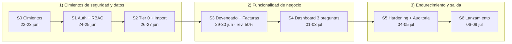

# 07 — Roadmap por Sprints

| Campo | Valor |
|---|---|
| **Documento** | 07 — Roadmap por Sprints |
| **Versión** | 1.0 |
| **Fecha** | 18/06/2026 |
| **Cadencia** | Sprints cortos de ~3–5 días (MVP *fixed-price*, ejecución rápida) |
| **Marco contractual** | SOW Dataholics–BQS (fixed price) · inicio 22/06/2026 |
| **Depende de** | [SRS (01)](../01-vision/01_SRS_especificacion_requisitos.md) · [Arquitectura (02)](../02-arquitectura/02_arquitectura_sistema.md) · [Modelo de Datos (03)](../03-datos/03_modelo_de_datos.md) · [Plan de Seguridad (04)](../04-seguridad/04_plan_de_seguridad.md) · [Plan de Pruebas (06)](../06-pruebas/06_plan_de_pruebas.md) · [ADR-001](../02-arquitectura/ADR/ADR-001_stack-ci4-react.md) · [ADR-002](../02-arquitectura/ADR/ADR-002_mysql-fuente-de-verdad.md) · [ADR-003](../02-arquitectura/ADR/ADR-003_autenticacion-shield-jwt.md) · [ADR-004](../02-arquitectura/ADR/ADR-004_cola-asincrona-cron.md) · [CLAUDE.md](../CLAUDE.md) |

> Este roadmap traduce los requisitos del [SRS](../01-vision/01_SRS_especificacion_requisitos.md) y las decisiones de los ADR en una secuencia de sprints ejecutable, anclada a las fechas reales del SOW. Cada sprint declara tareas técnicas concretas, las pruebas del [Plan de Pruebas (06)](../06-pruebas/06_plan_de_pruebas.md) que se ejecutan y un hito verificable. Las mejoras detectadas fuera de alcance se enlazan a [`OPORTUNIDADES_DE_MEJORA.md`](../OPORTUNIDADES_DE_MEJORA.md); no se aplican aquí.

---

## 1. Principio de orden seguro

Este MVP **no** se construye por capas visibles primero (pantallas) y plomería después. Se construye al revés: **los cimientos de seguridad y de datos van antes que cualquier funcionalidad de negocio**. La razón es de naturaleza del producto: es un portal financiero de la Dirección General, y el problema raíz de BQS es la dispersión de datos en hojas sucias. Si se programara primero el dashboard sobre datos sin normalizar y sin autenticación, se estaría calculando cifras incorrectas y exponiéndolas sin control de acceso — exactamente los dos riesgos que el sistema existe para eliminar ([SRS §1.2](../01-vision/01_SRS_especificacion_requisitos.md), [CLAUDE.md regla #1 y #2](../CLAUDE.md)).

El orden responde a una cadena de dependencias duras, no a preferencia estética:

1. **Sin base de datos no hay nada que persistir ni proteger.** Primero el monorepo, los entornos y el esquema MySQL del [Modelo de Datos (03)](../03-datos/03_modelo_de_datos.md) (Sprint 0).
2. **Sin autenticación no se debe exponer ningún dato financiero.** La whitelist, los tokens y el candado de solo lectura para `direccion` ([ADR-003](../02-arquitectura/ADR/ADR-003_autenticacion-shield-jwt.md)) se construyen antes de servir cualquier endpoint de negocio (Sprint 1).
3. **Sin clientes consolidados ni cotizaciones vigentes no hay devengado válido.** El Tier 0 saneado y la importación inicial preceden a la captura (Sprint 2).
4. **Sin un ciclo de cobro transaccional no hay cifras correctas que mostrar.** El devengado→facturado→cobrado con ACID ([Arquitectura §4.2–4.3](../02-arquitectura/02_arquitectura_sistema.md)) se implementa antes que el dashboard (Sprint 3).
5. **El dashboard solo proyecta lo que ya es correcto.** Las tres preguntas se calculan en servidor sobre datos ya consistentes (Sprint 4).
6. **Se endurece y se lanza sobre función completa, nunca antes.** Auditoría, OWASP y observabilidad cierran el ciclo (Sprints 5–6).

**Compuertas de dependencia (por qué un sprint no puede empezar antes que el anterior):**

```mermaid
flowchart LR
    A["Infra + Esquema<br/>(Sprint 0)"] -->|"sin BD no hay nada que proteger"| B["Identidad + RBAC<br/>(Sprint 1)"]
    B -->|"sin auth no se exponen datos"| C["Datos saneados Tier 0<br/>(Sprint 2)"]
    C -->|"sin clientes ni cotizaciones<br/>no hay devengado valido"| D["Ciclo de cobro ACID<br/>(Sprint 3)"]
    D -->|"sin cifras correctas<br/>no hay dashboard"| E["3 preguntas en servidor<br/>(Sprint 4)"]
    E -->|"sin funcion completa<br/>no se endurece ni se lanza"| F["Hardening + Lanzamiento<br/>(Sprints 5-6)"]
```

---

## 2. Anclaje al cronograma del SOW

El calendario está fijado por los hitos contractuales del SOW Dataholics–BQS y no es negociable salvo cambio formal de alcance. Los sprints se acomodan **dentro** de estas fechas ancla:

| Hito del SOW | Fecha | Sprint(s) que lo cubren |
|---|---|---|
| SOW aprobado por CTO (Luis Morales) | 17/06/2026 | — (precondición) |
| Inicio de proyecto (*fixed price*) | 22/06/2026 | Arranque de Sprint 0 |
| Revisión de avance 50% (normalización + primeras pantallas) | 29/06/2026 | Cierre de Sprint 2 / inicio de Sprint 3 |
| Entrega final para QA | 06/07/2026 | Cierre de Sprint 5 / arranque de Sprint 6 |
| Validación comercial del MVP | 09/07/2026 | Cierre de Sprint 6 |

> **Definición de "Done" del SOW:** se entregan (a) el código de la aplicación (`/api` CI4 + `/web` React), (b) los datos estructurados en MySQL con IDs únicos (Tier 0 importado y saneado) y (c) la documentación técnica de este repositorio. El pago se libera **5 días tras la validación del CTO**. Los criterios de aceptación funcionales son los de [SRS §7](../01-vision/01_SRS_especificacion_requisitos.md) y los 5 [Casos QA fuente](../00-fuentes/BQS-MVP1-QA-Test-Cases.md).

---

## 3. Sprints

### Sprint 0 — Cimientos (22–23 jun)

**Objetivo:** dejar el repositorio, los entornos y el esquema MySQL listos para que cualquier desarrollador clone, levante y migre sin fricción, con el staging de Site5 endurecido.

- Crear el **monorepo** con `/api` (CodeIgniter 4.7.x, PHP 8.2+) y `/web` (React 19 + Vite + TypeScript 5.x + Tailwind 3.x), siguiendo la estructura de arranque de [CLAUDE.md](../CLAUDE.md).
- Instalar dependencias base: `composer install` en `/api` (CI4 + Shield), `npm install` en `/web` (React, Vite, Tailwind, Axios).
- Configurar entornos por `.env` **fuera de control de versiones**: copiar `env` a `.env`, `php spark key:generate`, fijar `CI_ENVIRONMENT`, conexión MySQL y orígenes CORS. Las credenciales reales del servidor **no** se versionan ni se pegan en documentos; se cargan solo en `.env` (referencia de manejo seguro en [04 §4.1](../04-seguridad/04_plan_de_seguridad.md) y [mejoras](../OPORTUNIDADES_DE_MEJORA.md)).
- Implementar las **migraciones** que materializan el DDL del [Modelo de Datos (03 §4)](../03-datos/03_modelo_de_datos.md): las 5 tablas de dominio Tier 0 (`CAT_CLIENTES`, `COTIZACIONES`, `BITACORA_SORTEO`, `FACTURAS`, `PAGOS`) con sus `CHECK`, FK `ON DELETE RESTRICT` e índices, más las de soporte (`AUTH_WHITELIST`, `AUDITORIA`, `JOBS_COLA`). Ejecutar las migraciones oficiales de **Shield** (`users`, `auth_identities`, `auth_logins`, `auth_token_logins`, `auth_groups_users`, `auth_permissions_users`).
- Crear el **seeder** `InitialSeeder` con los catálogos base y el correo semilla de whitelist `eric@bestqualitysolutions.com` ([SRS §2.3](../01-vision/01_SRS_especificacion_requisitos.md)).
- Levantar **CI base**: pipeline que corre `composer install`, `php spark migrate`, `./vendor/bin/phpstan analyse` (nivel 8), `npm run build`, `npm run typecheck` y `npm run lint`; falla el build ante cualquier error.
- **Hardening inicial de staging en Site5:** HTTPS forzado (redirección 80→443), `.env` fuera del docroot, desactivar listado de directorios y acceso a `writable/` y `app/`, usuario MySQL de aplicación con privilegios mínimos (sin `DROP`/`GRANT`) — checklist de [Arquitectura §6](../02-arquitectura/02_arquitectura_sistema.md).
- **Pruebas del doc 06:** *smoke test* de arranque: `php spark migrate` aplica el esquema completo sin error; `phpunit` y `vitest` corren en vacío (suite verde aunque mínima); verificación de que las migraciones crean cada tabla con sus `CHECK` e índices ([06 — estados y esquema](../06-pruebas/06_plan_de_pruebas.md)).
- **Referencias:** [03 Modelo de Datos](../03-datos/03_modelo_de_datos.md), [ADR-001](../02-arquitectura/ADR/ADR-001_stack-ci4-react.md), [ADR-002](../02-arquitectura/ADR/ADR-002_mysql-fuente-de-verdad.md), [ADR-004](../02-arquitectura/ADR/ADR-004_cola-asincrona-cron.md), [Arquitectura §6](../02-arquitectura/02_arquitectura_sistema.md).

**Hito:** un desarrollador clona el repo, ejecuta `composer install && cp env .env && php spark key:generate && php spark migrate && php spark db:seed InitialSeeder` y `npm install && npm run build` **sin errores**; el esquema MySQL queda creado en staging con las 8 tablas + tablas Shield, y el pipeline de CI pasa en verde.

---

### Sprint D — Demo UI/UX (validación con `db.json` espejo)

> **Nuevo sprint de la [Metodología Demo-First v2](../../Metodología%20Demo-First/METODOLOGIA_DEMO_FIRST_v2.md).** Se ejecuta tras los cimientos (Sprint 0) y **antes** de construir el backend de negocio. El código del proyecto **empieza aquí**: un frontend real que consume un `db.json` espejo del DDL detrás de `lib/api.ts`, para validar la UX y **congelar los contratos del API** antes de gastar esfuerzo en backend.

**Objetivo:** un prototipo navegable que cubra **todo el sistema** (las 3 preguntas + ciclo de cobro + clientes/cotizaciones + whitelist/auditoría) desde la perspectiva del administrador, con mejores prácticas UI/UX (estados completos, WCAG 2.1 AA, responsive), validado con el stakeholder.

- Generar la guía [`demo-ux/09_demo_ux_guia.md`](../demo-ux/09_demo_ux_guia.md): inventario de pantallas (pantalla → RF → ruta → rol), mapa de navegación, catálogo de estados por componente, espejo de datos, accesibilidad, responsive y protocolo de validación.
- Construir el scaffold [`demo-ux/app/`](../demo-ux/app/): React 19 + Vite 6 + TypeScript + **Tailwind 4** con los tokens del [Design System (08)](../01-vision/08_identidad_visual_design_system.md); panel administrativo (nav lateral + barra superior) propio.
- Implementar la **capa de datos espejo**: `lib/types.ts` (espejo del [03](../03-datos/03_modelo_de_datos.md)), `lib/api.ts` (contrato = endpoints del [05](../05-api/05_especificacion_api.md)), `lib/api.mock.ts` (lee `db.json` y calcula las 3 preguntas como el servidor) y `lib/mock/db.json` (espejo exacto del DDL con datos ficticios sin PII).
- Cubrir los **5 Casos QA** a nivel de UX: consolidación de clientes (QA1), facturado del mes (QA2), por facturar (QA3), saldo neto de abonos (QA4) y bloqueo de whitelist (QA5).
- **Definición de Hecho** (Demo-First v2 §7): cada flujo con su pantalla; cada componente con estados default/hover/focus/disabled/loading/**empty/error**; navegación por teclado y foco visible; color AA y estado nunca solo por color; responsive a 360 px; las pantallas nunca leen `db.json` directo; `typecheck`/`lint` verdes.
- **Validación con stakeholder** y **bitácora hallazgos → cambios**; al cierre, **re-sincronizar** SRS (01) y API (05) y marcar el contrato de `lib/api.ts` como **congelado**.

**Hito:** el stakeholder recorre todos los flujos sin backend; los hallazgos quedan en la bitácora; el contrato del API queda congelado y el mismo `db.json` queda listo para sembrar MySQL en Fase 2 (Sprints 1–6).

---

### Sprint 1 — Autenticación y RBAC (24–25 jun)

**Objetivo:** que nadie acceda a un endpoint de negocio sin credenciales válidas **y** correo en whitelist, y que el rol `direccion` quede técnicamente incapaz de escribir.

- Configurar **Shield** para emitir **access tokens Bearer** de vida corta y refresh en cookie `HttpOnly` + `SameSite=Strict` + `Secure` ([ADR-003](../02-arquitectura/ADR/ADR-003_autenticacion-shield-jwt.md), [SRS RF-AUTH-02](../01-vision/01_SRS_especificacion_requisitos.md)).
- Implementar el endpoint `POST /api/v1/auth/login`: valida credenciales con `auth()->attempt()` y, como **segunda barrera**, cruza el correo contra `AUTH_WHITELIST` (`estaAutorizado()`); si no está o está revocado, `auth()->logout()` y **403** ([RF-AUTH-01](../01-vision/01_SRS_especificacion_requisitos.md), patrón en [Arquitectura §5](../02-arquitectura/02_arquitectura_sistema.md)).
- Implementar `logout` con **revocación** del token activo en BD e invalidación del refresh ([RF-AUTH-03](../01-vision/01_SRS_especificacion_requisitos.md)).
- Crear el **filtro `auth:token`** que en **cada** petición valida firma/expiración/revocación del token y re-cruza la whitelist; registrarlo por grupo de rutas en `Routes.php` ([Arquitectura §3.2](../02-arquitectura/02_arquitectura_sistema.md)).
- Crear el **filtro `readonly` (ReadOnlyGuard)** que bloquea todo método no-GET cuando el rol efectivo es `direccion`, devolviendo **403** sin tocar datos ([RF-AUTH-04](../01-vision/01_SRS_especificacion_requisitos.md), [§4.2 regla 6](../01-vision/01_SRS_especificacion_requisitos.md)).
- Definir los 4 roles Shield (`direccion`, `capturista`, `facturacion`, `admin`) y el esqueleto de **Policies** del lado servidor que responden "¿este usuario+rol puede esta acción sobre este recurso?" — `direccion` nunca obtiene escritura aunque combine roles ([SRS §2.2](../01-vision/01_SRS_especificacion_requisitos.md), [Arquitectura §3.5](../02-arquitectura/02_arquitectura_sistema.md)).
- Cliente React: pantalla de login, interceptor Axios que adjunta el Bearer, manejo del **token en memoria** (nunca `localStorage`) y refresco transparente ([ADR-001 §6](../02-arquitectura/ADR/ADR-001_stack-ci4-react.md)).
- CRUD de **whitelist** para el rol `admin` (listar/agregar/revocar) — [RF-CTA-01](../01-vision/01_SRS_especificacion_requisitos.md); asignación de roles — [RF-CTA-02](../01-vision/01_SRS_especificacion_requisitos.md).
- **Pruebas del doc 06:** **Caso QA 5** (whitelist: `intruso@competidor.com` → 403 y pantalla de acceso denegado); casos negativos de [ADR-003 §4](../02-arquitectura/ADR/ADR-003_autenticacion-shield-jwt.md): token inválido/expirado/revocado → 401, y **intento de escritura con token de `direccion` → 403 sin alterar datos** (verifica RF-AUTH-04); refresco de token expirado vía cookie.
- **Referencias:** [ADR-003](../02-arquitectura/ADR/ADR-003_autenticacion-shield-jwt.md), [04 Plan de Seguridad](../04-seguridad/04_plan_de_seguridad.md), [Arquitectura §3.2, §3.5, §4.1](../02-arquitectura/02_arquitectura_sistema.md), [Caso QA 5](../00-fuentes/BQS-MVP1-QA-Test-Cases.md).

**Hito:** un correo válido en whitelist obtiene access token y consume un GET protegido; `intruso@competidor.com` recibe 403; un `POST/PUT/DELETE` firmado con token de `direccion` devuelve 403 y la BD no cambia. Todos los casos verificados en la suite de pruebas.

---

### Sprint 2 — Tier 0 e importación inicial (26–27 jun)

**Objetivo:** consolidar la información dispersa en un Tier 0 limpio: clientes con ID único, montos numéricos válidos y cotizaciones listas para asociar devengado.

- CRUD de `CAT_CLIENTES` para el rol `admin`: alta/edición con `Nombre_Fiscal`, `Nombre_Comercial`, `RFC`, `Estatus`; **baja lógica** (`Estatus = Inactivo`), nunca física si hay movimientos (FK `RESTRICT`) — [RF-CLI-01/02](../01-vision/01_SRS_especificacion_requisitos.md).
- Implementar el **job `import_inicial`** (tipo de `JOBS_COLA`) que procesa el Excel/Sheets de origen de forma **asíncrona por cron** ([ADR-004](../02-arquitectura/ADR/ADR-004_cola-asincrona-cron.md), [CLAUDE.md regla #5](../CLAUDE.md)); el endpoint que lo **encola** valida autorización de `admin` y devuelve de inmediato; el procesamiento real ocurre fuera de la request.
- **Normalización de nombres variantes a `ID_Cliente`:** mapear textos comerciales distintos del mismo cliente (p. ej. "NIDEC Mobility" y "Nidec México") a un único `CLI-001`, consolidando su cartera — [RF-CLI-01](../01-vision/01_SRS_especificacion_requisitos.md), [Caso QA 1](../00-fuentes/BQS-MVP1-QA-Test-Cases.md).
- **Saneo numérico** en la importación: rechazar/convertir textos sucios (`"N/A"`, vacíos, separadores), forzar montos a `DECIMAL(14,2)` y rechazar negativos para que ningún dato rompa los `CHECK` ni los cálculos posteriores — [RF-ADM-02](../01-vision/01_SRS_especificacion_requisitos.md), [ADR-004 §5](../02-arquitectura/ADR/ADR-004_cola-asincrona-cron.md); el job es **idempotente** y reintentable (`max_intentos`).
- CRUD de **cotizaciones** (`COTIZACIONES`) para el rol `facturacion`: alta con `ID_Cliente`, `PO_Referencia`, `Monto_Autorizado`, `Piezas_Autorizadas`, `Estatus`; una cotización `Aprobada` queda disponible para asociar devengado — [RF-COT-01](../01-vision/01_SRS_especificacion_requisitos.md). Exponer el consumo devengado vs `Monto_Autorizado` — [RF-COT-02](../01-vision/01_SRS_especificacion_requisitos.md).
- Vista de **cartera por cliente** (lectura) con cotizaciones y saldo — base para [RF-CLI-03](../01-vision/01_SRS_especificacion_requisitos.md).
- Levantar el worker de cola `php spark bqs:process-queue` invocado por cron `*/5 min` en staging ([CLAUDE.md — comandos](../CLAUDE.md)).
- **Pruebas del doc 06:** **Caso QA 1** (consolidación: "NIDEC Mobility" + "Nidec México" → una sola entidad `CLI-001` con cartera sumada); validación numérica estricta de la importación (un `"N/A"` o un negativo se rechaza); intento de borrado físico de cliente con cotizaciones → bloqueado por FK `RESTRICT`.
- **Referencias:** [03 Modelo de Datos](../03-datos/03_modelo_de_datos.md), [ADR-004](../02-arquitectura/ADR/ADR-004_cola-asincrona-cron.md), [Caso QA 1](../00-fuentes/BQS-MVP1-QA-Test-Cases.md), [RF-CLI / RF-COT / RF-ADM-02](../01-vision/01_SRS_especificacion_requisitos.md).

**Hito (coincide con el insumo de la revisión 50% del 29/06):** la importación inicial deja los clientes variantes consolidados en un único `ID_Cliente` con cartera sumada y todos los montos numéricos válidos; existen cotizaciones `Aprobada` listas para devengado. La normalización es demostrable en la pantalla de Clientes.

---

### Sprint 3 — Devengado y emisión de facturas (29–30 jun)

> **Alineado con la revisión de avance 50% del 29/06:** al inicio de este sprint se demuestra al cliente la normalización (Sprint 2) y las primeras pantallas de captura/cartera.

**Objetivo:** implementar el corazón del dominio — el Ciclo de Cobro completo (devengado→facturado→cobrado) con integridad ACID y sin transiciones ilegales.

- Captura de `BITACORA_SORTEO` para el rol `capturista`: alta con `Fecha`, `ID_Cotizacion`, `Horas_Trabajadas`, `Piezas_Sorteadas`, `Monto_Devengado`; nace con `Estatus_Facturacion = Pendiente` y suma al "por facturar" de su cotización — [RF-DEV-01](../01-vision/01_SRS_especificacion_requisitos.md).
- **Validación numérica estricta** del devengado (rechaza texto, negativos y nulos no permitidos) en la capa de validación CI4/DTO — [RF-DEV-02](../01-vision/01_SRS_especificacion_requisitos.md), [Arquitectura §3.4](../02-arquitectura/02_arquitectura_sistema.md).
- **Emisión de `FACTURAS`** (rol `facturacion`) en una **transacción ACID** (`transStart()/transComplete()`): crea la factura con `Estatus_Pago = Vigente`, marca los devengados seleccionados como `Facturado` y registra `AUDITORIA` antes/después; si algo falla, **rollback total** sin alterar ningún registro — [RF-FAC-01](../01-vision/01_SRS_especificacion_requisitos.md), [Arquitectura §4.2 y §5](../02-arquitectura/02_arquitectura_sistema.md), [CLAUDE.md regla #6](../CLAUDE.md).
- **Registro de `PAGOS`** (rol `facturacion`) en transacción: inserta el abono y **reevalúa `Estatus_Pago`**; si `Σ Pagos ≥ Monto_Total` → `Pagada`, si es parcial permanece `Vigente`/`Vencida` y el saldo baja — [RF-PAG-01](../01-vision/01_SRS_especificacion_requisitos.md), [Arquitectura §4.3](../02-arquitectura/02_arquitectura_sistema.md).
- **Prevención de sobrepago:** un abono mayor al saldo restante se rechaza con error de negocio (**422**); no existe estado de "sobrepago" — [RF-PAG-02](../01-vision/01_SRS_especificacion_requisitos.md), [§4.2 regla 4](../01-vision/01_SRS_especificacion_requisitos.md).
- **Inmutabilidad de factura pagada:** una factura `Pagada` no admite nuevas transiciones; reabrir/revertir se rechaza — [RF-FAC-03](../01-vision/01_SRS_especificacion_requisitos.md), [§4.2 regla 1](../01-vision/01_SRS_especificacion_requisitos.md).
- **Marcado de `Vencida` por cron:** job `marcar_vencidas` + comando `php spark bqs:mark-overdue` (cron diario 00:15) que marca `Vencida` las facturas con `hoy > Fecha_Vencimiento` y saldo > 0; **solo el sistema** dispara esta transición — [RF-FAC-02](../01-vision/01_SRS_especificacion_requisitos.md), [§4.2 regla 5](../01-vision/01_SRS_especificacion_requisitos.md), [ADR-004](../02-arquitectura/ADR/ADR-004_cola-asincrona-cron.md).
- **Máquina de estados completa** implementada y custodiada en servidor según [SRS §4](../01-vision/01_SRS_especificacion_requisitos.md): no se "desfactura", no se salta a `Pagada` sin pasar por `Vigente`, `direccion` no dispara ninguna transición.
- **Pruebas del doc 06:** **Caso QA 4** (factura `F-9901` de $50,000 con abono de $20,000 → saldo $30,000); transición a `Pagada` cuando `Σ Pagos ≥ Monto_Total`; **prueba de rollback** (fallo a mitad de emisión no deja factura creada ni devengado marcado); sobrepago rechazado (422); cobertura exhaustiva de las transiciones de [§4.1](../01-vision/01_SRS_especificacion_requisitos.md) y de las **transiciones ilegales** de [§4.2](../01-vision/01_SRS_especificacion_requisitos.md); marcado de `Vencida` por el cron.
- **Referencias:** [SRS §3.5–3.7 y §4](../01-vision/01_SRS_especificacion_requisitos.md), [Arquitectura §4.2, §4.3, §5](../02-arquitectura/02_arquitectura_sistema.md), [ADR-004](../02-arquitectura/ADR/ADR-004_cola-asincrona-cron.md), [Caso QA 4](../00-fuentes/BQS-MVP1-QA-Test-Cases.md).

**Hito:** se emite una factura desde devengado y se registra un pago parcial, ambos como transacciones ACID con auditoría; el saldo y los estatus reflejan la regla de negocio; el cron marca `Vencida` correctamente; ninguna transición ilegal pasa las pruebas.

---

### Sprint 4 — Dashboard de las 3 preguntas (01–03 jul)

**Objetivo:** que la Dirección lea, en su teléfono, las tres cifras correctas calculadas en el servidor sobre datos ya consistentes.

- **Cálculo en backend** de las tres preguntas, en `DashboardService` + repositorios con Query Builder usando los índices del [03](../03-datos/03_modelo_de_datos.md); el cliente nunca recalcula ni recibe valores manipulables — [RF-DASH-04](../01-vision/01_SRS_especificacion_requisitos.md), [Arquitectura §4.4](../02-arquitectura/02_arquitectura_sistema.md), [CLAUDE.md regla #1](../CLAUDE.md).
  - **Pregunta 1 — ¿Qué se facturó?** `Σ FACTURAS.Monto_Total` con `Fecha_Emision` en el mes en curso y `Estatus_Pago ∈ {Pagada, Vigente}`; usa `idx_fac_estatus_emision` — [RF-DASH-01](../01-vision/01_SRS_especificacion_requisitos.md).
  - **Pregunta 2 — ¿Qué falta por facturar?** `Σ BITACORA_SORTEO.Monto_Devengado` con `Estatus_Facturacion = Pendiente`, **con desglose por `ID_Cotizacion`**; usa `idx_bit_estatus_fact` — [RF-DASH-02](../01-vision/01_SRS_especificacion_requisitos.md).
  - **Pregunta 3 — ¿Cuánto te deben?** `Σ Monto_Total` de facturas activas (`Vigente`/`Vencida`) menos `Σ PAGOS` asociados; usa `idx_pag_factura` — [RF-DASH-03](../01-vision/01_SRS_especificacion_requisitos.md).
- **Desgloses y detalle**: endpoint de resumen de cartera global y por cliente, con consistencia global = suma de por-cliente — [RF-MET-02](../01-vision/01_SRS_especificacion_requisitos.md); detalle de cartera por cliente — [RF-CLI-03](../01-vision/01_SRS_especificacion_requisitos.md).
- **SPA React del dashboard ejecutivo móvil:** tres tarjetas KPI legibles a **360 px sin scroll horizontal** ([RNF-07](../01-vision/01_SRS_especificacion_requisitos.md)); estado nunca representado solo por color (ícono + texto) y contraste WCAG 2.1 AA, usando los tokens de marca de [CLAUDE.md](../CLAUDE.md) y el [Design System (08)](../01-vision/08_identidad_visual_design_system.md) ([RNF-08](../01-vision/01_SRS_especificacion_requisitos.md)).
- Consumo de datos con token en memoria y revalidación controlada (hook `useResumenEjecutivo`, patrón en [Arquitectura §5](../02-arquitectura/02_arquitectura_sistema.md)).
- Optimizar consultas para cumplir **P95 < 800 ms** con datos de un año, verificando uso de índices y ausencia de escaneos completos — [RNF-01/RNF-02](../01-vision/01_SRS_especificacion_requisitos.md).
- **Pruebas del doc 06:** **Caso QA 2** (P1 = exactamente $100,000 del mes en curso, excluyendo $50,000 del mes previo); **Caso QA 3** (P2 = +$10,000 devengado `Pendiente` con desglose por cotización); **Caso QA 4** reflejado en P3 (saldo neto de abonos); prueba de que **alterar el payload del cliente no cambia las cifras oficiales** (RF-DASH-04); pruebas de componentes React con Vitest/Testing Library.
- **Referencias:** [SRS §3.8](../01-vision/01_SRS_especificacion_requisitos.md), [Technical-Specification §2 (fórmulas)](../00-fuentes/BQS-MVP1-Technical-Specification.md), [Arquitectura §4.4](../02-arquitectura/02_arquitectura_sistema.md), [Casos QA 2, 3, 4](../00-fuentes/BQS-MVP1-QA-Test-Cases.md), [Design System (08)](../01-vision/08_identidad_visual_design_system.md).

**Hito:** el dashboard móvil muestra las tres cifras exactas de los Casos QA 2, 3 y 4, con desglose por cotización en la Pregunta 2; las cifras provienen del backend y no cambian al manipular el cliente; los endpoints de dashboard cumplen P95 < 800 ms.

---

### Sprint 5 — Endurecimiento, auditoría y observabilidad (04–05 jul)

**Objetivo:** elevar el sistema a estándar de producción — auditable, resistente a abuso y observable — antes de la entrega para QA.

- **Auditoría completa:** garantizar que el 100% de las escrituras sobre `FACTURAS`, `PAGOS`, `BITACORA_SORTEO`, `COTIZACIONES`, `CAT_CLIENTES` y la whitelist registran en `AUDITORIA` (usuario, acción, entidad, id, antes/después, IP, timestamp) **dentro de la misma transacción**; registrar también los accesos GET de `direccion` — [RF-MET-01](../01-vision/01_SRS_especificacion_requisitos.md), [RNF-12](../01-vision/01_SRS_especificacion_requisitos.md), [Arquitectura §3.10](../02-arquitectura/02_arquitectura_sistema.md). La auditoría es **inmutable** (solo inserción).
- **OWASP hardening** (detalle en [04 Plan de Seguridad](../04-seguridad/04_plan_de_seguridad.md)): control de acceso por recurso e id (anti-IDOR en Policies), consultas parametrizadas (anti-inyección), escape por defecto de React y prohibición de `dangerouslySetInnerHTML` sin saneo, mensajes de error genéricos al cliente con detalle solo en logs.
- **Rate limiting** activo en `auth/login` y endpoints sensibles (filtro `throttle`) — [Arquitectura §3.2 y §6.7](../02-arquitectura/02_arquitectura_sistema.md).
- **CSP estricta + cabeceras**: `Content-Security-Policy`, `HSTS`, `X-Content-Type-Options: nosniff`, `X-Frame-Options: DENY`, `Referrer-Policy`; objetivo calificación **A en SSL Labs** — [RNF-03](../01-vision/01_SRS_especificacion_requisitos.md), [Arquitectura §6](../02-arquitectura/02_arquitectura_sistema.md).
- **Pruebas de seguridad negativas:** acceso sin token, token expirado/revocado, fuera de whitelist, escritura de `direccion`, intento de IDOR sobre cartera de otro cliente, sobrepago, inyección en campos de texto — todas deben fallar de forma controlada ([06 — casos de seguridad](../06-pruebas/06_plan_de_pruebas.md)).
- **Performance:** validar P95 < 800 ms de los endpoints de dashboard con volumen de un año (RNF-01) y confirmar uso de índices (RNF-02); medir comportamiento del cron bajo lote.
- **Calidad:** PHPStan nivel 8 sin errores, cero errores de tipado TS, cobertura ≥ 70% en lógica de negocio, sin vulnerabilidades conocidas en dependencias — [RNF-11](../01-vision/01_SRS_especificacion_requisitos.md), [SRS §7.9](../01-vision/01_SRS_especificacion_requisitos.md).
- **Cumplimiento LFPDPPP:** PII identificada (RFC, nombres, correos), derechos ARCO atendibles vía consulta a BD/auditoría — [RNF-09](../01-vision/01_SRS_especificacion_requisitos.md).
- **Credenciales de la fuente:** confirmar que **ningún secreto** (FTP/MySQL del documento fuente) vive en el repo ni en código; todos en `.env`; dejar registrada la recomendación de **rotación** de las credenciales expuestas en la fuente como [oportunidad de mejora](../OPORTUNIDADES_DE_MEJORA.md) (ver Riesgos §4).
- **Pruebas del doc 06:** suite completa de seguridad negativa, prueba de inmutabilidad de auditoría, pruebas de performance/índices, *gate* de calidad (PHPStan/TS/cobertura) en CI.
- **Referencias:** [04 Plan de Seguridad](../04-seguridad/04_plan_de_seguridad.md), [Arquitectura §6](../02-arquitectura/02_arquitectura_sistema.md), [SRS §5 (RNF) y §7](../01-vision/01_SRS_especificacion_requisitos.md), [ADR-003 §5](../02-arquitectura/ADR/ADR-003_autenticacion-shield-jwt.md).

**Hito:** todas las pruebas de seguridad negativas pasan; la auditoría cubre el 100% de las mutaciones financieras; CSP/HSTS activos con calificación A en SSL Labs; el *gate* de calidad (PHPStan nivel 8, cero TS, cobertura ≥ 70%) pasa en CI. El sistema queda **listo para entrega a QA (06/07)**.

---

### Sprint 6 — Lanzamiento (06–09 jul)

**Objetivo:** ejecutar la entrega para QA, cargar los datos finales y pasar la validación comercial del MVP.

- **Checklist de producción** ejecutado sobre el entorno definitivo de Site5: HTTPS forzado + HSTS, cabeceras CSP, `.env` fuera del docroot con `CI_ENVIRONMENT=production`, usuario MySQL de privilegios mínimos, cookies de refresh `HttpOnly`/`Secure`/`SameSite=Strict`, rate limiting, desactivación de listados de directorio, **backups automáticos diarios de MySQL y prueba de restauración** — checklist completo de [Arquitectura §6](../02-arquitectura/02_arquitectura_sistema.md).
- **Despliegue**: build de React a `/web/dist` servido como estático por Apache en la raíz del dominio; API CI4 bajo `/api`; cron configurado (`*/5` process-queue, `00:15` mark-overdue) — [Arquitectura §6](../02-arquitectura/02_arquitectura_sistema.md), [CLAUDE.md](../CLAUDE.md).
- **Datos finales:** ejecutar la importación inicial definitiva (job `import_inicial`) con los Excel/Sheets reales de BQS; verificar consolidación de clientes y montos saneados en producción (parte (b) del "Done" del SOW).
- **Documentación de operaciones:** runbook de despliegue, ejecución y monitoreo del cron, manejo de jobs fallidos (`JOBS_COLA.estado = fallido` y reintentos), procedimiento de alta/baja de whitelist y restauración de backup; entrega de la documentación técnica del repositorio (parte (c) del "Done").
- **Entrega para QA (06/07):** ejecutar y documentar los **5 Casos QA fuente** y los criterios de [SRS §7](../01-vision/01_SRS_especificacion_requisitos.md) sobre el entorno entregado; resolver hallazgos bloqueantes.
- **Validación comercial del MVP (09/07):** demo a la Dirección General sobre datos reales; confirmación del cumplimiento del "Done" del SOW (código, datos estructurados con ID, documentación). El pago se libera 5 días tras la validación del CTO.
- Levantar el **backlog post-MVP** (§5) con lo diferido y las mejoras de [`OPORTUNIDADES_DE_MEJORA.md`](../OPORTUNIDADES_DE_MEJORA.md).
- **Pruebas del doc 06:** re-ejecución de la **batería de aceptación completa** (Casos QA 1–5 + criterios §7) como *gate* de lanzamiento; *smoke test* post-despliegue en producción (login, dashboard, un ciclo emisión→pago, cron).
- **Referencias:** [SRS §7](../01-vision/01_SRS_especificacion_requisitos.md), [06 Plan de Pruebas](../06-pruebas/06_plan_de_pruebas.md), [Casos QA 1–5](../00-fuentes/BQS-MVP1-QA-Test-Cases.md), [Arquitectura §6](../02-arquitectura/02_arquitectura_sistema.md).

**Hito:** los 5 Casos QA y los 9 criterios de aceptación de [SRS §7](../01-vision/01_SRS_especificacion_requisitos.md) pasan en el entorno entregado; los datos finales están cargados y consolidados; la Dirección valida el MVP el 09/07 y se cumple la Definición de "Done" del SOW.

---

## 4. Riesgos y mitigaciones

| Riesgo | Probabilidad | Impacto | Mitigación | Sprint donde se atiende |
|---|---|---|---|---|
| **Datos sucios en la importación** (nombres variantes, `"N/A"`, montos como texto, negativos) que rompen `CHECK` o falsean cifras | Alta | Alto | Job `import_inicial` con normalización a `ID_Cliente` y saneo numérico antes de insertar; `CHECK`/FK como red de seguridad en BD; job idempotente y reintentable; validación demostrada con Caso QA 1 | **Sprint 2** (red de BD en Sprint 0) |
| **Restricción de uso de móviles en planta** para la captura (estaciones permitidas, personal autorizado) | Media | Medio | La captura (`capturista`) es web responsiva operada en estaciones permitidas, **separada** del perfil de lectura de Dirección; app nativa/offline queda **fuera de alcance** (§5 y [SRS §8](../01-vision/01_SRS_especificacion_requisitos.md)); supuesto registrado en [SRS §2.3](../01-vision/01_SRS_especificacion_requisitos.md) | **Sprint 3** (captura); decisión de alcance desde Sprint 0 |
| **Cronograma comprimido** (fixed price, ~3–5 días por sprint, 22/06→09/07) | Alta | Alto | Orden de dependencia segura que prioriza cimientos; *gate* de avance 50% el 29/06 para detectar desvíos temprano; alcance congelado al SRS; CI desde Sprint 0 para evitar retrabajo; backlog post-MVP para diferir lo no esencial | **Todos** (control en hitos 29/06, 06/07, 09/07) |
| **Credenciales de la fuente en texto plano** (FTP y MySQL en el documento fuente) | Alta | Alto | Ningún secreto en repo ni código — todo en `.env` fuera de control de versiones ([04 §4.1](../04-seguridad/04_plan_de_seguridad.md)); usuario MySQL de privilegios mínimos; recomendación formal de **rotar** las credenciales expuestas, registrada en [`OPORTUNIDADES_DE_MEJORA.md`](../OPORTUNIDADES_DE_MEJORA.md) | **Sprint 0** (no versionar) y **Sprint 5** (verificación + rotación) |
| **Scope creep / alcance creep** (peticiones fuera del MVP: timbrado, notas de crédito, multidivisa, etc.) | Media | Alto | Frontera del MVP explícita en [SRS §1.2 y §8](../01-vision/01_SRS_especificacion_requisitos.md); toda petición nueva va al **backlog post-MVP** (§5) y requiere cambio formal de SOW; principio de Simplicidad Primero e Impacto Mínimo del [pipeline](../00-fuentes/BQS-Pipeline-Promocion-Documentos.md) | **Todos** (frontera fijada desde Sprint 0; revisión en cada hito) |
| **Latencia del cron** (≤ 5 min) percibida como "no en tiempo real" en marcado de vencidas o importación | Baja | Bajo | Decisión aceptada en [ADR-004 §3](../02-arquitectura/ADR/ADR-004_cola-asincrona-cron.md): portal de lectura diaria tolera ≤ 5 min; comunicar expectativa en la documentación de operaciones | **Sprint 3** (cron) y **Sprint 6** (runbook) |
| **Trazabilidad fina devengado→factura no modelada** en el Tier 0 fuente | Media | Medio | En el MVP la relación se infiere por cliente/cotización y estatus ([03 §5](../03-datos/03_modelo_de_datos.md)); FK explícita `Folio_Factura` en `BITACORA_SORTEO` propuesta como [mejora](../OPORTUNIDADES_DE_MEJORA.md) sin alterar el Tier 0 | **Sprint 3** (inferencia); mejora diferida a backlog |

---

## 5. Backlog post-MVP

Lo siguiente queda **fuera del MVP1** y se difiere a fases posteriores, conforme a [SRS §8](../01-vision/01_SRS_especificacion_requisitos.md). Requiere cambio formal de alcance (SOW). Las propuestas que afectan el modelo de datos o las credenciales se documentan en [`OPORTUNIDADES_DE_MEJORA.md`](../OPORTUNIDADES_DE_MEJORA.md).

- **Timbrado fiscal con PAC del SAT** y descarga de XML/PDF (hoy la factura se registra, no se timbra desde el portal).
- **Notas de crédito, cancelaciones fiscales y reversa de facturas pagadas** (hoy `Pagada` es terminal, [SRS §4.2](../01-vision/01_SRS_especificacion_requisitos.md)).
- **Conciliación bancaria automática** (match de SPEI con `PAGOS`).
- **Notificaciones proactivas** (correo/WhatsApp) de facturas por vencer y vencidas — el tipo de job `notificacion` ya existe en `JOBS_COLA` como anticipación.
- **Multidivisa y reglas fiscales avanzadas** (hoy MXN e IVA estándar).
- **App móvil nativa y modo offline** para captura en planta (mitiga la restricción de móviles; hoy es web responsiva).
- **Reportes históricos avanzados y proyección de flujo de efectivo.**
- **Captura financiera delegada desde el perfil de Dirección** con doble confirmación (hoy `direccion` es estrictamente solo lectura).
- **Mejoras de modelo de datos** registradas en [`OPORTUNIDADES_DE_MEJORA.md`](../OPORTUNIDADES_DE_MEJORA.md): FK explícita devengado→factura, enlace `FACTURAS`↔`COTIZACIONES`, saldo materializado si el volumen lo exige ([03 §5](../03-datos/03_modelo_de_datos.md), [Arquitectura §7](../02-arquitectura/02_arquitectura_sistema.md)).
- **Rotación de credenciales** expuestas en el documento fuente y endurecimiento de su custodia ([Arquitectura §7](../02-arquitectura/02_arquitectura_sistema.md), [mejoras](../OPORTUNIDADES_DE_MEJORA.md)).
