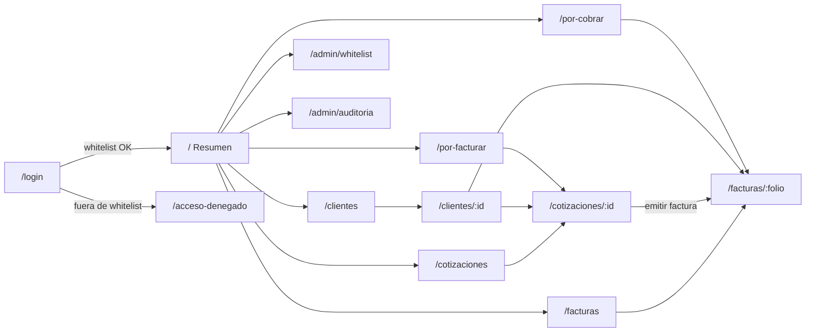

# 09 — Guía del Demo UI/UX

| Campo | Valor |
|---|---|
| **Documento** | 09 — Guía del Demo UI/UX (Fase 1 · Demo-First v2) |
| **Versión** | 1.0 |
| **Fecha** | 22/06/2026 |
| **Producto** | Portal Ejecutivo BQS — MVP1 |
| **Stack del demo** | React 19 · Vite 6 · TypeScript 5 · Tailwind CSS 4 · `lucide-react` · React Router 7 |
| **Ubicación del código** | [`demo-ux/app/`](app/) |
| **Origen de datos** | `src/lib/mock/db.json` (espejo exacto del DDL) detrás de `src/lib/api.ts` |
| **Depende de** | [01 — SRS](../01-vision/01_SRS_especificacion_requisitos.md) · [03 — Modelo de Datos](../03-datos/03_modelo_de_datos.md) · [05 — API](../05-api/05_especificacion_api.md) · [08 — Design System](../01-vision/08_identidad_visual_design_system.md) · [Metodología Demo-First v2](../../Metodología%20Demo-First/METODOLOGIA_DEMO_FIRST_v2.md) |

> Este documento es el **contrato de la Fase 1**. Define qué valida el demo, qué pantallas existen, qué estados cubre cada componente, cómo el `db.json` refleja el DDL y cómo se valida con el stakeholder. Un agente desarrollador debe poder, leyendo este documento y el código de `app/`, **completar y promover** el demo a producción sin ambigüedad.

---

## 1. Propósito y alcance

El demo es el **esqueleto del frontend de producción**, no una maqueta desechable. Cubre el sistema completo del MVP1 desde la **perspectiva del administrador** (que ve todos los módulos), y permite recorrer cada flujo del SRS antes de construir el backend. Al llegar la Fase 2, solo se sustituye el origen de datos (JSON → API real) rellenando `api.real.ts`; las pantallas no se reescriben.

**Declaración de datos:** todo dato es **simulado**, vive solo en `db.json`, **no se persiste** nada y **no contiene PII real** (correos `@…` ficticios, RFC y montos inventados). Esto preserva el "orden seguro" de la metodología: el demo no captura datos reales ni expone superficie de ataque.

**Qué valida el demo:**

- Las **tres preguntas** de la Dirección (facturado del mes, por facturar, por cobrar) y sus desgloses.
- El **Ciclo de Cobro** completo: captura de devengado → emisión de factura → registro de pagos, con sus reglas (validación numérica estricta, prevención de sobrepago, inmutabilidad de pagada).
- La **gestión** de clientes, cotizaciones, whitelist y la consulta de auditoría.
- El **control de acceso** por rol (incluido el bloqueo de whitelist y el candado de solo-lectura de Dirección) a nivel de presentación.
- Las **mejores prácticas UI/UX**: todos los estados de cada componente, accesibilidad WCAG 2.1 AA, responsive y navegación por teclado.

**Fuera del demo:** seguridad real (tokens, RBAC en servidor), cálculo en servidor, timbrado fiscal, persistencia. Todo eso es Fase 2 (backend). El demo *simula* el comportamiento server-side en el adaptador mock para que la UX sea fiel.

---

## 2. Inventario de pantallas

Todas las rutas privadas viven bajo el `AppShell` (exige sesión). El rol indicado es **quién ve el módulo**; la escritura la revalida el backend en Fase 2 (el cliente solo oculta lo no permitido).

| Pantalla | Ruta | Requisito(s) SRS | Roles que la ven | Archivo |
|---|---|---|---|---|
| Login | `/login` | RF-AUTH-01 | público | `pages/LoginPage.tsx` |
| Acceso denegado (QA5) | `/acceso-denegado` | RF-AUTH-01 | público | `pages/AccesoDenegadoPage.tsx` |
| Resumen ejecutivo (3 preguntas) | `/` | RF-DASH-01/02/03 | todos | `pages/DashboardPage.tsx` |
| Por facturar (desglose por cotización) | `/por-facturar` | RF-DASH-02 | todos | `pages/PorFacturarPage.tsx` |
| Por cobrar (desglose por cliente) | `/por-cobrar` | RF-DASH-03 | todos | `pages/PorCobrarPage.tsx` |
| Clientes (lista + alta) | `/clientes` | RF-CLI-01/02 | todos (alta: admin) | `pages/ClientesPage.tsx` |
| Cliente — detalle + cartera | `/clientes/:id` | RF-CLI-03, QA1 | todos (baja: admin) | `pages/ClienteDetailPage.tsx` |
| Cotizaciones (lista + alta) | `/cotizaciones` | RF-COT-01 | todos (alta: facturación) | `pages/CotizacionesPage.tsx` |
| Cotización — consumo + devengado + emisión | `/cotizaciones/:id` | RF-COT-02, RF-DEV-01/02, RF-FAC-01 | todos (captura: capturista; emisión: facturación) | `pages/CotizacionDetailPage.tsx` |
| Facturas (lista + filtros) | `/facturas` | RF-FAC-02 | todos | `pages/FacturasPage.tsx` |
| Factura — detalle + pagos | `/facturas/:folio` | RF-PAG-01/02, RF-FAC-03 | todos (abono: facturación) | `pages/FacturaDetailPage.tsx` |
| Whitelist | `/admin/whitelist` | RF-CTA-01 | admin | `pages/WhitelistPage.tsx` |
| Auditoría | `/admin/auditoria` | RF-MET-01 | admin | `pages/AuditoriaPage.tsx` |
| 404 | `*` | — | público | `pages/NotFoundPage.tsx` |

---

## 3. Mapa de navegación (IA)



La navegación principal es un **panel administrativo** con nav lateral (agrupada en *Dirección*, *Operación*, *Administración*) + barra superior con indicador de "datos simulados", candado de solo-lectura y menú de usuario. En móvil la nav lateral se vuelve un cajón (drawer) con overlay.

---

## 4. Catálogo de estados por componente

La biblioteca vive en `src/components/ui/` (basada en el doc 08) y `src/components/layout/`. Cada componente expone explícitamente sus estados (Definición de Hecho, Demo-First v2 §7).

| Componente | Archivo | Estados / variantes cubiertos |
|---|---|---|
| Button | `ui/Button.tsx` | `primary` · `secondary` · `danger` · `ghost`; default/hover/focus-visible/disabled/**loading** (spinner) |
| TextField | `ui/TextField.tsx` | default/focus/disabled/**error** (ícono + texto, `aria-invalid`+`aria-describedby`)/hint |
| Select | `ui/Select.tsx` | default/focus/disabled |
| StatusBadge | `ui/StatusBadge.tsx` | Vigente · Vencida · Pagada · Por facturar · Facturado · Crítico (siempre **ícono + texto**, nunca solo color) |
| RoleBadge | `ui/RoleBadge.tsx` | dirección · capturista · facturación · admin |
| KpiCard | `ui/KpiCard.tsx` | acentos primary/secondary/warning/danger; cifra `tabular-nums` + barra de acento lateral |
| Card / CardHeader | `ui/Card.tsx` | superficie base + encabezado con acción |
| DataTable | `ui/DataTable.tsx` | columnas left/right/center, mono, num; fila hover/seleccionable por teclado (`Enter`/`Espacio`), `scope=col`, scroll horizontal interno |
| Pagination | `ui/Pagination.tsx` | anterior/siguiente, disabled en extremos, rango "n–m de t" |
| Spinner | `ui/Spinner.tsx` | `role=status` + texto `sr-only` |
| Skeleton | `ui/Skeleton.tsx` | `Skeleton`, `KpiSkeleton`, `TableSkeleton` (evitan salto de layout) |
| EmptyState | `ui/EmptyState.tsx` | **vacío** con ícono, mensaje y acción opcional |
| ErrorState | `ui/ErrorState.tsx` | **error** con `role=alert` + botón Reintentar |
| Modal | `ui/Modal.tsx` | `role=dialog`, cierre con Esc, foco inicial, overlay; bottom-sheet en móvil |
| Toast | `ui/Toast.tsx` | success/warning/error/info; `role=alert` (error) / `status` (resto); auto-cierre salvo error |
| AppShell/Sidebar/Topbar | `layout/*` | nav activa con color + indicador (`aria-current`), drawer móvil, menú de usuario |

**Patrón de estado por pantalla (obligatorio):** cada página de datos resuelve los cuatro estados — **loading** (skeleton), **error** (`ErrorState` + reintento), **empty** (`EmptyState`) y **success** (contenido). Ejemplo de referencia: `DashboardPage.tsx`, `ClientesPage.tsx`.

---

## 5. Espejo de datos (`db.json` ↔ DDL doc 03)

`src/lib/mock/db.json` tiene **una clave por tabla con el nombre EXACTO del DDL** (mayúsculas Tier 0), columnas y enums idénticos, y FKs como ids existentes. La clave `usuarios` es un stand-in de Shield solo para el demo (login/roles). La clave `_demo` documenta el "hoy" fijo del demo (`2026-06-22`) para reproducibilidad.

| Tabla (clave db.json) | Tipo TS (`lib/types.ts`) | Filas demo | Escenarios que cubre |
|---|---|---|---|
| `CAT_CLIENTES` | `CatCliente` | 6 | QA1 (CLI-001 NIDEC consolidado), cliente **Inactivo** (CLI-005), cliente **sin cartera** (CLI-006, empty state) |
| `COTIZACIONES` | `Cotizacion` | 6 | enums `Aprobada`/`Pendiente PO`/`Cerrada`; PO nula (COT-0080) |
| `BITACORA_SORTEO` | `BitacoraSorteo` | 5 | `Pendiente` (CAP-00231 = $10,000 → QA3) y `Facturado` |
| `FACTURAS` | `Factura` | 5 | `Vigente` (F-9901 → QA4), `Pagada`, `Vencida` (F-9806, mayo) |
| `PAGOS` | `Pago` | 4 | abono parcial de F-9901 ($20,000 → saldo $30,000, QA4) y liquidaciones |
| `AUTH_WHITELIST` | `AuthWhitelist` | 5 | autorizados + uno **revocado** (`activo=0`); `intruso@competidor.com` ausente → QA5 |
| `AUDITORIA` | `Auditoria` | 5 | acciones crear/actualizar/acceso |
| `JOBS_COLA` | `JobCola` | 2 | `import_inicial` y `marcar_vencidas` completados |
| `usuarios` (demo) | `Usuario` | 4 | personas por rol para el acceso rápido |

**Cómo el mock produce las 3 preguntas (idéntico al cálculo de servidor del doc 05 §3), con `hoy = 2026-06`:**

- **Facturado del mes (P1)** = Σ `FACTURAS.Monto_Total` con `Fecha_Emision` en `2026-06` y `Estatus_Pago ∈ {Pagada, Vigente}` → **$100,000.00** (F-9901 50k Vigente + F-9902 30k Pagada + F-9903 20k Pagada). F-9806 (mayo, 50k) y F-9700 (abril) **se excluyen** → cumple **QA2**.
- **Por facturar (P2)** = Σ `BITACORA_SORTEO.Monto_Devengado` con `Estatus_Facturacion = Pendiente` → **$10,000.00** (CAP-00231) con desglose por cotización → cumple **QA3**.
- **Por cobrar (P3)** = Σ (`Monto_Total` − Σ pagos) de facturas `Vigente|Vencida` → F-9901 ($50,000 − $20,000 = **$30,000**, **QA4**) + F-9806 ($50,000 vencida) = **$80,000.00** total de cartera.

> **Nota de fidelidad QA.** El demo reproduce **exactamente** las cifras de aceptación a su nivel: P1 = $100,000 (QA2), P2 = $10,000 (QA3) y el saldo de **F-9901 = $30,000** (QA4) en el detalle de la factura y en el cliente. El **total** de "por cobrar" agrega además la factura vencida F-9806 ($50,000) para exhibir el estado `Vencida`, por lo que el KPI global es $80,000 — consistente con la fórmula de RF-DASH-03. Si se desea que el KPI global de P3 sea $30,000 para un guion de demo minimalista, basta con marcar F-9806 como `Pagada` (o quitarla) en `db.json`.

### Doble uso del `db.json` (Fase 2)

El mismo `db.json` siembra MySQL en el `InitialSeeder` de CI4 vía `insertBatch`, tabla por tabla, porque las columnas y enums ya coinciden con el DDL. Los datos validados en el demo y los datos de prueba del backend (doc 06) son **la misma fuente**. (La clave `usuarios` y `_demo` no se siembran: la identidad real la maneja Shield.)

---

## 6. Accesibilidad (WCAG 2.1 AA) — checklist verificable

- [x] Todas las combinaciones de color en uso provienen de los tokens del doc 08 (verificados AA en doc 08 §10).
- [x] El estado **nunca** se comunica solo con color: `StatusBadge` y toasts llevan **ícono + texto** (RNF-08).
- [x] Foco siempre visible (`focus-visible:ring-*`) en botones, enlaces, inputs, filas de tabla y nav.
- [x] Navegación completa por teclado; filas de tabla activables con `Enter`/`Espacio`; modal cierra con `Esc`.
- [x] HTML semántico: `<header>`, `<nav aria-label>`, `<main>`, `<table>` con `<caption>` (sr-only) y `<th scope="col">`.
- [x] `aria-invalid` + `aria-describedby` en campos con error; `aria-current="page"` en nav activa; `role=status`/`role=alert` en spinner/errores/toasts.
- [x] Cifras con `tabular-nums` (clase `.num`) y alineadas a la derecha.
- [x] `prefers-reduced-motion` respetado (anula transiciones/animaciones).

**Pendiente de verificación manual del agente:** correr un lector de pantalla sobre los flujos críticos y revisar el orden de tabulación en los modales (sin trampa de foco).

---

## 7. Responsive (breakpoints del doc 08)

| Breakpoint | Ancho | Comportamiento |
|---|---|---|
| Móvil | 360–639 px | 1 columna; **3 KPIs apilados sin scroll horizontal** (RNF-07); nav lateral como drawer; tablas con scroll horizontal **interno**; modales como bottom-sheet. |
| Tablet | 640–1023 px | KPIs en 2 columnas; filtros en 2 columnas; nav drawer. |
| Escritorio | ≥ 1024 px | KPIs en 3 columnas; nav lateral fija (`w-64`); contenido `max-w-7xl`. |

Grid de KPIs: `grid-cols-1 sm:grid-cols-2 lg:grid-cols-3` (verificado a 360 px).

---

## 8. Protocolo de validación con el stakeholder

Guion sugerido de la sesión (Hito del Sprint D):

1. **Login y seguridad.** Entrar como *Admin*; intentar `intruso@competidor.com` → pantalla de **acceso denegado** (QA5). Entrar como *Eric (Dirección)* → notar el badge **Solo lectura** y la ausencia de botones de escritura.
2. **Las 3 preguntas.** En *Resumen*, confirmar $100,000 / $10,000 / y el total por cobrar. Abrir *Por facturar* (desglose por cotización, QA3) y *Por cobrar* (saldo por cliente).
3. **Consolidación de clientes (QA1).** Buscar "NIDEC" / "Nidec"; abrir CLI-001 y ver su cartera sumada.
4. **Ciclo de cobro.** En una cotización `Aprobada`: capturar devengado (probar un negativo → **error de validación**), emitir factura desde devengado, y registrar un abono (probar un sobrepago → **rechazo**); ver la factura pasar a `Pagada` al liquidar.
5. **Administración.** Agregar y revocar un correo en whitelist; revisar la auditoría.
6. **Calidad transversal.** Mostrar estados vacío/cargando/error (recargar, filtros sin resultados), responsive a 360 px y navegación por teclado.

Registrar cada hallazgo en la bitácora (§9). Al cerrar: **re-sincronizar** SRS (01) y API (05) y marcar el contrato de `lib/api.ts` como **congelado**.

---

## 9. Bitácora hallazgos → cambios

| # | Hallazgo en la validación | Documento afectado (SRS/API/08) | Cambio acordado | Estado |
|---|---|---|---|---|
| — | *(pendiente de la sesión de validación)* | | | |

> Esta tabla se llena durante/después de la sesión. Cada fila enlaza un hallazgo con el documento que se corrige y el cambio concreto, antes de congelar el contrato del API.

---

## 10. Para el agente desarrollador (arquitectura y convenciones)

**Estructura de `app/`:**

```
app/
├── index.html                 Inter (preconnect) + #root
├── package.json               React 19 · Vite 6 · TS 5 · Tailwind 4 · router 7 · lucide
├── vite.config.ts             plugin react + @tailwindcss/vite
├── tsconfig*.json             strict, paths "@/*" -> src/*
├── .env.example               VITE_USE_MOCK (default mock) · VITE_API_URL
└── src/
    ├── main.tsx               BrowserRouter > SessionProvider > ToastProvider > App
    ├── App.tsx                rutas (mapa §3)
    ├── styles/index.css       @theme (tokens doc 08) + base
    ├── styles/tokens.css      tokens de referencia (doc 08 §6)
    ├── lib/
    │   ├── types.ts           espejo del DDL (doc 03) + envolturas doc 05
    │   ├── api.ts             ★ CONTRATO ApiClient (un método por endpoint doc 05)
    │   ├── api.mock.ts         implementación mock (lee db.json, calcula como servidor)
    │   ├── api.real.ts         implementación real (fetch; se activa en Fase 2)
    │   ├── index.ts           interruptor VITE_USE_MOCK + re-exports
    │   ├── format.ts          MXN, fechas, periodo
    │   ├── cn.ts              utilidad de clases
    │   └── mock/{db.json, query.ts}
    ├── hooks/useAsync.ts      loading/empty/error/reload
    ├── auth/session.tsx       sesión simulada + helpers de rol (canWrite, isReadOnly)
    ├── components/ui/*        biblioteca del doc 08
    ├── components/layout/*    AppShell · Sidebar · Topbar · nav.ts
    └── pages/*                una por pantalla del §2
```

**Reglas no negociables del demo (Demo-First v2):**

1. **Las pantallas nunca leen `db.json`**; consumen `api.*` importado de `@/lib`. Cambiar de mock a real es cambiar `VITE_USE_MOCK`, no las pantallas.
2. **`lib/api.ts` es el contrato congelable.** Un método por endpoint del doc 05. No agregar lógica de negocio en las pantallas: el adaptador (mock hoy, real mañana) decide.
3. **`db.json` espejo exacto del DDL.** Mismas tablas/columnas/enums/FKs; datos ficticios sin PII.
4. **El cliente solo presenta.** Formatea (`format.ts`) lo que el adaptador entrega ya calculado; toda autorización/validación/cálculo es responsabilidad del servidor en Fase 2.
5. **Accesibilidad y estados** son parte de "hecho": cada pantalla cubre loading/empty/error/success.

**Comandos:**

```bash
cd "demo-ux/app"
cp .env.example .env        # VITE_USE_MOCK=true
npm install
npm run dev                 # http://localhost:5173
npm run typecheck           # tsc --noEmit (debe quedar verde)
npm run lint                # ESLint
npm run build               # build de producción
```

**Promoción a Fase 2 (producción):**

1. Mover `demo-ux/app/` → `apps/web/`.
2. Rellenar `src/lib/api.real.ts` contra la API CI4 (ya esqueletado: desempaqueta `{data}`/`{meta}`/`{error}`; token Bearer en memoria; cookie de refresh `HttpOnly`).
3. `VITE_USE_MOCK=false` y `VITE_API_URL=https://bqs.dataholics.com.mx/api`.
4. Sembrar MySQL con el mismo `db.json` (InitialSeeder, `insertBatch`).
5. Reemplazar la sesión simulada (`auth/session.tsx`) por el flujo real de Shield (login → access token → `me`), conservando los helpers de rol.
6. Borrar `src/lib/api.mock.ts` y `src/lib/mock/`. **Las pantallas y componentes no se tocan.**

---

## 11. Definición de Hecho del demo (Sprint D)

- [x] Cada pantalla del §2 navegable.
- [x] Cada componente con sus estados (default/hover/focus/disabled/loading/empty/error).
- [x] Navegación por teclado; foco visible; roles/labels ARIA; jerarquía de encabezados.
- [x] Color WCAG 2.1 AA (tokens doc 08); estado nunca solo por color.
- [x] Responsive en todos los breakpoints del doc 08.
- [x] Mock detrás de `lib/api.ts`; pantallas nunca leen `db.json`.
- [x] `db.json` cubre escenarios vacío, sin-permiso y vencido, no solo el camino feliz.
- [x] `db.json` validado contra el DDL (mismas columnas y enums).
- [ ] `npm run typecheck` y `npm run lint` verdes (ejecutar tras `npm install`).
- [ ] Sesión de validación con stakeholder + bitácora §9.
- [ ] SRS (01) y API (05) re-sincronizados; contrato de `lib/api.ts` marcado **congelado**.
```
